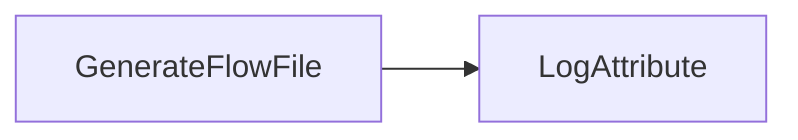
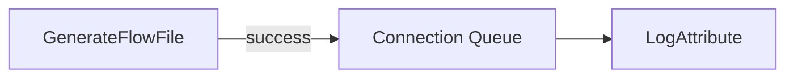

# Lab 01：建立第一個 Flow

目標：建立最小可執行資料流，理解 Processor、Connection、Relationship、Queue 與 Start/Stop。

預估時間：20 分鐘。

## 你會做出什麼



`GenerateFlowFile` 產生一筆 FlowFile，`LogAttribute` 把 FlowFile 的 attributes 與內容寫到 NiFi log。

## Step 1：建立 Process Group

1. 開啟 `https://localhost:8443/nifi`。
2. 在空白 canvas 上方工具列拖曳 `Process Group`。
3. 名稱輸入 `training-lab-01`。
4. 進入 `training-lab-01`。

為什麼要先用 Process Group：公司專案通常會把不同資料流、不同環境、不同功能切開，避免整張 canvas 難以維護。

## Step 2：新增 GenerateFlowFile

1. 拖曳 `Processor` 到 canvas。
2. 搜尋 `GenerateFlowFile`。
3. 新增後打開設定。
4. 設定 `Scheduling`：
   - `Run Schedule`：`60 sec`
5. 設定 `Properties`：
   - `Custom Text`：

```text
hello,nifi
this,is,my-first-flow
```

6. 按 `Apply`。

## Step 3：新增 LogAttribute

1. 拖曳 `Processor` 到 canvas。
2. 搜尋 `LogAttribute`。
3. 設定 `Properties`：
   - `Log Level`：`info`
   - `Log Payload`：`true`
   - `Log Prefix`：`lab01`
4. 按 `Apply`。

## Step 4：連線

1. 從 `GenerateFlowFile` 拖曳箭頭到 `LogAttribute`。
2. Relationship 選 `success`。
3. 開啟 `LogAttribute` 設定。
4. 到 `Relationships`。
5. 勾選 `success` 的 auto-terminate。
6. 按 `Apply`。

說明：每個 Relationship 都必須被連出去或 auto-terminate，否則 Processor 會 invalid。

## Step 5：啟動與觀察

1. 選取兩個 Processor。
2. 按左側 Operate 面板的 Start。
3. 等 1 至 2 次執行後，停止 `GenerateFlowFile`。

在當前工作目錄 PowerShell 看 log：

```powershell
docker compose logs --tail=120 nifi
```

你應該看到 `lab01` 相關 log，裡面有 FlowFile attributes 與 payload。

## Step 6：觀察 Queue

如果 `LogAttribute` 沒有啟動，`GenerateFlowFile` 產生的 FlowFile 會停在 connection queue。

練習：

1. 停止 `LogAttribute`。
2. 啟動 `GenerateFlowFile` 一次。
3. 點 connection 上的 queue 數字。
4. 右鍵 queue，查看 `List queue`。
5. 點單筆 FlowFile 的資訊，觀察 `Attributes` 與 `Content`。

## 完成檢查

- 你知道 Processor stopped、running、invalid 的差異。
- 你知道 connection 裡的 queue 是下游未處理的 FlowFile。
- 你知道 Relationship 沒處理會讓 Processor invalid。
- 你可以用 `docker compose logs` 看到 `LogAttribute` 輸出。

## 常見錯誤

- `GenerateFlowFile` 一直產資料：把 `Run Schedule` 調大，或練習完立刻 stop。
- `LogAttribute` invalid：確認 `success` relationship 是否已 auto-terminate。
- 看不到 log：確認 `Log Level = info`，再用 `docker compose logs --tail=120 nifi` 查最近 log。

## 本 Lab 的學習重點回顧

這個 Lab 建立的是最小 NiFi flow：



整個流程的意思是：

1. `GenerateFlowFile` 每 60 秒被 NiFi 排程觸發一次。
2. 每次觸發時，它會產生一筆新的 FlowFile。
3. 這筆 FlowFile 的 content 是你在 `Custom Text` 填入的文字。
4. FlowFile 透過 `success` relationship 進入 connection queue。
5. `LogAttribute` 從 queue 取出 FlowFile。
6. `LogAttribute` 把 FlowFile attributes 與 payload 寫進 NiFi log。

所以這個 Lab 不是在做真實資料整合，而是在模擬「一筆資料進入 NiFi 後，被下游 Processor 接收並留下觀察紀錄」。

做完後你要理解三件事：

- Processor 不是一直自動做事，它要被排程觸發，而且要是 running。
- Connection 不是單純線條，中間有 queue，資料可能會卡在那裡。
- `LogAttribute` 是新手最重要的觀察工具之一，用來確認 FlowFile 內容與 attributes 是否符合預期。
