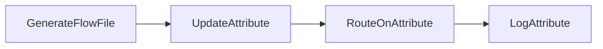
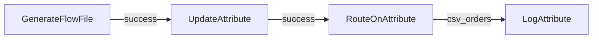
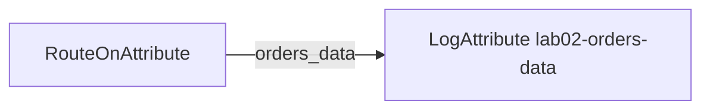
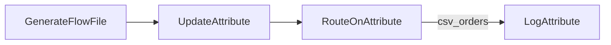

# Lab 02：FlowFile、Attribute、Expression Language 與路由

目標：理解 FlowFile 由 content 與 attributes 組成，並用 Expression Language 依 attribute 分流。

預估時間：30 分鐘。

## 你會做出什麼



## Step 1：建立 Process Group

建立 `training-lab-02`，進入該 Process Group。

## Step 2：新增 GenerateFlowFile

設定：

- `Run Schedule`：`60 sec`
- `Custom Text`：

```csv
order_id,customer,amount,status
1001,Alice,120.50,NEW
1002,Bob,35.00,CANCELLED
```

## Step 3：新增 UpdateAttribute

新增 Processor：`UpdateAttribute`。

在 `Properties` 新增 dynamic properties：

| Property | Value |
| --- | --- |
| `source.system` | `training` |
| `data.kind` | `orders` |
| `filename` | `orders-${now():format("yyyyMMddHHmmss")}.csv` |

說明：Attribute 是 FlowFile 的 metadata。公司專案常用它保存來源系統、檔名、批次號、schema 名稱、錯誤原因。

## Step 4：新增 RouteOnAttribute

新增 Processor：`RouteOnAttribute`。

設定：

- `Routing Strategy`：`Route to Property name`

新增 dynamic property：

| Property | Value |
| --- | --- |
| `csv_orders` | `${filename:endsWith('.csv')}` |

RouteOnAttribute 會依 dynamic property 產生同名 relationship，例如 `csv_orders`。

## Step 5：新增 LogAttribute

新增 Processor：`LogAttribute`。

設定：

- `Log Prefix`：`lab02`
- `Log Payload`：`true`

## Step 6：連線與 relationship

連線：



Auto-terminate：

- `RouteOnAttribute` 的 `unmatched`
- `LogAttribute` 的 `success`

## Step 7：執行與觀察

1. 全選 Processor，按 Start。
2. 等一筆資料通過後，停止 `GenerateFlowFile`。
3. 查看 log：

```powershell
docker compose logs --tail=160 nifi
```

4. 到 NiFi UI 打開 provenance，搜尋最近 FlowFile。
5. 觀察 attributes 是否包含：
   - `source.system`
   - `data.kind`
   - `filename`
   - `RouteOnAttribute.Route`

## 練習題

開始練習前，先停止 `GenerateFlowFile`，避免你修改 route 時資料一直進來。每一題調整完設定後，再短暫啟動 `GenerateFlowFile` 觀察結果。

### 練習 1：修改 RouteOnAttribute，新增 data.kind route

修改 Processor：`RouteOnAttribute`

到 `Properties`，新增 dynamic property：

| Property | Value |
| --- | --- |
| `orders_data` | `${data.kind:equals('orders')}` |

這會新增一條 relationship：`orders_data`。

接著新增一個 `LogAttribute`，命名或註解成 `lab02-orders-data`，設定：

- `Log Prefix`：`lab02-orders-data`
- `Log Payload`：`true`

連線：



Auto-terminate：

- 新增的 `LogAttribute` 的 `success`

確認方式：

1. 目前 `UpdateAttribute` 的 `data.kind = orders`。
2. 所以 `orders_data` 會符合。
3. 原本的 `csv_orders` 也會符合，因為 `filename` 還是 `.csv`。
4. 觀察兩個 `LogAttribute` 是否都印出 log。

### 練習 2：修改 UpdateAttribute，觀察其中一條 route 不符合

修改 Processor：`UpdateAttribute`

到 `Properties`，把這個 dynamic property：

| Property | 原本 Value | 改成 Value |
| --- | --- | --- |
| `data.kind` | `orders` | `customers` |

不要改 `RouteOnAttribute`。

此時 route 判斷會變成：

| Relationship | 條件 | 是否符合 |
| --- | --- | --- |
| `csv_orders` | `${filename:endsWith('.csv')}` | 會符合 |
| `orders_data` | `${data.kind:equals('orders')}` | 不符合 |

確認方式：

1. Apply 後重新啟動流程。
2. `csv_orders` 還是會輸出 log。
3. `orders_data` 不會輸出 log。

這一步的重點是：`UpdateAttribute` 改的是 attribute 值，`RouteOnAttribute` 根據改完後的 attribute 決定 relationship。

### 練習 3：修改 UpdateAttribute，讓資料真的走 unmatched

修改 Processor：`UpdateAttribute`

要讓資料走 `unmatched`，必須讓所有 route 條件都不符合。

把 dynamic properties 改成：

| Property | 改成 Value |
| --- | --- |
| `data.kind` | `customers` |
| `filename` | `orders-${now():format("yyyyMMddHHmmss")}.txt` |

此時 route 判斷會變成：

| Relationship | 條件 | 是否符合 |
| --- | --- | --- |
| `csv_orders` | `${filename:endsWith('.csv')}` | 不符合，因為 filename 是 `.txt` |
| `orders_data` | `${data.kind:equals('orders')}` | 不符合，因為 data.kind 是 `customers` |

確認方式：

1. 若只想讓資料結束，確認 `RouteOnAttribute` 的 `unmatched` 有 auto-terminate。
2. 若想觀察 `unmatched`，先取消 `unmatched` 的 auto-terminate，再新增一個 `LogAttribute` 並把 `unmatched` 連過去。
3. 新增的 `LogAttribute` 要把 `success` auto-terminate。
4. Apply 後重新啟動流程。
5. `csv_orders` 和 `orders_data` 都不會輸出 log。
6. 若 `unmatched` 接到 `LogAttribute`，會看到資料走到 `unmatched`。

### 練習 4：改回多條 route 同時符合

修改 Processor：`UpdateAttribute`

把 dynamic properties 改回：

| Property | 改回 Value |
| --- | --- |
| `data.kind` | `orders` |
| `filename` | `orders-${now():format("yyyyMMddHHmmss")}.csv` |

此時 `RouteOnAttribute` 有兩條 route：

| Relationship | 條件 | 是否符合 |
| --- | --- | --- |
| `csv_orders` | `${filename:endsWith('.csv')}` | 會符合 |
| `orders_data` | `${data.kind:equals('orders')}` | 會符合 |

觀察問題：

- 一筆 FlowFile 是否會同時送到兩條 relationship？
- 兩個 `LogAttribute` 是否都會印出 log？
- `RouteOnAttribute.Route` attribute 會如何呈現？

如果你在練習 3 額外建立了 `unmatched` 的 `LogAttribute`，這一題可以保留它；因為 `unmatched` 不符合時不會收到資料。重點是確認 `csv_orders` 與 `orders_data` 兩條已符合的 route 都有被處理。

這個練習的重點是分清楚：

- `UpdateAttribute`：負責新增或修改 attributes。
- `RouteOnAttribute`：負責讀取 attributes 並決定要走哪條 relationship。

## 完成檢查

- 你能分辨 FlowFile content 與 attributes。
- 你能用 `UpdateAttribute` 新增 metadata。
- 你能用 `RouteOnAttribute` 依 attribute 分流。
- 你知道 `unmatched` 沒處理時會造成 invalid 或資料卡住。

## 本 Lab 的學習重點回顧

這個 Lab 建立的是 attribute-based routing：



整個流程的意思是：

1. `GenerateFlowFile` 產生一筆 CSV 文字資料。
2. `UpdateAttribute` 不改 CSV 內容，只幫 FlowFile 加上 metadata，例如 `source.system`、`data.kind`、`filename`。
3. `RouteOnAttribute` 不看 CSV 欄位，而是看 FlowFile attributes。
4. 如果 attributes 符合條件，例如檔名是 `.csv`，資料就走到 `csv_orders` relationship。
5. `LogAttribute` 把最後的 FlowFile 狀態寫到 log，讓你確認 route 是否正確。

這個 Lab 模擬公司專案常見情境：資料進來後，先補上來源、類型、批次資訊，再根據 metadata 決定資料要走哪條流程。

做完後你要理解：

- Attributes 是 FlowFile 的外層標籤，適合拿來做路由、批次追蹤、錯誤原因保存。
- `RouteOnAttribute` 適合依 metadata 分流，不適合直接查 CSV 裡的欄位值。
- 如果你要依 CSV 欄位內容分流，後面會用 `QueryRecord` 或 Record 相關 Processor。
