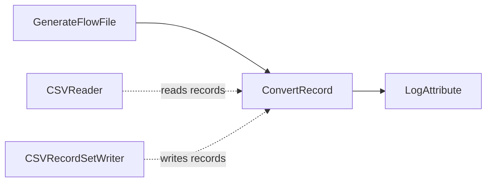

# Lab 03：CSV Reader/Writer 與 ConvertRecord

目標：理解 Record Reader/Writer Controller Service，並用 `ConvertRecord` 讀取 CSV、輸出標準化 CSV。

預估時間：35 分鐘。

## 你會做出什麼


這一章會刻意練習 Controller Service，因為公司專案中 `Record Reader is disabled`、`Record Writer is disabled` 是很常見的 invalid 來源。

## Step 1：建立 Process Group

建立 `training-lab-03`，進入該 Process Group。

## Step 2：新增 Controller Services

在 Process Group 空白處右鍵，選 `Configure`，進入 `Controller Services`。

新增 `CSVReader`：

| Property | Value |
| --- | --- |
| `Schema Access Strategy` | `Use String Fields From Header` |
| `CSV Format` | `RFC 4180` 或預設值 |

新增 `CSVRecordSetWriter`：

| Property | Value |
| --- | --- |
| `Schema Access Strategy` | `Inherit Record Schema` |
| `Schema Write Strategy` | `Do Not Write Schema` |
| `Include Header Line` | `true` |

設定完成後，兩個 Controller Service 都要按 `Enable`。

說明：Processor 只保存「要使用哪個 service」的參照。實際解析 CSV、輸出 CSV 的設定是在 Controller Service 裡。

## Step 3：新增 GenerateFlowFile

新增 Processor：`GenerateFlowFile`。

設定：

- `Run Schedule`：`60 sec`
- `Custom Text`：

```csv
order_id,customer,amount,status
1001,Alice,120.50,NEW
1002,Bob,35.00,CANCELLED
1003,Chris,500.00,NEW
```

## Step 4：新增 ConvertRecord

新增 Processor：`ConvertRecord`。

設定：

| Property | Value |
| --- | --- |
| `Record Reader` | 選剛建立的 `CSVReader` |
| `Record Writer` | 選剛建立的 `CSVRecordSetWriter` |
| `Include Zero Record FlowFiles` | `false` |

如果 `Record Reader` 或 `Record Writer` 顯示 invalid，先回 Controller Services 確認 service 是 `Enabled`。

## Step 5：新增 LogAttribute

新增 Processor：`LogAttribute`。

設定：

- `Log Prefix`：`lab03`
- `Log Payload`：`true`

## Step 6：連線


Auto-terminate：

- `ConvertRecord` 的 `failure`
- `LogAttribute` 的 `success`

這裡 auto-terminate `ConvertRecord` 的 `failure` 只是為了讓入門練習保持簡短。公司專案中不建議直接結束 failure，通常要接到 `LogAttribute`、錯誤 queue 或錯誤處理流程。

## Step 7：執行與驗證

1. 全選 Processor，按 Start。
2. 等一筆資料通過後，停止 `GenerateFlowFile`。
3. 查看 log：

```powershell
docker compose logs --tail=180 nifi
```

4. 在 provenance 找這筆 FlowFile，確認 attributes：
   - `record.count` 應為 `3`
   - `mime.type` 由 writer 決定

## 故意製造錯誤

練習排錯：

1. 修改位置：Process Group 空白處右鍵，選 `Configure`。
2. 進入 `Controller Services`。
3. 找到本 Lab 建立的 `CSVReader`。
4. 對 `CSVReader` 按 `Disable`。
5. 修改位置：回到 Processor `ConvertRecord`。
6. 打開 `ConvertRecord` 設定，按 `Perform Validation`。
7. 觀察錯誤訊息，應該會看到 `Record Reader` 參照的 Controller Service disabled。
8. 回到 `Controller Services`，把 `CSVReader` 按 `Enable`。
9. 再回 `ConvertRecord` 按 `Perform Validation`。

這會重現你之前遇到的 Controller Service disabled 問題。

## 完成檢查

- 你知道 Controller Service 必須 `Enable`。
- 你知道 `CSVReader` 負責把 content 解析成 records。
- 你知道 `CSVRecordSetWriter` 負責把 records 寫回 content。
- 你能從 `record.count` 判斷實際處理了幾筆 record。

## 本 Lab 的學習重點回顧

這個 Lab 建立的是 record conversion flow：



整個流程的意思是：

1. `GenerateFlowFile` 產生一段 CSV content。
2. `ConvertRecord` 需要兩個 Controller Services。
3. `CSVReader` 把 CSV content 解析成 NiFi records。
4. `CSVRecordSetWriter` 再把 records 寫回 CSV content。
5. `LogAttribute` 把轉換後的 FlowFile 狀態與內容寫到 log。

這個 Lab 看起來像只是 CSV 轉 CSV，但重點不是格式變化，而是學會 NiFi Record 架構。

做完後你要理解：

- Reader 負責「讀懂來源資料」。
- Writer 負責「輸出成目標格式」。
- `ConvertRecord` 本身負責串接 Reader 和 Writer。
- Controller Service 必須 enabled，否則 Processor 會 invalid。
- 後續 `QueryRecord`、`UpdateRecord`、`PutDatabaseRecord` 都會建立在這個 Reader/Writer 觀念上。
