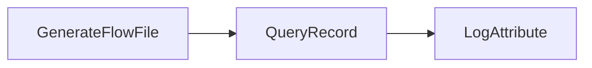
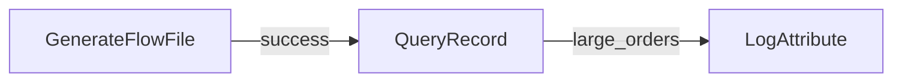
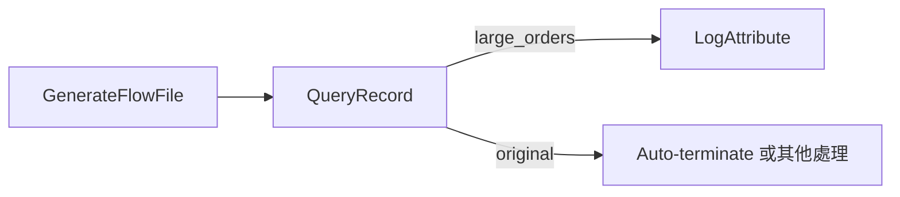

# Lab 04：QueryRecord 與 Record 層級資料篩選

目標：用 SQL-like 語法對 CSV records 做欄位篩選與 row filtering。

預估時間：40 分鐘。

## 你會做出什麼



`RouteOnAttribute` 是看 FlowFile attribute，`QueryRecord` 是看 FlowFile content 裡的 record 欄位。

## Step 1：建立 Process Group

建立 `training-lab-04`，進入該 Process Group。

## Step 2：準備 Controller Services

你可以沿用 Lab 03 的設定方式，在本 Process Group 建立：

- `CSVReader`
- `CSVRecordSetWriter`

建議設定：

`CSVReader`：

| Property | Value |
| --- | --- |
| `Schema Access Strategy` | `Infer Schema` |
| `CSV Format` | `RFC 4180` 或預設值 |

`CSVRecordSetWriter`：

| Property | Value |
| --- | --- |
| `Schema Access Strategy` | `Inherit Record Schema` |
| `Schema Write Strategy` | `Do Not Write Schema` |
| `Include Header Line` | `true` |

設定完成後 Enable。

## Step 3：新增 GenerateFlowFile

設定：

- `Run Schedule`：`60 sec`
- `Custom Text`：

```csv
order_id,customer,amount,status
1001,Alice,120.50,NEW
1002,Bob,35.00,CANCELLED
1003,Chris,500.00,NEW
1004,Dora,80.00,NEW
```

## Step 4：新增 QueryRecord

新增 Processor：`QueryRecord`。

設定：

| Property | Value |
| --- | --- |
| `Record Reader` | 選 `CSVReader` |
| `Record Writer` | 選 `CSVRecordSetWriter` |
| `Include Zero Record FlowFiles` | `false` |

新增 dynamic property：

| Property | Value |
| --- | --- |
| `large_orders` | `SELECT * FROM FLOWFILE WHERE "amount" >= 100` |

官方文件建議欄位名稱用雙引號包起來，避免和 SQL keyword 衝突。

新增 dynamic property 後，`QueryRecord` 會產生 `large_orders` relationship。

## Step 5：新增 LogAttribute

設定：

- `Log Prefix`：`lab04-large-orders`
- `Log Payload`：`true`

## Step 6：連線



Auto-terminate：

- `QueryRecord` 的 `failure`
- `QueryRecord` 的 `original`
- `LogAttribute` 的 `success`

## Step 7：執行與觀察

執行後查看 log：

```powershell
docker compose logs --tail=200 nifi
```

你應該只看到金額大於等於 `100` 的 records。

## 練習題

新增第二個 dynamic property：

| Property | Value |
| --- | --- |
| `cancelled_orders` | `SELECT "order_id", "customer", "status" FROM FLOWFILE WHERE "status" = 'CANCELLED'` |

再新增一個 `LogAttribute`，接到 `cancelled_orders`。

觀察：

- `large_orders` 輸出幾筆？
- `cancelled_orders` 輸出幾筆？
- `original` relationship 是否有被處理或 auto-terminate？

## 常見錯誤

- SQL 欄位名稱打錯：會走 `failure`。
- Reader 推斷型別不如預期：金額比較失敗時，先確認 `Schema Access Strategy`，必要時改用明確 schema。
- 忘記處理 `original`：QueryRecord 會保留原始 FlowFile，未連線或未 auto-terminate 會造成 invalid。

## 完成檢查

- 你能說明 Attribute 路由與 Record 欄位篩選的差異。
- 你能用 QueryRecord 產生多個 relationship。
- 你能用 `record.count` 與 output content 檢查篩選結果。

## 本 Lab 的學習重點回顧

這個 Lab 建立的是 record-level filtering：



整個流程的意思是：

1. `GenerateFlowFile` 產生一份包含多筆訂單的 CSV。
2. `CSVReader` 把 CSV 解析成 records。
3. `QueryRecord` 用 SQL-like 語法查這些 records。
4. 符合 `amount >= 100` 的 records 會被輸出到 `large_orders` relationship。
5. `CSVRecordSetWriter` 把篩選後的 records 寫回 CSV。
6. `LogAttribute` 印出篩選後的結果。

這個 Lab 模擬公司專案常見情境：一批資料進來後，只挑出符合條件的資料往下游送，例如大額訂單、取消訂單、錯誤狀態資料。

做完後你要理解：

- `RouteOnAttribute` 是看 FlowFile attributes。
- `QueryRecord` 是看 content 裡每一筆 record 的欄位。
- `QueryRecord` 可以用多個 dynamic properties 產生多條輸出 relationship。
- `original` relationship 是原始資料，要明確處理或 auto-terminate。
