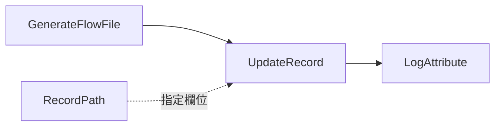

# Lab 05：UpdateRecord、RecordPath 與欄位轉換

目標：用 `UpdateRecord` 修改 CSV record 欄位，練習 RecordPath。

預估時間：40 分鐘。

## 你會做出什麼


`UpdateAttribute` 改的是 FlowFile metadata；`UpdateRecord` 改的是 content 裡每一筆 record 的欄位值。

## Step 1：建立 Process Group

建立 `training-lab-05`，進入該 Process Group。

## Step 2：建立 Controller Services

建立並 Enable：

- `CSVReader`
- `CSVRecordSetWriter`

建議同 Lab 04：

`CSVReader` 使用 `Infer Schema`，`CSVRecordSetWriter` 使用 `Inherit Record Schema` 與 `Do Not Write Schema`。

## Step 3：新增 GenerateFlowFile

設定：

- `Run Schedule`：`60 sec`
- `Custom Text`：

```csv
order_id,customer,amount,status
1001,Alice,120.50,new
1002,Bob,35.00,cancelled
1003,Chris,500.00,new
```

## Step 4：新增 UpdateRecord

新增 Processor：`UpdateRecord`。

設定：

| Property | Value |
| --- | --- |
| `Record Reader` | 選 `CSVReader` |
| `Record Writer` | 選 `CSVRecordSetWriter` |
| `Replacement Value Strategy` | `Literal Value` |

新增 dynamic property：

| Property | Value |
| --- | --- |
| `/source_system` | `training` |

這會嘗試把每筆 record 的 `/source_system` 欄位更新為 `training`。

注意：若 writer/schema 不允許新增不存在欄位，結果可能不會如你預期。這是 NiFi Record 類 processor 的重要觀念：Reader/Writer schema 會影響欄位保留與輸出。

## Step 5：改用既有欄位

再新增或調整 dynamic property：

| Property | Value |
| --- | --- |
| `/status` | `NEW` |

這會把所有 record 的 `status` 改成 `NEW`。

## Step 6：連線與執行


Auto-terminate：

- `UpdateRecord` 的 `failure`
- `LogAttribute` 的 `success`

這裡 auto-terminate `UpdateRecord` 的 `failure` 是為了讓入門練習保持簡短。公司專案中，`failure` 通常要接到錯誤處理流程，避免錯誤資料直接結束。

`LogAttribute` 設定：

- `Log Prefix`：`lab05`
- `Log Payload`：`true`

執行後查看：

```powershell
docker compose logs --tail=220 nifi
```

## Step 7：練習 RecordPath Value

修改 Processor：`UpdateRecord`

把 `Replacement Value Strategy` 改成：

```text
Record Path Value
```

保留或修改 dynamic property：

| Property | Value |
| --- | --- |
| `/status` | `/final_status` |

刪除前面 Step 4 建立的 dynamic property：

| Property | 原本 Value | 動作 |
| --- | --- | --- |
| `/source_system` | `training` | 刪除 |

說明：`Record Path Value` 會讓所有 dynamic property 的 value 都被當成 RecordPath。`/status = /final_status` 是合法的，因為 `/final_status` 指向同一筆 record 的欄位；但 `/source_system = training` 會失敗，因為 `training` 只是一般文字，不是合法 RecordPath。若沒有刪除它，執行時會看到類似 `RecordPathException: Unexpected token '<EOF>' ... Query: trainin`，資料會走 `failure`。

接著修改 Processor：`GenerateFlowFile`

把 `Custom Text` 改成：

```csv
order_id,customer,amount,status,final_status
1001,Alice,120.50,new,READY
1002,Bob,35.00,cancelled,SKIP
1003,Chris,500.00,new,READY
```

預期在 `LogAttribute` payload 看到類似：

```csv
order_id,customer,amount,status,final_status
1001,Alice,120.50,READY,READY
1002,Bob,35.00,SKIP,SKIP
1003,Chris,500.00,READY,READY
```

這一步要檢查的是：

1. `GenerateFlowFile` 的 `Custom Text` 是上面的 CSV。
2. `UpdateRecord` 的 `Replacement Value Strategy` 是 `Record Path Value`。
3. `UpdateRecord` 的 dynamic property 只保留 `/status = /final_status`。
4. `UpdateRecord` 不要保留 `/source_system = training`。
5. 從 `LogAttribute` 的 log payload 或 Queue 的 FlowFile content 觀察輸出 CSV。

## 練習題

### 練習 1：修改 UpdateRecord，遮罩 customer

修改 Processor：`UpdateRecord`

確認 `Replacement Value Strategy` 是：

```text
Literal Value
```

到 `Properties`，先刪除 Step 7 的 `/status = /final_status`，再新增或修改 dynamic property：

| Property | Value |
| --- | --- |
| `/customer` | `masked` |

確認方式：

1. Apply 後重新執行流程。
2. 查看 `LogAttribute` 輸出。
3. 確認每筆 record 的 `customer` 都變成 `masked`。

### 練習 2：修改 UpdateRecord，觀察 amount 型別

修改 Processor：`UpdateRecord`

到 `Properties`，先刪除練習 1 的 `/customer = masked`，再新增或修改 dynamic property：

| Property | Value |
| --- | --- |
| `/amount` | `0` |

確認方式：

1. Apply 後重新執行流程。
2. 查看 `LogAttribute` 輸出。
3. 觀察 `amount` 是否輸出為 `0`。
4. 若後續要寫入 DB，思考這個值是否能被 DB 欄位型別接受。

### 練習 3：故意設定不存在的 RecordPath

修改 Processor：`UpdateRecord`

到 `Properties`，先刪除練習 2 的 `/amount = 0`，再新增 dynamic property：

| Property | Value |
| --- | --- |
| `/not_exists` | `test` |

確認方式：

1. Apply 後回到 canvas，觀察 `UpdateRecord` 左上角是否變成 invalid 警告狀態。
2. 如果出現 invalid，將滑鼠移到警告圖示上查看 validation errors。
3. 重新執行流程。
4. 查看 `LogAttribute` 輸出是否出現 `not_exists` 欄位。
5. 目前本 Lab 的 `CSVRecordSetWriter` 使用 `Inherit Record Schema`，你可能會看到 `not_exists` 被輸出成新欄位。

這個練習的重點是：`UpdateRecord` 的 dynamic property key 是 RecordPath，value 是要寫入該欄位的值；欄位是否能輸出，會受到 schema 與 writer 設定影響。

### 練習 4：改用固定 schema Writer，觀察新增欄位不被輸出

這一題會沿用練習 3 的狀態：`UpdateRecord` 已經有 `/not_exists = test`。

先停止 `GenerateFlowFile`，避免你修改 Controller Service 時資料繼續進來。

新增 Controller Service：`CSVRecordSetWriter`，命名或註解成 `CSVRecordSetWriter-fixed-schema`。

設定：

| Property | Value |
| --- | --- |
| `Schema Access Strategy` | `Use 'Schema Text' Property` |
| `Schema Write Strategy` | `Do Not Write Schema` |
| `Include Header Line` | `true` |
| `Schema Text` | 使用下方 Avro schema |

`Schema Text`：

```json
{
  "type": "record",
  "name": "OrderRecord",
  "fields": [
    { "name": "order_id", "type": "string" },
    { "name": "customer", "type": "string" },
    { "name": "amount", "type": "string" },
    { "name": "status", "type": "string" }
  ]
}
```

Enable 這個新的 `CSVRecordSetWriter-fixed-schema`。

修改 Processor：`UpdateRecord`

| Property | Value |
| --- | --- |
| `Record Writer` | 選 `CSVRecordSetWriter-fixed-schema` |
| `Replacement Value Strategy` | `Literal Value` |

確認 dynamic property 只有：

| Property | Value |
| --- | --- |
| `/not_exists` | `test` |

重新執行流程，觀察 `LogAttribute` 輸出。

預期結果：

- `not_exists` 不會出現在輸出 CSV header。
- 如果 `GenerateFlowFile` 還保留 Step 7 的 `final_status` 欄位，`final_status` 也不會出現在輸出 CSV。
- FlowFile 不一定會走 `failure`；比較常見的是 Writer 只依固定 schema 寫出允許的欄位。

這一題的重點是：`UpdateRecord` 負責修改 record；`CSVRecordSetWriter` 負責輸出 record。公司專案若使用固定 schema，新增欄位沒有寫進 schema，就算 `UpdateRecord` 設定了該欄位，最後也可能不會輸出。

練習結束後，若要回到前面的自由練習狀態，把 `UpdateRecord` 的 `Record Writer` 改回原本的 `CSVRecordSetWriter`。

## 完成檢查

- 你知道 `UpdateAttribute` 與 `UpdateRecord` 的差異。
- 你能用 `/field_name` 這種 RecordPath 指到欄位。
- 你知道 `Replacement Value Strategy` 會決定 value 被當成 literal 還是 RecordPath。
- 你知道 `UpdateRecord` 可以嘗試新增欄位，但 Writer schema 會決定最後輸出哪些欄位。
- 你知道固定 schema 常用在公司專案，用來限制輸出欄位與下游契約。

## 本 Lab 的學習重點回顧

這個 Lab 建立的是 record transformation flow：



整個流程的意思是：

1. `GenerateFlowFile` 產生 CSV 訂單資料。
2. `CSVReader` 把 CSV 解析成 records。
3. `UpdateRecord` 用 RecordPath 找到 record 裡的欄位。
4. `UpdateRecord` 依設定把欄位改成固定值，或改成另一個欄位的值。
5. `CSVRecordSetWriter` 把修改後的 records 寫回 CSV。
6. `LogAttribute` 印出修改後的結果。

這個 Lab 模擬公司專案常見情境：資料進入後要標準化欄位值、補欄位、遮罩欄位，或把來源欄位轉成目標系統需要的格式。

做完後你要理解：

- `UpdateAttribute` 改 FlowFile 外層 metadata。
- `UpdateRecord` 改 FlowFile content 裡的 record 欄位。
- RecordPath 像是指向 record 欄位的路徑，例如 `/status`。
- Schema 會影響欄位能不能被保留或正確輸出；固定 schema 沒有定義的欄位通常不會被 Writer 寫出。
