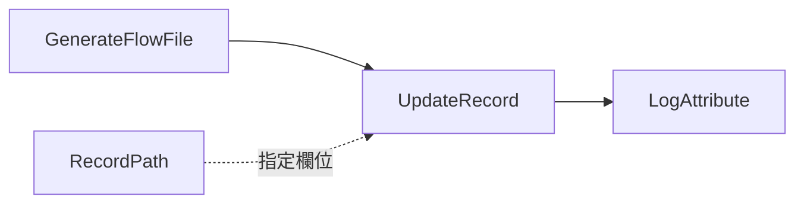

# Lab 05：UpdateRecord、RecordPath 與欄位轉換

目標：用 `UpdateRecord` 修改 CSV record 欄位，練習 RecordPath。

預估時間：40 分鐘。

## 你會做出什麼


`UpdateAttribute` 改的是 FlowFile metadata；`UpdateRecord` 改的是 content 裡每一筆 record 的欄位值。

## Step 1：建立 Process Group

建立 `training-lab-05`，進入該 Process Group。

## Step 2：建立 Controller Services

建立並 Enable：

- `CSVReader`
- `CSVRecordSetWriter`

建議同 Lab 04：

`CSVReader` 使用 `Infer Schema`，`CSVRecordSetWriter` 使用 `Inherit Record Schema` 與 `Do Not Write Schema`。

## Step 3：新增 GenerateFlowFile

設定：

- `Run Schedule`：`60 sec`
- `Custom Text`：

```csv
order_id,customer,amount,status
1001,Alice,120.50,new
1002,Bob,35.00,cancelled
1003,Chris,500.00,new
```

## Step 4：新增 UpdateRecord

新增 Processor：`UpdateRecord`。

設定：

| Property | Value |
| --- | --- |
| `Record Reader` | 選 `CSVReader` |
| `Record Writer` | 選 `CSVRecordSetWriter` |
| `Replacement Value Strategy` | `Literal Value` |

新增 dynamic property：

| Property | Value |
| --- | --- |
| `/source_system` | `training` |

這會嘗試把每筆 record 的 `/source_system` 欄位更新為 `training`。

注意：若 writer/schema 不允許新增不存在欄位，結果可能不會如你預期。這是 NiFi Record 類 processor 的重要觀念：Reader/Writer schema 會影響欄位保留與輸出。

## Step 5：改用既有欄位

再新增或調整 dynamic property：

| Property | Value |
| --- | --- |
| `/status` | `NEW` |

這會把所有 record 的 `status` 改成 `NEW`。

## Step 6：連線與執行


Auto-terminate：

- `UpdateRecord` 的 `failure`
- `LogAttribute` 的 `success`

`LogAttribute` 設定：

- `Log Prefix`：`lab05`
- `Log Payload`：`true`

執行後查看：

```powershell
docker compose logs --tail=220 nifi
```

## Step 7：練習 RecordPath Value

把 `Replacement Value Strategy` 改成：

```text
Record Path Value
```

新增一組練習資料：

```csv
order_id,customer,amount,status,final_status
1001,Alice,120.50,new,READY
1002,Bob,35.00,cancelled,SKIP
1003,Chris,500.00,new,READY
```

設定 dynamic property：

| Property | Value |
| --- | --- |
| `/status` | `/final_status` |

執行後，`status` 應該取自同一筆 record 的 `final_status`。

## 練習題

1. 把 `/customer` 改成固定值 `masked`，理解資料遮罩的基本做法。
2. 把 `/amount` 改成 `0`，觀察型別是否被 writer 保留。
3. 故意設定不存在的 RecordPath `/not_exists`，觀察是否報錯或被略過。

## 完成檢查

- 你知道 `UpdateAttribute` 與 `UpdateRecord` 的差異。
- 你能用 `/field_name` 這種 RecordPath 指到欄位。
- 你知道 `Replacement Value Strategy` 會決定 value 被當成 literal 還是 RecordPath。
- 你知道 schema 會影響欄位是否能被新增、保留或輸出。

## 本 Lab 的學習重點回顧

這個 Lab 建立的是 record transformation flow：



整個流程的意思是：

1. `GenerateFlowFile` 產生 CSV 訂單資料。
2. `CSVReader` 把 CSV 解析成 records。
3. `UpdateRecord` 用 RecordPath 找到 record 裡的欄位。
4. `UpdateRecord` 依設定把欄位改成固定值，或改成另一個欄位的值。
5. `CSVRecordSetWriter` 把修改後的 records 寫回 CSV。
6. `LogAttribute` 印出修改後的結果。

這個 Lab 模擬公司專案常見情境：資料進入後要標準化欄位值、補欄位、遮罩欄位，或把來源欄位轉成目標系統需要的格式。

做完後你要理解：

- `UpdateAttribute` 改 FlowFile 外層 metadata。
- `UpdateRecord` 改 FlowFile content 裡的 record 欄位。
- RecordPath 像是指向 record 欄位的路徑，例如 `/status`。
- Schema 會影響欄位能不能被保留或正確輸出。
