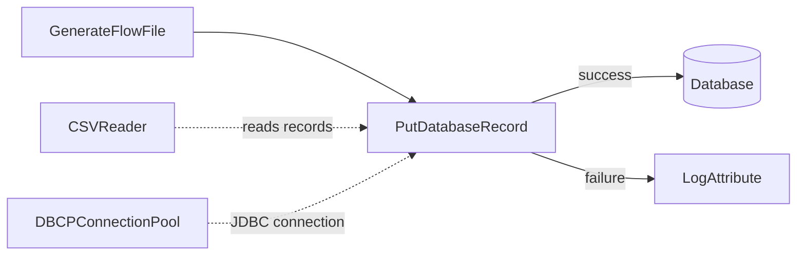
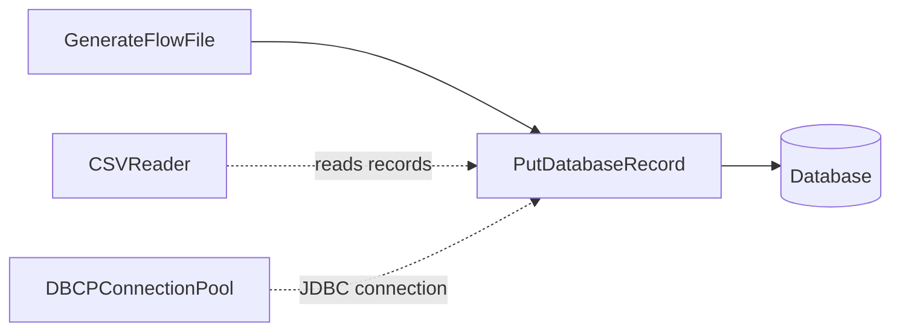

# Lab 06：本地 MSSQL 資料庫整合入門

目標：理解 NiFi 如何透過 `DBCPConnectionPool` 管理 MSSQL JDBC 連線，並用 `PutDatabaseRecord` 將 records 寫入本地 MSSQL。

預估時間：45 至 60 分鐘。

這一章會分成兩段：

- A 段：在目前專案環境確認 JDBC driver 掛載。
- B 段：用本地 MSSQL 測試資料庫實作 `PutDatabaseRecord`。

## 你會做出什麼



`CSVReader` 負責讀取 CSV records，`DBCPConnectionPool` 負責提供資料庫連線，`PutDatabaseRecord` 負責把 records 寫入資料表。失敗路徑會先接到 `LogAttribute`，方便你看到 DB 錯誤。

## A 段：確認 JDBC driver

NiFi container 內必須看得到 MSSQL JDBC driver jar，`DBCPConnectionPool` 才能載入 SQL Server driver。

先釐清一個容易誤會的觀念：NiFi 確實是透過 `Database Connection URL` 這種連線字串連到資料庫，但連線字串不能取代 JDBC driver。連線字串只描述「要連到哪一台資料庫、哪個 database、使用哪些連線參數」；JDBC driver 才是 NiFi 用來理解 SQL Server 協定並建立連線的 Java library。

延伸閱讀：[JDBC Driver Jar 完整說明](supplement-jdbc-driver.md)

所以 MSSQL 連線需要三個東西一起成立：

| 設定 | 作用 |
| --- | --- |
| `Database Connection URL` | MSSQL 連線字串，例如 host、port、database name、TLS 參數 |
| `Database Driver Class Name` | 指定要用哪個 Java driver class |
| `Database Driver Locations` | 指定 driver jar 在 NiFi container 內的位置 |

本 Lab 建議使用 Microsoft JDBC Driver for SQL Server。下載時可搜尋：

```text
download microsoft jdbc driver for sql server
```

下載後，把 driver jar 放到專案根目錄，例如：

```text
mssql-jdbc-13.4.0.jre11.jar
```

接著在 `docker-compose.yaml` 的 `nifi.volumes` 加上這一行：

```yaml
- "./mssql-jdbc-13.4.0.jre11.jar:/tmp/mssql-jdbc.jar"
```

如果你使用不同版本的 driver jar，左邊檔名要跟實際檔名一致；右邊 container 內路徑建議固定成 `/tmp/mssql-jdbc.jar`，後面 DBCP 設定比較簡單。

修改 volume 後重建 NiFi container：

```powershell
docker compose up -d nifi
```

用 PowerShell 確認 NiFi container 內看得到 driver：

```powershell
docker exec nifi-service sh -lc "ls -l /tmp/mssql-jdbc.jar"
```

`DBCPConnectionPool` 的 `Database Driver Locations` 要填 container 內路徑，也就是 `/tmp/mssql-jdbc.jar`，不是 Windows 主機上的檔案路徑。

只要 NiFi 成功透過這組設定寫入本地 MSSQL，你在 SSMS 或 Azure Data Studio 查 `dbo.nifi_training_orders` 就會直接看到資料。差別只是：NiFi 到 MSSQL 的連線方式是 JDBC；你在 MSSQL 工具看到的是同一張資料表的結果。

官方文件依據：

- Microsoft JDBC Driver for SQL Server：https://learn.microsoft.com/en-us/sql/connect/jdbc/microsoft-jdbc-driver-for-sql-server
- SQL Server JDBC connection URL 與 driver class：https://learn.microsoft.com/en-us/sql/connect/jdbc/using-the-jdbc-driver

## B 段：實作 CSV 寫入本地 MSSQL

這一段會先在 MSSQL 建好 database 與 table，再回 NiFi UI 建立資料流。不要在 database 還不存在時先 Enable `DBCPConnectionPool`，因為 `databaseName=nifi_training` 代表 NiFi 要連到一個已存在的 database。

## B 段前置設定：確認 MSSQL TCP port

如果 MSSQL 是安裝在 Windows 本機，先確認 SQL Server 有開啟 TCP/IP，並確認它目前監聽哪個 port。這一步是在 Windows 上設定，不是在 NiFi UI 裡設定。

1. 開啟 `SQL Server Configuration Manager`。
   - 可以從 Windows 開始選單搜尋。
   - 如果搜尋不到，可以用 `Win + R` 嘗試執行 `SQLServerManager16.msc`、`SQLServerManager15.msc` 或 `SQLServerManager14.msc`。不同 SQL Server 版本的檔名可能不同。
2. 左側打開 `SQL Server Network Configuration`。
3. 選你的 instance：
   - 預設 instance 通常是 `Protocols for MSSQLSERVER`
   - SQL Server Express 常見是 `Protocols for SQLEXPRESS`
   - 公司或本機自訂 instance 會是 `Protocols for <instance-name>`
4. 右側找到 `TCP/IP`。
5. 如果 `TCP/IP` 是 `Disabled`，右鍵選 `Enable`。
6. 右鍵 `TCP/IP`，選 `Properties`。
7. 進入 `IP Addresses` 分頁。
8. 捲到最下面 `IPAll`。
9. 先看目前設定，不要急著清空：

| Setting | Value |
| --- | --- |
| `TCP Dynamic Ports` | 若有值，代表目前可能使用動態 port |
| `TCP Port` | 若有值，代表目前使用固定 port |

接下來有兩種做法。

### 做法 A：保留目前動態 port

如果 `TCP Dynamic Ports` 已經有值，且這台本機 MSSQL 也被其他專案使用，建議先不要改。直接使用目前的 port 連線即可。

假設 `TCP Dynamic Ports` 顯示 `51234`，那後面的 NiFi `Database Connection URL` 要用：

```text
jdbc:sqlserver://host.docker.internal:51234;databaseName=nifi_training;encrypt=true;trustServerCertificate=true;
```

用 PowerShell 確認本機該 port 可連：

```powershell
Test-NetConnection localhost -Port 51234
```

如果 `TcpTestSucceeded` 是 `True`，代表本機 TCP port 已可連線。

### 做法 B：全新練習環境才改成固定 1433

如果這是專門給 NiFi Lab 用的本機 MSSQL，沒有其他專案依賴目前動態 port，可以改成固定 `1433`，讓教學與排錯比較單純。

在 `IPAll` 設定：

| Setting | Value |
| --- | --- |
| `TCP Dynamic Ports` | 清空，不要填值 |
| `TCP Port` | `1433` |

接著：

1. 按 `OK`。
2. 左側切到 `SQL Server Services`。
3. 找到你的 SQL Server service，例如：
    - `SQL Server (MSSQLSERVER)`
    - `SQL Server (SQLEXPRESS)`
4. 右鍵該 service，選 `Restart`。

用 PowerShell 確認 Windows 本機的 `1433` 有開：

```powershell
Test-NetConnection localhost -Port 1433
```

如果 `TcpTestSucceeded` 是 `True`，代表本機 TCP port 已可連線。

若 NiFi container 仍然連不到本機 MSSQL，再確認 Windows 防火牆是否允許你使用的 TCP port。本機練習可新增 inbound rule 允許該 port，公司環境則依資安規範處理。

說明：Microsoft 官方文件建議用 `SQL Server Configuration Manager` 啟用 TCP/IP 與設定固定 TCP port；修改 protocol 或 port 後，要重新啟動 SQL Server Database Engine 才會生效。如果你只是沿用目前動態 port，通常不需要改設定或重啟。

## Step 1：準備 MSSQL database 與 table

先在 SSMS 或 Azure Data Studio 連到本地 MSSQL，執行：

```sql
IF DB_ID(N'nifi_training') IS NULL
BEGIN
    CREATE DATABASE nifi_training;
END;
GO

USE nifi_training;
GO

IF OBJECT_ID(N'dbo.nifi_training_orders', N'U') IS NULL
BEGIN
    CREATE TABLE dbo.nifi_training_orders (
        DbId INT IDENTITY(1,1) PRIMARY KEY,
        order_id VARCHAR(20),
        customer VARCHAR(100),
        amount DECIMAL(12, 2),
        status VARCHAR(30)
    );
END;
GO
```

如果你重跑 Lab 想重新觀察結果，可以先清空練習資料：

```sql
USE nifi_training;
GO

TRUNCATE TABLE dbo.nifi_training_orders;
GO
```

正式環境請不要直接用 production table 練習。先用 sandbox database、sandbox schema 或本地 MSSQL。

資料表欄位：

| 欄位 | 型別 | 說明 |
| --- | --- | --- |
| `DbId` | `INT IDENTITY(1,1)` | MSSQL 自增主鍵，不需要出現在 CSV |
| `order_id` | `VARCHAR(20)` | 業務訂單編號，對應 CSV 的 `order_id` |
| `customer` | `VARCHAR(100)` | 對應 CSV 的 `customer` |
| `amount` | `DECIMAL(12, 2)` | 對應 CSV 的 `amount` |
| `status` | `VARCHAR(30)` | 對應 CSV 的 `status` |

說明：本 Lab 使用 `DbId` 當自增主鍵，是為了讓你可以重跑同一批 CSV，不會因為 `order_id = 1001` 重複而卡在 primary key。公司正式資料表是否要讓 `order_id` 唯一，要依業務規則決定；若訂單編號本來就不能重複，正式設計仍應加唯一約束或改用 upsert 流程。

## Step 2：建立 Process Group

回到 NiFi UI，建立 `training-lab-06`，進入該 Process Group。

## Step 3：建立 DBCPConnectionPool

在 Process Group 空白處右鍵，選 `Configure`，進入 `Controller Services`。

建立 Controller Service：`DBCPConnectionPool`。

本 Lab 假設 MSSQL 安裝在 Windows 本機。NiFi 跑在 Docker container 內，所以連 Windows 主機上的 MSSQL 時，host 建議用 `host.docker.internal`，不要用 `localhost`。port 請填 B 段前置設定中確認到的 MSSQL port；如果你採用固定 `1433`，就使用下面範例。

設定：

| Property | MSSQL 本地範例 |
| --- | --- |
| `Database Connection URL` | `jdbc:sqlserver://host.docker.internal:1433;databaseName=nifi_training;encrypt=true;trustServerCertificate=true;` |
| `Database Driver Class Name` | `com.microsoft.sqlserver.jdbc.SQLServerDriver` |
| `Database Driver Locations` | `/tmp/mssql-jdbc.jar` |
| `Database User` | 建議使用 SQL Server 驗證帳號 |
| `Password` | SQL Server 驗證密碼 |

這裡的「連線字串」就是 `Database Connection URL`。它是必要設定，但不是唯一設定；如果沒有 MSSQL JDBC driver jar，NiFi 仍然無法理解 `jdbc:sqlserver://...` 這種 URL。

如果你在 SSMS 使用 `Windows Authentication`，通常不需要輸入帳密，因為 SSMS 直接使用目前登入 Windows 的使用者身分。但 NiFi 是跑在 Linux container 裡，不會自動取得你的 Windows 登入身分。因此本 Lab 建議使用 SQL Server 驗證帳號，不建議把 `Database User` / `Password` 留空。

Windows 驗證不是不能做，而是需要額外設定 Kerberos、NTLM 或 Microsoft JDBC driver 的 integrated authentication 相關參數。這已經超出入門 Lab 範圍，正式公司專案應依 DBA、AD 與資安規範設定。

如果你保留本機 MSSQL 目前的動態 port，請把 URL 裡的 `1433` 改成實際 port，例如：

```text
jdbc:sqlserver://host.docker.internal:51234;databaseName=nifi_training;encrypt=true;trustServerCertificate=true;
```

如果你的 MSSQL 也是 Docker container，且和 NiFi 在同一個 Docker network，host 要改成 MSSQL service name，例如：

```text
jdbc:sqlserver://sqlserver:1433;databaseName=nifi_training;encrypt=true;trustServerCertificate=true;
```

### 雲端 MSSQL / Azure SQL 的 DBCPConnectionPool 連線字串

如果公司資料庫在雲端，不要使用 `host.docker.internal`。`host.docker.internal` 只代表 Docker container 要連回 Windows 主機；雲端 DB 要填雲端資料庫的 DNS name 或 server host。

常見雲端 MSSQL 設定：

| Property | 雲端 MSSQL 範例 |
| --- | --- |
| `Database Connection URL` | `jdbc:sqlserver://<db-host>:1433;databaseName=<database-name>;encrypt=true;trustServerCertificate=false;loginTimeout=30;` |
| `Database Driver Class Name` | `com.microsoft.sqlserver.jdbc.SQLServerDriver` |
| `Database Driver Locations` | `/tmp/mssql-jdbc.jar` |
| `Database User` | 公司提供的 SQL login |
| `Password` | 公司提供的 SQL password |

Azure SQL Database 常見範例：

```text
jdbc:sqlserver://<server-name>.database.windows.net:1433;databaseName=<database-name>;encrypt=true;trustServerCertificate=false;hostNameInCertificate=*.database.windows.net;loginTimeout=30;
```

範例替換：

```text
jdbc:sqlserver://my-company-sql.database.windows.net:1433;databaseName=nifi_training;encrypt=true;trustServerCertificate=false;hostNameInCertificate=*.database.windows.net;loginTimeout=30;
```

說明：

| URL 片段 | 意義 |
| --- | --- |
| `<server-name>.database.windows.net` | Azure SQL 的 server DNS name |
| `1433` | SQL Server / Azure SQL 常見 TCP port |
| `databaseName=<database-name>` | 要連線的 database，必須已存在 |
| `encrypt=true` | 啟用 TLS 加密 |
| `trustServerCertificate=false` | 要驗證伺服器憑證，正式環境建議使用 |
| `hostNameInCertificate=*.database.windows.net` | 讓 driver 用 Azure SQL 憑證主機名稱做驗證 |
| `loginTimeout=30` | 連線逾時秒數 |

雲端 DB 連線前先確認：

1. database 已建立；NiFi 不會因為 DBCPConnectionPool 設定而自動建立 database。
2. table 已建立；`PutDatabaseRecord` 執行時才會檢查 table metadata。
3. 雲端防火牆、security group 或 allowlist 已允許 NiFi 來源 IP 連線到 `1433`。
4. 如果 NiFi 跑在 Docker Desktop，本機對外 IP 可能和公司 VPN、NAT 或雲端 allowlist 有關，需依公司網路環境確認。
5. 正式環境不要把 DB 帳密寫進 Git；應使用 NiFi Parameter Context、環境變數或公司 secret 管理方式。

注意：本地練習常用 `trustServerCertificate=true` 是為了避開自簽憑證驗證問題；雲端 DB 尤其是正式環境，應優先使用 `trustServerCertificate=false`，讓 JDBC driver 驗證 TLS 憑證。

`trustServerCertificate=true` 只適合本地練習或測試環境，目的是避開自簽憑證驗證問題。公司正式環境應依 DBA 或資安規範設定 TLS 憑證。

設定完成後，按 `Enable`。如果 Enable 失敗，先看錯誤訊息，通常是 URL、driver class、driver jar path、帳密或網路連線問題。

## Step 4：建立 CSV Reader

建立 `CSVReader`：

| Property | Value |
| --- | --- |
| `Schema Access Strategy` | 建議正式環境用明確 schema；練習可先用 `Infer Schema` |

Enable。

## Step 5：建立 GenerateFlowFile

設定：

- `Run Schedule`：`60 sec`
- `Custom Text`：

```csv
order_id,customer,amount,status
1001,Alice,120.50,NEW
1002,Bob,35.00,CANCELLED
```

## Step 6：建立 PutDatabaseRecord

新增 Processor：`PutDatabaseRecord`。

設定：

| Property | Value |
| --- | --- |
| `Record Reader` | 選 `CSVReader` |
| `Database Connection Pooling Service` | 選 `DBCPConnectionPool` |
| `Database Type` | `MS SQL 2012+` |
| `Database Name` | `nifi_training` |
| `Schema Name` | `dbo` |
| `Table Name` | `nifi_training_orders` |
| `Statement Type` | `INSERT` |

注意：不要把 `dbo.nifi_training_orders` 全部填到 `Table Name`。`PutDatabaseRecord` 會用 JDBC metadata 查表，MSSQL 的 database、schema、table 要分開填。

Auto-terminate：

- `PutDatabaseRecord` 的 `success` 可以先 auto-terminate。
- `PutDatabaseRecord` 的 `failure` 先連到 `LogAttribute`，不要一開始就 auto-terminate，方便排錯。

建議練習做法：

1. 新增一個 `LogAttribute`，命名或註解成 `lab06-db-failure`。
2. 設定 `Log Prefix = lab06-db-failure`。
3. 設定 `Log Payload = true`。
4. 將 `PutDatabaseRecord` 的 `failure` relationship 連到這個 `LogAttribute`。
5. 將 `lab06-db-failure` 的 `success` auto-terminate。

成功路徑可以先 auto-terminate，因為資料已寫入資料庫；失敗路徑先保留觀察，方便看 DB 錯誤訊息。

## Step 7：執行與驗證

1. Start `lab06-db-failure` 這個 `LogAttribute`。
2. Start `PutDatabaseRecord`。
3. Start `GenerateFlowFile`。
4. 等一筆資料送出後，停止 `GenerateFlowFile`。
5. 到 DB 查詢：

```sql
SELECT * FROM dbo.nifi_training_orders;
```

## 常見錯誤與排查

### Controller Service disabled

現象：

```text
Controller Service with ID ... is disabled
```

處理：

1. 回到 Process Group 的 Controller Services。
2. 找到 `DBCPConnectionPool` 或 `CSVReader`。
3. 修正設定。
4. Enable。
5. 回 Processor 觀察 invalid 狀態是否消失；若仍 invalid，將滑鼠移到警告圖示上查看 validation errors。

### 找不到 JDBC driver

處理：

1. 確認 jar 是否存在於 container。
2. 確認 `Database Driver Locations` 是 container 內路徑，不是 Windows 主機路徑。
3. 確認 `Database Driver Class Name` 是 `com.microsoft.sqlserver.jdbc.SQLServerDriver`。

### localhost 連不到 MSSQL

現象：

```text
The TCP/IP connection to the host localhost, port 1433 has failed
```

處理：

1. NiFi 在 container 內，`localhost` 代表 NiFi container 自己，不是 Windows 主機。
2. 若 MSSQL 裝在 Windows 本機，URL host 改成 `host.docker.internal`。
3. 確認 MSSQL 已啟用 TCP/IP，並監聽你在 B 段前置設定確認到的 port。
4. 確認 Windows 防火牆允許本機 Docker 連線。

### 雲端 DB 連不到

現象：

```text
The TCP/IP connection to the host <db-host>, port 1433 has failed
```

處理：

1. 確認 `Database Connection URL` 的 host 是雲端 DB host，不是 `localhost` 或 `host.docker.internal`。
2. 確認 port 通常是 `1433`，除非 DBA 明確提供不同 port。
3. 確認雲端 DB firewall、security group 或 allowlist 已允許 NiFi 來源 IP。
4. 若你透過公司 VPN 才能連 DB，先確認 Docker container 是否也能走到該網路路徑。
5. 用本機工具先測試網路可達性，例如：

```powershell
Test-NetConnection <db-host> -Port 1433
```

說明：`Test-NetConnection` 只能確認 TCP port 是否可達，不能證明帳密、database name 或 TLS 設定正確。若 TCP 可達但 DBCP Enable 仍失敗，再看 NiFi bulletin 或 `docker compose logs --tail=200 nifi`。

### Table not found

現象：

```text
Table dbo.nifi_training_orders not found
```

處理：

1. 不要把 `dbo.nifi_training_orders` 全部填在 `Table Name`。
2. 在 `PutDatabaseRecord` 分開設定：

| Property | Value |
| --- | --- |
| `Database Name` | `nifi_training` |
| `Schema Name` | `dbo` |
| `Table Name` | `nifi_training_orders` |

3. 到 MSSQL 確認實際名稱：

```sql
SELECT
    TABLE_CATALOG,
    TABLE_SCHEMA,
    TABLE_NAME
FROM INFORMATION_SCHEMA.TABLES
WHERE TABLE_NAME = 'nifi_training_orders';
```

4. 若查到的 `TABLE_SCHEMA` 不是 `dbo`，就把 NiFi 的 `Schema Name` 改成查到的值。
5. 修改後重新執行流程，觀察 `failure` path 是否還有錯誤。

### TLS 或憑證錯誤

本地練習可先在 JDBC URL 加上：

```text
encrypt=true;trustServerCertificate=true;
```

正式環境不要直接照抄這個設定，應依公司憑證與資安規範處理。

### 欄位對不上

處理：

1. CSV header 名稱要能對應資料表欄位。
2. 欄位型別要能被 DB 轉換。
3. 若有多餘欄位，先用 QueryRecord 或 UpdateRecord 整理。

## 完成檢查

- 你知道 JDBC jar 必須在 NiFi container 裡可讀。
- 你知道 NiFi 連 MSSQL 是透過 JDBC：連線字串負責描述目標，driver 負責實際建立連線。
- 你知道 DBCPConnectionPool 是共用 MSSQL 連線設定。
- 你知道 PutDatabaseRecord 用 RecordReader 讀取 FlowFile content。
- 你知道 NiFi container 連 Windows 本機 MSSQL 時，通常要用 `host.docker.internal`。
- 你知道 NiFi 寫入成功後，可直接在 SSMS 或 Azure Data Studio 查到同一張 MSSQL 資料表。
- 你知道正式環境應先用 sandbox table 驗證。

## 本 Lab 的學習重點回顧

這個 Lab 建立的是 CSV to database flow：



整個流程的意思是：

1. `GenerateFlowFile` 產生一份 CSV 訂單資料。
2. `CSVReader` 把 CSV content 解析成 records。
3. `DBCPConnectionPool` 提供 JDBC 連線設定與連線池。
4. `PutDatabaseRecord` 根據 records 與 table name 產生 SQL 寫入資料庫。
5. 寫入成功走 `success`，寫入失敗走 `failure`。

這個 Lab 模擬公司專案常見情境：從檔案、API 或上游系統取得資料後，整理成 records，再寫入 MSSQL。

做完後你要理解：

- NiFi 寫 DB 通常不是 Processor 自己保存全部連線資訊，而是透過 `DBCPConnectionPool`。
- `Database Connection URL` 是連線字串，但不能取代 JDBC driver。
- JDBC jar path 必須是 container 內路徑，不是 Windows 主機路徑。
- 本地 MSSQL 從 NiFi container 連線時，通常用 `host.docker.internal:<port>`。
- CSV header、record 欄位與資料表欄位需要對得上。
- DB 寫入流程一定要設計 failure path，否則 production 排錯會很困難。
