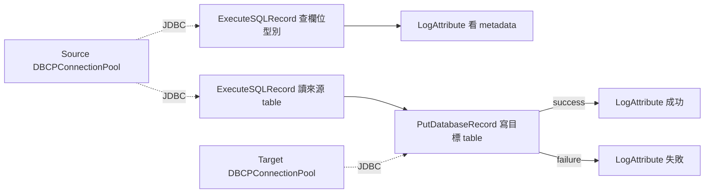
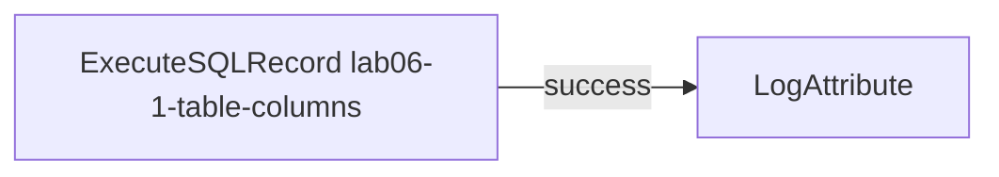
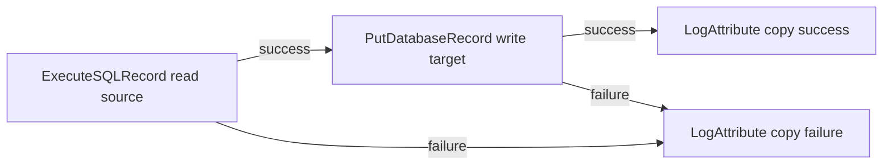
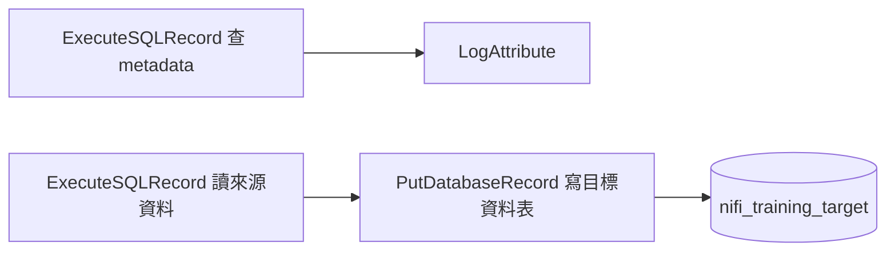

# Lab 06-1：從 MSSQL 讀取資料表資訊並複製資料

目標：用 `ExecuteSQLRecord` 從本地 MSSQL 查詢 table 欄位與型別，再把來源 table 的資料複製到另一個本地 database 的 table。

預估時間：60 分鐘。

## 你會做出什麼

本 Lab 會建立兩條資料流：



第一條 flow 會查 `INFORMATION_SCHEMA.COLUMNS`，讓你看到某個 table 的所有欄位與型別。

第二條 flow 會從 `nifi_training.dbo.nifi_training_orders` 讀資料，寫到 `nifi_training_target.dbo.nifi_training_orders_copy`。

## 官方確認的資料庫讀寫觀念

本 Lab 會用到：

| 元件 | 用途 |
| --- | --- |
| `ExecuteSQLRecord` | 執行 SQL query，將 ResultSet 轉成 FlowFile records |
| `PutDatabaseRecord` | 將 FlowFile records 寫入資料庫 table |
| `DBCPConnectionPool` | 管理 JDBC 連線與 driver 設定 |
| `CSVRecordSetWriter` | 將 SQL 查詢結果輸出成 CSV，方便用 `LogAttribute` 觀察 |

來源：

- https://nifi.apache.org/components/org.apache.nifi.processors.standard.ExecuteSQLRecord/
- https://nifi.apache.org/components/org.apache.nifi.processors.standard.PutDatabaseRecord/
- https://nifi.apache.org/components/org.apache.nifi.dbcp.DBCPConnectionPool/
- https://learn.microsoft.com/en-us/sql/relational-databases/system-information-schema-views/columns-transact-sql

## 前置條件

先完成 [Lab 06：本地 MSSQL 資料庫整合入門](06-00-database-integration.md)，並確認：

1. NiFi container 內看得到 `/tmp/mssql-jdbc.jar`。
2. 本地 MSSQL TCP port 可連線。
3. `nifi_training.dbo.nifi_training_orders` 已存在。
4. `nifi_training.dbo.nifi_training_orders` 至少有幾筆資料。

如果來源表沒有資料，可先在 SSMS 或 Azure Data Studio 執行：

```sql
USE nifi_training;
GO

INSERT INTO dbo.nifi_training_orders (order_id, customer, amount, status)
VALUES
    ('1001', 'Alice', 120.50, 'NEW'),
    ('1002', 'Bob', 35.00, 'CANCELLED'),
    ('1003', 'Carol', 520.00, 'PAID');
GO
```

說明：若你前面 Lab 已經插入過相同資料，這段可能會讓資料重複。因為 Lab 06 的 `order_id` 不是 primary key，重複資料不會被阻擋；正式環境是否允許重複，要看業務規則。

## Part 1：建立目標 database 與 table

這一段先在 MSSQL 建立另一個本地 database：`nifi_training_target`。

在 SSMS 或 Azure Data Studio 執行：

```sql
IF DB_ID(N'nifi_training_target') IS NULL
BEGIN
    CREATE DATABASE nifi_training_target;
END;
GO

USE nifi_training_target;
GO

IF OBJECT_ID(N'dbo.nifi_training_orders_copy', N'U') IS NULL
BEGIN
    CREATE TABLE dbo.nifi_training_orders_copy (
        TargetDbId INT IDENTITY(1,1) PRIMARY KEY,
        order_id VARCHAR(20),
        customer VARCHAR(100),
        amount DECIMAL(12, 2),
        status VARCHAR(30),
        copied_at DATETIME2 DEFAULT SYSUTCDATETIME()
    );
END;
GO
```

如果你要重跑 Lab，可以清空目標表：

```sql
USE nifi_training_target;
GO

TRUNCATE TABLE dbo.nifi_training_orders_copy;
GO
```

說明：目標表使用 `TargetDbId` 當自增主鍵，不直接複製來源表的 `DbId`。這樣重跑練習時，不會因為來源主鍵值重複而卡住。

## Part 2：建立 Process Group

回到 NiFi UI，建立 `training-lab-06-1`，進入該 Process Group。

## Part 3：建立 Controller Services

在 Process Group 空白處右鍵，選 `Configure`，進入 `Controller Services`。

### Step 1：建立 Source DBCPConnectionPool

建立 Controller Service：`DBCPConnectionPool`。

命名或註解成 `DBCPConnectionPool-source-nifi-training`。

設定：

| Property | Value |
| --- | --- |
| `Database Connection URL` | `jdbc:sqlserver://host.docker.internal:1433;databaseName=nifi_training;encrypt=true;trustServerCertificate=true;` |
| `Database Driver Class Name` | `com.microsoft.sqlserver.jdbc.SQLServerDriver` |
| `Database Driver Locations` | `/tmp/mssql-jdbc.jar` |
| `Database User` | 你的 SQL Server 驗證帳號 |
| `Password` | 你的 SQL Server 驗證密碼 |

如果你本機 MSSQL 使用動態 port，把 `1433` 改成 Lab 06 確認到的 port。

Enable。

### Step 2：建立 Target DBCPConnectionPool

再建立一個 `DBCPConnectionPool`。

命名或註解成 `DBCPConnectionPool-target-nifi-training-target`。

設定：

| Property | Value |
| --- | --- |
| `Database Connection URL` | `jdbc:sqlserver://host.docker.internal:1433;databaseName=nifi_training_target;encrypt=true;trustServerCertificate=true;` |
| `Database Driver Class Name` | `com.microsoft.sqlserver.jdbc.SQLServerDriver` |
| `Database Driver Locations` | `/tmp/mssql-jdbc.jar` |
| `Database User` | 你的 SQL Server 驗證帳號 |
| `Password` | 你的 SQL Server 驗證密碼 |

Enable。

說明：這裡故意用兩個 DBCPConnectionPool，讓你清楚分辨來源 database 與目標 database。公司專案若來源與目標是不同 server，更應該分開設定。

### Step 3：建立 CSVRecordSetWriter

建立 Controller Service：`CSVRecordSetWriter`。

命名或註解成 `CSVRecordSetWriter-db-result`。

設定：

| Property | Value |
| --- | --- |
| `Schema Access Strategy` | `Inherit Record Schema` |
| `Schema Write Strategy` | `Do Not Write Schema` |
| `Include Header Line` | `true` |

Enable。

說明：`ExecuteSQLRecord` 查詢 DB 後會產生 records，這個 writer 負責把 records 寫成 CSV，方便 `LogAttribute` 直接看內容。

### Step 4：建立 CSVReader

建立 Controller Service：`CSVReader`。

命名或註解成 `CSVReader-db-result`。

設定：

| Property | Value |
| --- | --- |
| `Schema Access Strategy` | `Infer Schema` |
| `CSV Format` | `RFC 4180` 或預設值 |

Enable。

說明：`PutDatabaseRecord` 需要 Record Reader 讀取上游 FlowFile content。這裡上游 `ExecuteSQLRecord` 會輸出 CSV，所以使用 `CSVReader`。

## Part 4：查詢 table 欄位與型別

### Step 1：新增 ExecuteSQLRecord

新增 Processor：`ExecuteSQLRecord`。

命名或註解成 `lab06-1-table-columns`。

設定：

| Property | Value |
| --- | --- |
| `Database Connection Pooling Service` | `DBCPConnectionPool-source-nifi-training` |
| `Record Writer` | `CSVRecordSetWriter-db-result` |
| `SQL select query` | 使用下方 SQL |

```sql
SELECT
    ORDINAL_POSITION,
    COLUMN_NAME,
    DATA_TYPE,
    CHARACTER_MAXIMUM_LENGTH,
    NUMERIC_PRECISION,
    NUMERIC_SCALE,
    IS_NULLABLE
FROM INFORMATION_SCHEMA.COLUMNS
WHERE TABLE_SCHEMA = 'dbo'
  AND TABLE_NAME = 'nifi_training_orders'
ORDER BY ORDINAL_POSITION
```

設定 `Scheduling`：

| Setting | Value |
| --- | --- |
| `Run Schedule` | `60 sec` |
| `Concurrent Tasks` | `1` |

### Step 2：新增 LogAttribute

新增 Processor：`LogAttribute`。

命名或註解成 `lab06-1-table-columns-log`。

設定：

| Property | Value |
| --- | --- |
| `Log Prefix` | `lab06-1-table-columns` |
| `Log Payload` | `true` |

### Step 3：連線與執行

連線：



Auto-terminate：

- `ExecuteSQLRecord` 的 `failure`
- `lab06-1-table-columns-log` 的 `success`

執行：

1. Start `lab06-1-table-columns-log`。
2. Start `lab06-1-table-columns`。
3. 等一筆查詢結果送出後，停止 `lab06-1-table-columns`。
4. 查看 log：

```powershell
docker compose logs --tail=220 nifi
```

你應該看到類似：

```csv
ORDINAL_POSITION,COLUMN_NAME,DATA_TYPE,CHARACTER_MAXIMUM_LENGTH,NUMERIC_PRECISION,NUMERIC_SCALE,IS_NULLABLE
1,DbId,int,,10,0,NO
2,order_id,varchar,20,,,YES
3,customer,varchar,100,,,YES
4,amount,decimal,,12,2,YES
5,status,varchar,30,,,YES
```

說明：這段是在查資料表 metadata，不是在查業務資料。公司專案常用它來確認來源表欄位名稱、型別、nullable 與欄位順序。

## Part 5：從來源 DB table 複製資料到目標 DB table

### Step 1：新增 ExecuteSQLRecord 讀來源資料

新增 Processor：`ExecuteSQLRecord`。

命名或註解成 `lab06-1-read-source-orders`。

設定：

| Property | Value |
| --- | --- |
| `Database Connection Pooling Service` | `DBCPConnectionPool-source-nifi-training` |
| `Record Writer` | `CSVRecordSetWriter-db-result` |
| `SQL select query` | 使用下方 SQL |

```sql
SELECT
    order_id,
    customer,
    amount,
    status
FROM dbo.nifi_training_orders
ORDER BY DbId
```

設定 `Scheduling`：

| Setting | Value |
| --- | --- |
| `Run Schedule` | `60 sec` |
| `Concurrent Tasks` | `1` |

說明：這裡刻意不查來源表的 `DbId`，因為目標表有自己的 `TargetDbId` identity 欄位。跨 DB 複製資料時，不要不經思考就把來源主鍵硬塞到目標表。

### Step 2：新增 PutDatabaseRecord 寫入目標 table

新增 Processor：`PutDatabaseRecord`。

命名或註解成 `lab06-1-write-target-orders`。

設定：

| Property | Value |
| --- | --- |
| `Record Reader` | `CSVReader-db-result` |
| `Database Connection Pooling Service` | `DBCPConnectionPool-target-nifi-training-target` |
| `Database Type` | `MS SQL 2012+` |
| `Database Name` | `nifi_training_target` |
| `Schema Name` | `dbo` |
| `Table Name` | `nifi_training_orders_copy` |
| `Statement Type` | `INSERT` |

注意：和 Lab 06 一樣，MSSQL 的 database、schema、table 要分開填。不要把 `dbo.nifi_training_orders_copy` 全部填到 `Table Name`。

### Step 3：新增成功與失敗 LogAttribute

新增 `LogAttribute`，命名或註解成 `lab06-1-copy-success`。

設定：

| Property | Value |
| --- | --- |
| `Log Prefix` | `lab06-1-copy-success` |
| `Log Payload` | `false` |

新增 `LogAttribute`，命名或註解成 `lab06-1-copy-failure`。

設定：

| Property | Value |
| --- | --- |
| `Log Prefix` | `lab06-1-copy-failure` |
| `Log Payload` | `true` |

### Step 4：連線與 Auto-terminate

連線：



Auto-terminate：

- `lab06-1-copy-success` 的 `success`
- `lab06-1-copy-failure` 的 `success`

說明：這次不要 auto-terminate `PutDatabaseRecord` 的 `failure`。DB 寫入失敗時，先讓 failure path 進 `LogAttribute`，才能看到 table、欄位、型別或權限錯誤。

### Step 5：執行與驗證

1. Start `lab06-1-copy-success`。
2. Start `lab06-1-copy-failure`。
3. Start `lab06-1-write-target-orders`。
4. Start `lab06-1-read-source-orders`。
5. 等一筆查詢結果送出後，停止 `lab06-1-read-source-orders`。
6. 到 MSSQL 查目標 table：

```sql
USE nifi_training_target;
GO

SELECT *
FROM dbo.nifi_training_orders_copy
ORDER BY TargetDbId;
```

你應該看到來源 table 的 `order_id`、`customer`、`amount`、`status` 被寫到目標 table。

## 練習題

### 練習 1：只複製特定狀態

這一題沿用 Part 5 的 flow。先停止 `lab06-1-read-source-orders`。

修改 Processor：`lab06-1-read-source-orders`

把 SQL 改成：

```sql
SELECT
    order_id,
    customer,
    amount,
    status
FROM dbo.nifi_training_orders
WHERE status = 'CANCELLED'
ORDER BY DbId
```

重新執行後，查目標 table 是否只新增 `CANCELLED` 資料。

### 練習 2：查另一張 table 的欄位 metadata

這一題沿用 Part 4 的 flow。先停止 `lab06-1-table-columns`。

修改 `SQL select query`：

```sql
SELECT
    TABLE_SCHEMA,
    TABLE_NAME,
    ORDINAL_POSITION,
    COLUMN_NAME,
    DATA_TYPE,
    IS_NULLABLE
FROM INFORMATION_SCHEMA.COLUMNS
WHERE TABLE_NAME = 'nifi_training_orders_copy'
ORDER BY TABLE_SCHEMA, TABLE_NAME, ORDINAL_POSITION
```

若你要查目標 database 的 table metadata，記得把 `lab06-1-table-columns` 的 `Database Connection Pooling Service` 改成 `DBCPConnectionPool-target-nifi-training-target`。

## 常見錯誤

### 查不到欄位 metadata

現象：

- `ExecuteSQLRecord` 成功，但 log 只有 header 或沒有資料列。

處理：

1. 確認 DBCPConnectionPool 連到正確 database。
2. 確認 `TABLE_SCHEMA` 與 `TABLE_NAME` 正確。
3. 在 SSMS 執行同一段 SQL 確認是否查得到。

### PutDatabaseRecord 找不到目標 table

現象：

```text
Table dbo.nifi_training_orders_copy not found
```

處理：

1. 確認 `nifi_training_target` database 已建立。
2. 確認 `dbo.nifi_training_orders_copy` table 已建立。
3. 在 `PutDatabaseRecord` 分開設定：

| Property | Value |
| --- | --- |
| `Database Name` | `nifi_training_target` |
| `Schema Name` | `dbo` |
| `Table Name` | `nifi_training_orders_copy` |

### 欄位對不上

現象：

- DB 寫入失敗。
- bulletin 或 log 提到 record field 無法對應 table column。

處理：

1. 確認 `ExecuteSQLRecord` 的 SELECT 欄位名稱和目標 table 欄位名稱一致。
2. 不要 SELECT 來源表的 `DbId`，除非目標 table 也有同名欄位且允許寫入。
3. 確認型別可轉換，例如 `amount` 可以寫入 `DECIMAL(12,2)`。

### 重跑後目標 table 多出重複資料

原因：

- 本 Lab 使用 `INSERT`，每次執行都會新增資料。

處理：

- 練習時可先 `TRUNCATE TABLE dbo.nifi_training_orders_copy`。
- 正式專案要評估唯一鍵、upsert、merge 或去重流程。

## 完成檢查

- 你知道可以用 `ExecuteSQLRecord` 查 DB metadata。
- 你知道 `INFORMATION_SCHEMA.COLUMNS` 可以查 table 欄位名稱、型別與 nullable。
- 你知道 `ExecuteSQLRecord` 可以把 DB 查詢結果輸出成 FlowFile records。
- 你知道 `PutDatabaseRecord` 可以把上游 records 寫入另一個 DB table。
- 你知道來源 DB 與目標 DB 建議用不同 DBCPConnectionPool 表示清楚。
- 你知道複製資料時不要不經思考直接複製來源 identity primary key。

## 本 Lab 的學習重點回顧

這個 Lab 建立的是 database read and copy flow：



整個流程的意思是：

1. `ExecuteSQLRecord` 可以執行 SQL query。
2. 查 `INFORMATION_SCHEMA.COLUMNS` 可以把 table 欄位與型別輸出成 records。
3. 查業務 table 可以把資料列輸出成 FlowFile records。
4. `PutDatabaseRecord` 讀取這些 records，寫到目標 database 的 table。
5. `DBCPConnectionPool` 讓來源與目標連線設定清楚分離。

做完後你要理解：

- NiFi 不只可以寫 DB，也可以讀 DB 查詢結果。
- table schema 可以先查出來再設計 mapping，不要盲目寫入。
- 跨 database 複製時，要明確處理來源欄位、目標欄位、identity 欄位與重跑重複資料問題。
