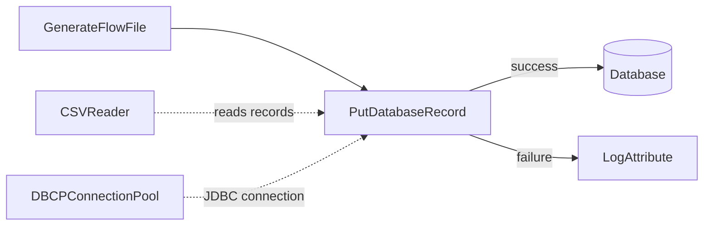
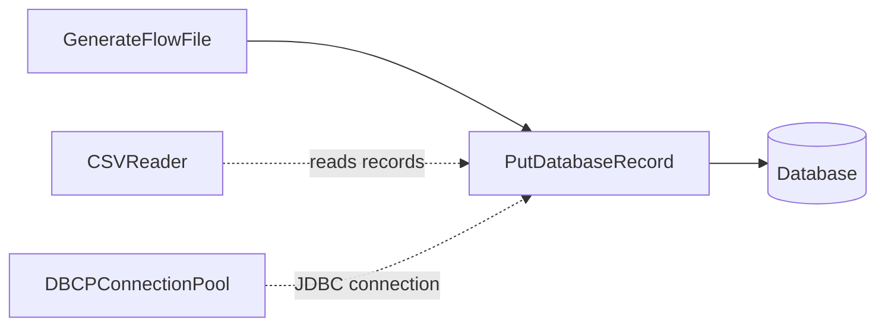

# Lab 06：本地 MSSQL 資料庫整合入門

目標：理解 NiFi 如何透過 `DBCPConnectionPool` 管理 MSSQL JDBC 連線，並用 `PutDatabaseRecord` 將 records 寫入本地 MSSQL。

預估時間：45 至 60 分鐘。

這一章會分成兩段：

- A 段：在目前專案環境確認 JDBC driver 掛載。
- B 段：用本地 MSSQL 測試資料庫實作 `PutDatabaseRecord`。

## 你會做出什麼



`CSVReader` 負責讀取 CSV records，`DBCPConnectionPool` 負責提供資料庫連線，`PutDatabaseRecord` 負責把 records 寫入資料表。失敗路徑會先接到 `LogAttribute`，方便你看到 DB 錯誤。

## A 段：確認 JDBC driver

NiFi container 內必須看得到 MSSQL JDBC driver jar，`DBCPConnectionPool` 才能載入 SQL Server driver。

先釐清一個容易誤會的觀念：NiFi 確實是透過 `Database Connection URL` 這種連線字串連到資料庫，但連線字串不能取代 JDBC driver。連線字串只描述「要連到哪一台資料庫、哪個 database、使用哪些連線參數」；JDBC driver 才是 NiFi 用來理解 SQL Server 協定並建立連線的 Java library。

所以 MSSQL 連線需要三個東西一起成立：

| 設定 | 作用 |
| --- | --- |
| `Database Connection URL` | MSSQL 連線字串，例如 host、port、database name、TLS 參數 |
| `Database Driver Class Name` | 指定要用哪個 Java driver class |
| `Database Driver Locations` | 指定 driver jar 在 NiFi container 內的位置 |

本 Lab 建議使用 Microsoft JDBC Driver for SQL Server。下載時可搜尋：

```text
download microsoft jdbc driver for sql server
```

下載後，把 driver jar 放到專案根目錄，例如：

```text
mssql-jdbc-13.4.0.jre11.jar
```

接著在 `docker-compose.yaml` 的 `nifi.volumes` 加上這一行：

```yaml
- "./mssql-jdbc-13.4.0.jre11.jar:/tmp/mssql-jdbc.jar"
```

如果你使用不同版本的 driver jar，左邊檔名要跟實際檔名一致；右邊 container 內路徑建議固定成 `/tmp/mssql-jdbc.jar`，後面 DBCP 設定比較簡單。

修改 volume 後重建 NiFi container：

```powershell
docker compose up -d nifi
```

用 PowerShell 確認 NiFi container 內看得到 driver：

```powershell
docker exec nifi-service sh -lc "ls -l /tmp/mssql-jdbc.jar"
```

`DBCPConnectionPool` 的 `Database Driver Locations` 要填 container 內路徑，也就是 `/tmp/mssql-jdbc.jar`，不是 Windows 主機上的檔案路徑。

只要 NiFi 成功透過這組設定寫入本地 MSSQL，你在 SSMS 或 Azure Data Studio 查 `dbo.nifi_training_orders` 就會直接看到資料。差別只是：NiFi 到 MSSQL 的連線方式是 JDBC；你在 MSSQL 工具看到的是同一張資料表的結果。

官方文件依據：

- Microsoft JDBC Driver for SQL Server：https://learn.microsoft.com/en-us/sql/connect/jdbc/microsoft-jdbc-driver-for-sql-server
- SQL Server JDBC connection URL 與 driver class：https://learn.microsoft.com/en-us/sql/connect/jdbc/using-the-jdbc-driver

## B 段：實作 CSV 寫入本地 MSSQL

以下步驟都在 `training-lab-06` Process Group 內進行。先建立 Process Group，再建立 Controller Service，避免新手不知道 service 應該放在哪一層。

## Step 1：建立 Process Group

建立 `training-lab-06`，進入該 Process Group。

## Step 2：建立 DBCPConnectionPool

在 Process Group 空白處右鍵，選 `Configure`，進入 `Controller Services`。

建立 Controller Service：`DBCPConnectionPool`。

本 Lab 假設 MSSQL 安裝在 Windows 本機，並開啟 TCP `1433`。NiFi 跑在 Docker container 內，所以連 Windows 主機上的 MSSQL 時，host 建議用 `host.docker.internal`，不要用 `localhost`。

設定：

| Property | MSSQL 本地範例 |
| --- | --- |
| `Database Connection URL` | `jdbc:sqlserver://host.docker.internal:1433;databaseName=nifi_training;encrypt=true;trustServerCertificate=true;` |
| `Database Driver Class Name` | `com.microsoft.sqlserver.jdbc.SQLServerDriver` |
| `Database Driver Locations` | `/tmp/mssql-jdbc.jar` |
| `Database User` | 你的 MSSQL 登入帳號 |
| `Password` | 你的 MSSQL 密碼 |

這裡的「連線字串」就是 `Database Connection URL`。它是必要設定，但不是唯一設定；如果沒有 MSSQL JDBC driver jar，NiFi 仍然無法理解 `jdbc:sqlserver://...` 這種 URL。

如果你的 MSSQL 也是 Docker container，且和 NiFi 在同一個 Docker network，host 要改成 MSSQL service name，例如：

```text
jdbc:sqlserver://sqlserver:1433;databaseName=nifi_training;encrypt=true;trustServerCertificate=true;
```

`trustServerCertificate=true` 只適合本地練習或測試環境，目的是避開自簽憑證驗證問題。公司正式環境應依 DBA 或資安規範設定 TLS 憑證。

設定完成後，按 `Enable`。如果 Enable 失敗，先看錯誤訊息，通常是 URL、driver class、driver jar path、帳密或網路連線問題。

## Step 3：建立 CSV Reader

建立 `CSVReader`：

| Property | Value |
| --- | --- |
| `Schema Access Strategy` | 建議正式環境用明確 schema；練習可先用 `Infer Schema` |

Enable。

## Step 4：準備資料表

目標資料表範例：

```sql
IF DB_ID(N'nifi_training') IS NULL
BEGIN
    CREATE DATABASE nifi_training;
END;
GO

USE nifi_training;
GO

IF OBJECT_ID(N'dbo.nifi_training_orders', N'U') IS NULL
BEGIN
    CREATE TABLE dbo.nifi_training_orders (
        order_id VARCHAR(20) PRIMARY KEY,
        customer VARCHAR(100),
        amount DECIMAL(12, 2),
        status VARCHAR(30)
    );
END;
GO
```

如果你重跑 Lab 時遇到 primary key 重複，可以先清空練習資料：

```sql
USE nifi_training;
GO

TRUNCATE TABLE dbo.nifi_training_orders;
GO
```

正式環境請不要直接用 production table 練習。先用 sandbox database、sandbox schema 或本地 MSSQL。

資料表欄位：

| 欄位 | 型別 | 說明 |
| --- | --- | --- |
| `order_id` | `VARCHAR(20)` | 主鍵，對應 CSV 的 `order_id` |
| `customer` | `VARCHAR(100)` | 對應 CSV 的 `customer` |
| `amount` | `DECIMAL(12, 2)` | 對應 CSV 的 `amount` |
| `status` | `VARCHAR(30)` | 對應 CSV 的 `status` |

## Step 5：建立 GenerateFlowFile

設定：

- `Run Schedule`：`60 sec`
- `Custom Text`：

```csv
order_id,customer,amount,status
1001,Alice,120.50,NEW
1002,Bob,35.00,CANCELLED
```

## Step 6：建立 PutDatabaseRecord

新增 Processor：`PutDatabaseRecord`。

設定：

| Property | Value |
| --- | --- |
| `Record Reader` | 選 `CSVReader` |
| `Database Connection Pooling Service` | 選 `DBCPConnectionPool` |
| `Table Name` | `dbo.nifi_training_orders` |
| `Statement Type` | `INSERT` |

Auto-terminate：

- `PutDatabaseRecord` 的 `success` 可以先 auto-terminate。
- `PutDatabaseRecord` 的 `failure` 先連到 `LogAttribute`，不要一開始就 auto-terminate，方便排錯。

建議練習做法：

1. 新增一個 `LogAttribute`，命名或註解成 `lab06-db-failure`。
2. 設定 `Log Prefix = lab06-db-failure`。
3. 設定 `Log Payload = true`。
4. 將 `PutDatabaseRecord` 的 `failure` relationship 連到這個 `LogAttribute`。
5. 將 `lab06-db-failure` 的 `success` auto-terminate。

成功路徑可以先 auto-terminate，因為資料已寫入資料庫；失敗路徑先保留觀察，方便看 DB 錯誤訊息。

## Step 7：執行與驗證

1. Start `lab06-db-failure` 這個 `LogAttribute`。
2. Start `PutDatabaseRecord`。
3. Start `GenerateFlowFile`。
4. 等一筆資料送出後，停止 `GenerateFlowFile`。
5. 到 DB 查詢：

```sql
SELECT * FROM dbo.nifi_training_orders;
```

## 常見錯誤與排查

### Controller Service disabled

現象：

```text
Controller Service with ID ... is disabled
```

處理：

1. 回到 Process Group 的 Controller Services。
2. 找到 `DBCPConnectionPool` 或 `CSVReader`。
3. 修正設定。
4. Enable。
5. 回 Processor 觀察 invalid 狀態是否消失；若仍 invalid，將滑鼠移到警告圖示上查看 validation errors。

### 找不到 JDBC driver

處理：

1. 確認 jar 是否存在於 container。
2. 確認 `Database Driver Locations` 是 container 內路徑，不是 Windows 主機路徑。
3. 確認 `Database Driver Class Name` 是 `com.microsoft.sqlserver.jdbc.SQLServerDriver`。

### localhost 連不到 MSSQL

現象：

```text
The TCP/IP connection to the host localhost, port 1433 has failed
```

處理：

1. NiFi 在 container 內，`localhost` 代表 NiFi container 自己，不是 Windows 主機。
2. 若 MSSQL 裝在 Windows 本機，URL host 改成 `host.docker.internal`。
3. 確認 MSSQL 已啟用 TCP/IP，並監聽 `1433`。
4. 確認 Windows 防火牆允許本機 Docker 連線。

### TLS 或憑證錯誤

本地練習可先在 JDBC URL 加上：

```text
encrypt=true;trustServerCertificate=true;
```

正式環境不要直接照抄這個設定，應依公司憑證與資安規範處理。

### primary key 重複

如果重複執行同一批測試 CSV，MSSQL 會因為 `order_id` 主鍵重複而拒絕寫入。

處理：

1. 練習時先 `TRUNCATE TABLE dbo.nifi_training_orders;`。
2. 或把 `PutDatabaseRecord` 的 `Statement Type` 改成公司實際需要的策略，例如 update/upsert 類流程。

### 欄位對不上

處理：

1. CSV header 名稱要能對應資料表欄位。
2. 欄位型別要能被 DB 轉換。
3. 若有多餘欄位，先用 QueryRecord 或 UpdateRecord 整理。

## 完成檢查

- 你知道 JDBC jar 必須在 NiFi container 裡可讀。
- 你知道 NiFi 連 MSSQL 是透過 JDBC：連線字串負責描述目標，driver 負責實際建立連線。
- 你知道 DBCPConnectionPool 是共用 MSSQL 連線設定。
- 你知道 PutDatabaseRecord 用 RecordReader 讀取 FlowFile content。
- 你知道 NiFi container 連 Windows 本機 MSSQL 時，通常要用 `host.docker.internal`。
- 你知道 NiFi 寫入成功後，可直接在 SSMS 或 Azure Data Studio 查到同一張 MSSQL 資料表。
- 你知道正式環境應先用 sandbox table 驗證。

## 本 Lab 的學習重點回顧

這個 Lab 建立的是 CSV to database flow：



整個流程的意思是：

1. `GenerateFlowFile` 產生一份 CSV 訂單資料。
2. `CSVReader` 把 CSV content 解析成 records。
3. `DBCPConnectionPool` 提供 JDBC 連線設定與連線池。
4. `PutDatabaseRecord` 根據 records 與 table name 產生 SQL 寫入資料庫。
5. 寫入成功走 `success`，寫入失敗走 `failure`。

這個 Lab 模擬公司專案常見情境：從檔案、API 或上游系統取得資料後，整理成 records，再寫入 MSSQL。

做完後你要理解：

- NiFi 寫 DB 通常不是 Processor 自己保存全部連線資訊，而是透過 `DBCPConnectionPool`。
- `Database Connection URL` 是連線字串，但不能取代 JDBC driver。
- JDBC jar path 必須是 container 內路徑，不是 Windows 主機路徑。
- 本地 MSSQL 從 NiFi container 連線時，通常用 `host.docker.internal:1433`。
- CSV header、record 欄位與資料表欄位需要對得上。
- DB 寫入流程一定要設計 failure path，否則 production 排錯會很困難。
