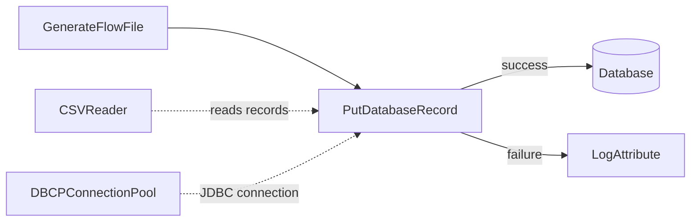
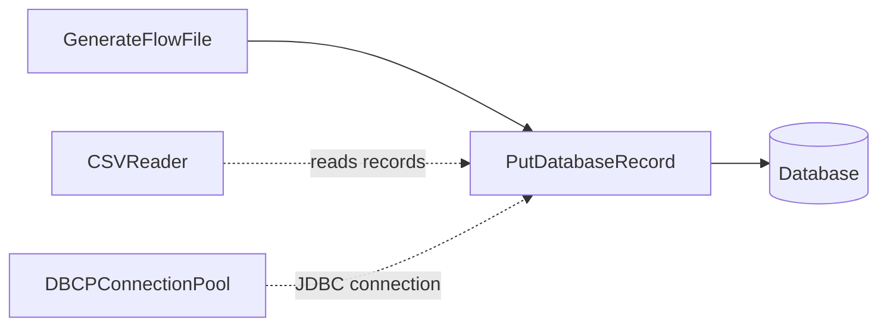

# Lab 06：資料庫整合入門

目標：理解 NiFi 如何透過 `DBCPConnectionPool` 管理 JDBC 連線，並用 `PutDatabaseRecord` 將 records 寫入資料庫。

預估時間：45 至 60 分鐘。

這一章會分成兩段：

- A 段：在目前專案環境確認 JDBC driver 掛載。
- B 段：用公司或本機測試資料庫實作 `PutDatabaseRecord`。

## 你會做出什麼



`CSVReader` 負責讀取 CSV records，`DBCPConnectionPool` 負責提供資料庫連線，`PutDatabaseRecord` 負責把 records 寫入資料表。失敗路徑會先接到 `LogAttribute`，方便你看到 DB 錯誤。

## A 段：確認 JDBC driver

目前 `docker-compose.yaml` 已把 JDBC jar 掛進 NiFi container：

```text
/tmp/aws_athena_jdbc.jar
/tmp/aws_redshift_jdbc.jar
/tmp/mysql-connector-java-8.0.26.jar
```

用 PowerShell 確認：

```powershell
docker exec nifi-service sh -lc "ls -l /tmp/*jdbc*.jar /tmp/mysql-connector-java-8.0.26.jar 2>/dev/null"
```

`DBCPConnectionPool` 的 `Database Driver Locations` 可以填這些 container 內路徑。

## B 段：實作 CSV 寫入資料庫

以下步驟都在 `training-lab-06` Process Group 內進行。先建立 Process Group，再建立 Controller Service，避免新手不知道 service 應該放在哪一層。

## Step 1：建立 Process Group

建立 `training-lab-06`，進入該 Process Group。

## Step 2：建立 DBCPConnectionPool

在 Process Group 空白處右鍵，選 `Configure`，進入 `Controller Services`。

建立 Controller Service：`DBCPConnectionPool`。

常用設定：

| Property | MySQL 範例 |
| --- | --- |
| `Database Connection URL` | `jdbc:mysql://<host>:3306/<database>?useSSL=false&serverTimezone=UTC` |
| `Database Driver Class Name` | `com.mysql.cj.jdbc.Driver` |
| `Database Driver Locations` | `/tmp/mysql-connector-java-8.0.26.jar` |
| `Database User` | 依公司環境 |
| `Password` | 依公司環境 |

Redshift 範例：

| Property | Redshift 範例 |
| --- | --- |
| `Database Connection URL` | `jdbc:redshift://<host>:5439/<database>` |
| `Database Driver Locations` | `/tmp/aws_redshift_jdbc.jar` |

Athena 範例：

| Property | Athena 範例 |
| --- | --- |
| `Database Driver Locations` | `/tmp/aws_athena_jdbc.jar` |

實際 JDBC URL 與 driver class 以公司提供的 driver 文件為準。

設定完成後，按 `Enable`。如果 Enable 失敗，先看錯誤訊息，通常是 URL、driver class、driver jar path、帳密或網路連線問題。

## Step 3：建立 CSV Reader

建立 `CSVReader`：

| Property | Value |
| --- | --- |
| `Schema Access Strategy` | 建議正式環境用明確 schema；練習可先用 `Infer Schema` |

Enable。

## Step 4：準備資料表

目標資料表範例：

```sql
CREATE TABLE nifi_training_orders (
    order_id VARCHAR(20) PRIMARY KEY,
    customer VARCHAR(100),
    amount DECIMAL(12, 2),
    status VARCHAR(30)
);
```

正式環境請不要直接用 production table 練習。先用 sandbox schema 或測試資料庫。

## Step 5：建立 GenerateFlowFile

設定：

- `Run Schedule`：`60 sec`
- `Custom Text`：

```csv
order_id,customer,amount,status
1001,Alice,120.50,NEW
1002,Bob,35.00,CANCELLED
```

## Step 6：建立 PutDatabaseRecord

新增 Processor：`PutDatabaseRecord`。

設定：

| Property | Value |
| --- | --- |
| `Record Reader` | 選 `CSVReader` |
| `Database Connection Pooling Service` | 選 `DBCPConnectionPool` |
| `Table Name` | `nifi_training_orders` |
| `Statement Type` | `INSERT` |

Auto-terminate：

- `PutDatabaseRecord` 的 `success` 可以先 auto-terminate。
- `PutDatabaseRecord` 的 `failure` 先連到 `LogAttribute`，不要一開始就 auto-terminate，方便排錯。

建議練習做法：

1. 新增一個 `LogAttribute`，命名或註解成 `lab06-db-failure`。
2. 設定 `Log Prefix = lab06-db-failure`。
3. 設定 `Log Payload = true`。
4. 將 `PutDatabaseRecord` 的 `failure` relationship 連到這個 `LogAttribute`。
5. 將 `lab06-db-failure` 的 `success` auto-terminate。

成功路徑可以先 auto-terminate，因為資料已寫入資料庫；失敗路徑先保留觀察，方便看 DB 錯誤訊息。

## Step 7：執行與驗證

1. Start `lab06-db-failure` 這個 `LogAttribute`。
2. Start `PutDatabaseRecord`。
3. Start `GenerateFlowFile`。
4. 等一筆資料送出後，停止 `GenerateFlowFile`。
5. 到 DB 查詢：

```sql
SELECT * FROM nifi_training_orders;
```

## 常見錯誤與排查

### Controller Service disabled

現象：

```text
Controller Service with ID ... is disabled
```

處理：

1. 回到 Process Group 的 Controller Services。
2. 找到 `DBCPConnectionPool` 或 `CSVReader`。
3. 修正設定。
4. Enable。
5. 回 Processor 按 `Perform Validation`。

### 找不到 JDBC driver

處理：

1. 確認 jar 是否存在於 container。
2. 確認 `Database Driver Locations` 是 container 內路徑，不是 Windows 主機路徑。
3. 確認 driver class name 正確。

### 欄位對不上

處理：

1. CSV header 名稱要能對應資料表欄位。
2. 欄位型別要能被 DB 轉換。
3. 若有多餘欄位，先用 QueryRecord 或 UpdateRecord 整理。

## 完成檢查

- 你知道 JDBC jar 必須在 NiFi container 裡可讀。
- 你知道 DBCPConnectionPool 是共用 DB 連線設定。
- 你知道 PutDatabaseRecord 用 RecordReader 讀取 FlowFile content。
- 你知道正式環境應先用 sandbox table 驗證。

## 本 Lab 的學習重點回顧

這個 Lab 建立的是 CSV to database flow：



整個流程的意思是：

1. `GenerateFlowFile` 產生一份 CSV 訂單資料。
2. `CSVReader` 把 CSV content 解析成 records。
3. `DBCPConnectionPool` 提供 JDBC 連線設定與連線池。
4. `PutDatabaseRecord` 根據 records 與 table name 產生 SQL 寫入資料庫。
5. 寫入成功走 `success`，寫入失敗走 `failure`。

這個 Lab 模擬公司專案常見情境：從檔案、API 或上游系統取得資料後，整理成 records，再寫入 MySQL、Redshift 或其他資料庫。

做完後你要理解：

- NiFi 寫 DB 通常不是 Processor 自己保存全部連線資訊，而是透過 `DBCPConnectionPool`。
- JDBC jar path 必須是 container 內路徑，不是 Windows 主機路徑。
- CSV header、record 欄位與資料表欄位需要對得上。
- DB 寫入流程一定要設計 failure path，否則 production 排錯會很困難。
