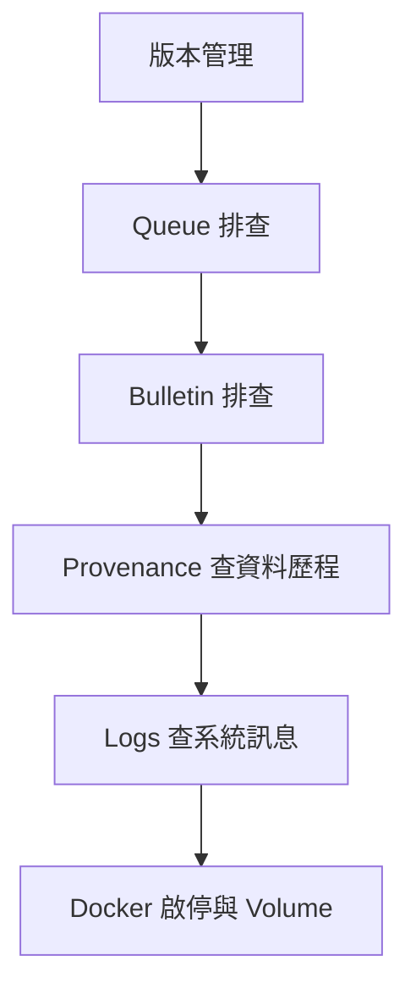
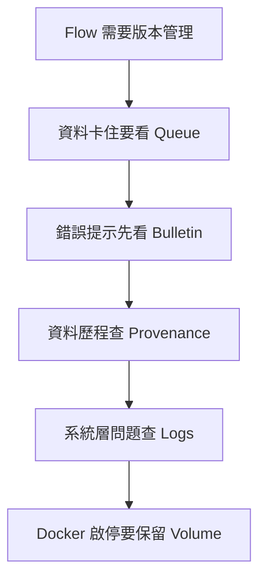

# Lab 07：版本管理、排錯與日常操作

目標：建立一套 NiFi 日常維護習慣，包含版本管理、queue 排查、provenance、bulletin、logs 與 Docker volume 注意事項。

預估時間：45 分鐘。

## 你會做出什麼



這一章不是建立新資料轉換流程，而是用前面 Lab 的流程練習日常維護。每個 Part 都會對應公司專案常見的排錯入口。

## Part 1：版本管理觀念

NiFi UI 上的 flow 會自動保存到 NiFi 的 flow 設定檔；你不需要按 Save。但公司專案不能只依賴單機檔案，應該使用版本管理流程。

你目前有啟動 NiFi Registry：

```text
http://localhost:18080/nifi-registry
```

注意：Apache 官方已公告 NiFi Registry 已 deprecated，NiFi 2 也有 Git-based Flow Registry Clients。若公司專案仍使用 NiFi Registry，先照公司既有流程；若是新專案，建議評估 Git-based Registry。

## Part 2：建立版本管理練習

1. 進入 NiFi Registry。
2. 建立 bucket，例如 `training`。
3. 回到 NiFi UI。
4. 在 root canvas 或指定 Process Group 設定 Registry Client。
5. 對 `training-lab-03` 或 `training-lab-04` 右鍵，選版本控制相關操作。
6. Commit 第一版，訊息輸入：

```text
initial training flow
```

7. 修改其中一個 Processor comment。
8. 觀察 Process Group 是否顯示 locally modified。
9. Commit 第二版。

實務上，commit message 要寫清楚資料流變更意圖，例如：

```text
route cancelled orders to rejection path
```

## Part 3：Queue 排查

當資料卡住時，先看 connection queue。

排查順序：

1. Queue 數量是否增加。
2. 下游 Processor 是否 stopped、invalid 或 disabled。
3. Queue 裡的 FlowFile attributes 是否如預期。
4. Content 是否為預期格式。
5. 是否有 back pressure。

練習：

1. 進入已完成的 `training-lab-04`。
2. 先確認 `training-lab-04` 沒有殘留 queue；若有測試資料，先清掉或讓下游處理完。
3. 修改 Processor：停止接在 `large_orders` 後面的 `LogAttribute`。
4. 保持上游 `GenerateFlowFile` 和 `QueryRecord` 可以執行。
5. 啟動上游一次，或短暫啟動 `GenerateFlowFile` 後立刻停止。
6. 觀察 `QueryRecord -> LogAttribute` 之間的 connection queue 是否出現數字。
7. 點 connection queue。
8. 使用 `List queue` 檢查 FlowFile。
9. 打開其中一筆 FlowFile，查看 `Attributes` 與 `Content`。
10. 重新啟動下游 `LogAttribute`。
11. 確認 queue 被清空。

這個練習的重點是：資料不是消失，而是停在 connection queue 等待下游 Processor 處理。

## Part 4：Bulletin 排查

Processor 右上角出現紅色或黃色提示時，先看 bulletin。

常見原因：

- Controller Service disabled。
- Relationship 沒處理。
- RecordReader schema 不符合 content。
- SQL 欄位不存在。
- DB 連線失敗。
- 權限不足或檔案路徑不存在。

處理方式：

1. 點 Processor 上的 bulletin icon。
2. 複製錯誤關鍵字。
3. 回到該 Processor 的 Properties 或 Controller Service。
4. 修正後按 `Perform Validation`。

## Part 5：Provenance 排查

Data Provenance 用來回答「這筆資料到底經過哪些處理」。

操作：

1. 從右上角 Global Menu 開啟 `Data Provenance`。
2. 查最近幾分鐘事件。
3. 點某筆 event 的 details。
4. 看三個重點：
   - `Details`：事件類型、component、時間。
   - `Attributes`：FlowFile metadata 在此步驟前後是否變化。
   - `Content`：必要時查看或下載內容。
5. 用 lineage 看資料流經過的路徑。

實務用途：

- 確認資料是否真的進入某個 Processor。
- 比對轉換前後 content。
- 查某筆資料在哪一步失敗。
- 重放資料做修正驗證。

## Part 6：Docker 日常操作

目前專案已使用 named volumes 保存 NiFi/Registry 資料。

日常啟停：

```powershell
docker compose stop
docker compose start
```

可以重建 container，但不要刪 volume：

```powershell
docker compose down
docker compose up -d
```

不要執行：

```powershell
docker compose down -v
docker volume prune
```

因為 `-v` 和 volume prune 可能移除資料 volume。

確認 volume 掛載：

```powershell
docker inspect nifi-service --format '{{range .Mounts}}{{.Destination}} -> {{.Name}}{{println}}{{end}}'
```

## Part 7：看 logs

NiFi：

```powershell
docker compose logs --tail=200 nifi
```

Registry：

```powershell
docker compose logs --tail=200 nifi-registry
```

跟隨 logs：

```powershell
docker compose logs -f nifi
```

## 完成檢查

- 你能解釋 queue、bulletin、provenance、logs 各自適合查什麼。
- 你知道 NiFi flow 會自動保存，但公司專案仍需要版本管理。
- 你知道日常啟停用 `stop/start`，不要刪 volume。
- 你知道 Registry 在 NiFi 2.x 的長期方向需要依公司策略確認。

## 本 Lab 的學習重點回顧

這個 Lab 不是建立單一資料處理 flow，而是建立 NiFi 的維護與排錯習慣。

整體重點是：



這個 Lab 模擬公司專案的日常維運情境：流程已經存在，但你需要知道誰改了 flow、資料卡在哪、哪一步失敗、是否可以安全重啟容器。

做完後你要理解：

- NiFi UI 上的 flow 會保存，但團隊協作仍需要版本管理。
- Queue 是資料卡住時的第一個觀察點。
- Bulletin 是 Processor 即時錯誤提示。
- Provenance 是追查單筆資料流向的主要工具。
- Docker named volume 是保護本機 NiFi 設定與 state 的關鍵。
