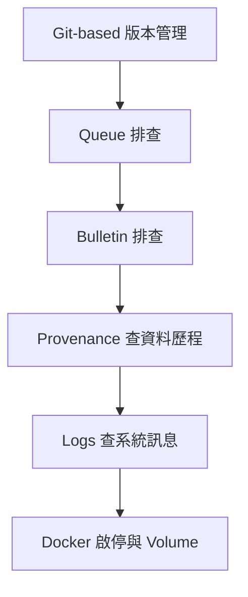
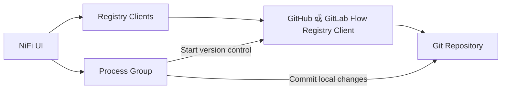
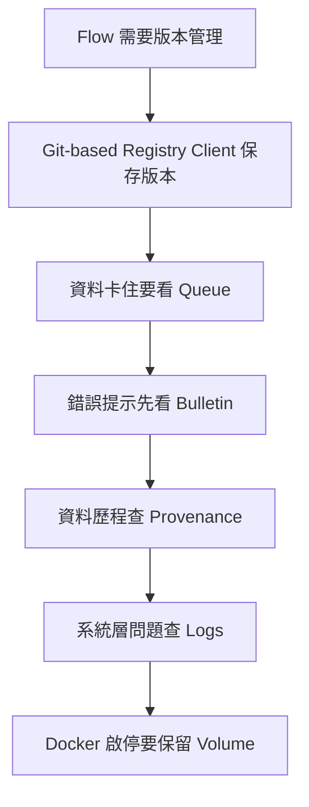

# Lab 07：版本管理、排錯與日常操作

目標：建立一套 NiFi 日常維護習慣，包含 Git-based 版本管理、queue 排查、provenance、bulletin、logs 與 Docker volume 注意事項。

預估時間：60 分鐘。

## 你會做出什麼



這一章不是建立新資料轉換流程，而是用前面 Lab 的流程練習日常維護。每個 Part 都會對應公司專案常見的版本管理或排錯入口。

## Part 1：版本管理觀念

NiFi UI 上的 flow 會自動保存到 NiFi 的 flow 設定檔；你不需要按 Save。但公司專案不能只依賴單機檔案，應該使用版本管理流程。

你目前有啟動 NiFi Registry：

```text
http://localhost:18080/nifi-registry
```

注意：Apache 官方已公告 NiFi Registry 已 deprecated，NiFi 2 也有 Git-based Flow Registry Clients。若公司專案仍使用 NiFi Registry，先照公司既有流程；若是新專案，建議優先學習 Git-based Flow Registry Clients。

這裡的 Git-based Flow Registry Clients 指的是 NiFi 本身可設定的 Registry Client，例如 GitHub、GitLab、Bitbucket 或 Azure DevOps 類型。它不是只有「自己寫程式打 NiFi API，然後把 JSON commit 到 Git」這種自訂流程；NiFi UI 的版本控制操作也可以透過這類 Registry Client 把 Process Group 版本保存到 Git 平台。

兩種做法要分清楚：

| 做法 | 說明 | 常見使用方式 |
| --- | --- | --- |
| NiFi UI + Git-based Flow Registry Client | 在 NiFi 設定 Registry Client，對 Process Group 做 version control，底層保存到 Git 平台 | 新版 NiFi 建議評估 |
| NiFi API + Git | 自己寫程式呼叫 NiFi API 匯出 flow definition，再用程式 commit 到 Git | 客製化 CI/CD 或自動化流程 |

兩者都可能用到 Git，但第一種是 NiFi 內建版本控制整合；第二種是團隊自行設計的外部自動化流程。

## Part 2：本機 NiFi Registry 版本管理練習

這段練習保留給「公司既有專案仍使用 NiFi Registry」的情境。若你是新專案，仍建議看完操作概念後，接著做 Part 3 的 Git-based 練習。

1. 進入 NiFi Registry。
2. 建立 bucket，例如 `training`。
3. 回到 NiFi UI。
4. 在 root canvas 或指定 Process Group 設定 Registry Client。
5. 對 `training-lab-03` 或 `training-lab-04` 右鍵，選版本控制相關操作。
6. Commit 第一版，訊息輸入：

```text
initial training flow
```

7. 修改其中一個 Processor comment。
8. 觀察 Process Group 是否顯示 locally modified。
9. Commit 第二版。

實務上，commit message 要寫清楚資料流變更意圖，例如：

```text
route cancelled orders to rejection path
```

## Part 3：Git-based Flow Registry Client 練習

這段是本章最需要學的版本管理主線。你會在 NiFi UI 建立 Git-based Registry Client，然後對一個 Process Group 做 `Start version control`，讓版本保存到 Git 平台。



開始前先準備：

1. 一個獨立 Git repository，例如 `nifi-training-flows`。不要直接拿正式專案 repository 練習。
2. 建立 GitHub repository 時，建議勾選 `Add a README file`，讓 repository 一開始就有 `main` branch。
3. 一個可寫入該 repository 的 token。若你用 GitHub private repository，先照下一段 `Step 0` 建立 GitHub token。
4. 先完成前面任一個 Process Group，例如 `training-lab-03` 或 `training-lab-04`。

說明：Git-based Registry Client 是 NiFi 內建的版本控制整合，不是你自己在外面寫程式呼叫 NiFi API。你仍然在 NiFi UI 右鍵 Process Group 做版本控制，只是底層保存位置改成 Git 平台。

### Step 0：建立 GitHub Personal Access Token

如果你使用自己的 GitHub private repository，建議建立 `Fine-grained token`，不要用 classic token。Fine-grained token 可以限制只能存取指定 repository，練習時比較安全。

1. 登入 GitHub。
2. 右上角點你的頭像。
3. 進入 `Settings`。
4. 左側最下面進入 `Developer settings`。
5. 進入 `Personal access tokens` > `Fine-grained tokens`。
6. 點 `Generate new token`。
7. 設定基本資料：

| Setting | Value |
| --- | --- |
| `Token name` | `nifi-training-flow-registry` |
| `Expiration` | 練習可選 30 或 90 天 |
| `Resource owner` | 你的 GitHub 帳號 |
| `Repository access` | `Only select repositories` |
| `Selected repositories` | 你的 private repo，例如 `nifi-training-flows` |

8. 在 `Repository permissions` 找到 `Contents`。
9. 將 `Contents` 設為 `Read and write`。
10. 其他權限先不要開。
11. 點 `Generate token`。
12. GitHub 只會顯示 token 一次，立刻複製，下一步要貼到 NiFi 的 `Personal Access Token`。

說明：NiFi 需要讀取 repository 內容，也需要把 flow version commit 回 repository，所以 `Contents` 需要 `Read and write`。token 是敏感資訊，不要寫進課程文件、不要貼在聊天紀錄、不要 commit 到 Git。

如果你找不到 `Contents`：

1. 確認你進的是 `Fine-grained tokens`，不是 `Tokens (classic)`。
2. 確認已設定 `Repository access = Only select repositories`，並且已選到你的 private repo。
3. 確認你看的是 `Repository permissions`，不是 `Account permissions`。
4. 若畫面有搜尋框，輸入 `contents`。

### Step 1：新增 Git-based Registry Client

1. 打開 NiFi UI。
2. 點右上角 `Global Menu`。
3. 進入 `Controller Settings`。
4. 切到 `Registry Clients`。
5. 按右上角 `+`。
6. 依公司使用的平台選一種 type：
   - GitHub：`GitHubFlowRegistryClient`
   - GitLab：`GitLabFlowRegistryClient`
   - Bitbucket：`BitbucketFlowRegistryClient`
   - Azure DevOps：`AzureDevOpsFlowRegistryClient`
7. 名稱建議填：

```text
training-git-flow-registry
```

8. 按 `Add`。

說明：這一步只是把「NiFi 要連到哪一種 Flow Registry」註冊進 NiFi。真正的 Git repository、branch、token 會在下一步設定。

本課程目前 Docker 環境已確認有 `GitHubFlowRegistryClient` 與 `GitLabFlowRegistryClient`。若你在 UI 搜尋不到 Bitbucket 或 Azure DevOps 類型，先用 GitHub 或 GitLab 完成練習；正式專案再依公司 NiFi image 內實際安裝的 NAR 決定。

### Step 2：設定 GitHub 或 GitLab 連線

如果公司使用 GitHub，常見設定如下：

| Property | Value |
| --- | --- |
| `Authentication Type` | `Personal Access Token` |
| `Personal Access Token` | Step 0 建立的 GitHub token |
| `GitHub API URL` | `https://api.github.com/` |
| `Repository Owner` | repository owner 或 organization |
| `Repository Name` | 例如 `nifi-training-flows` |
| `Repository Path` | 例如 `flows`，也可以留空使用 repository root |
| `Default Branch` | `main` |
| `Parameter Context Values` | 練習可先用 `RETAIN`；正式專案依公司規範 |

如果公司使用 GitLab，常見設定如下：

| Property | Value |
| --- | --- |
| `Authentication Type` | `Access Token` |
| `Access Token` | 你的 GitLab token |
| `GitLab API URL` | GitLab 站台 URL，例如 `https://gitlab.com/` 或公司 GitLab URL |
| `GitLab API Version` | `V4` |
| `Repository Namespace` | group 或 namespace |
| `Repository Name` | 例如 `nifi-training-flows` |
| `Repository Path` | 例如 `flows`，也可以留空使用 repository root |
| `Default Branch` | `main` |
| `Parameter Context Values` | 練習可先用 `RETAIN`；正式專案依公司規範 |

設定後按 `Update`。

說明：GitHub 與 GitLab 的欄位名稱不同，所以不要硬套同一組欄位。GitHub 用 `Repository Owner`，GitLab 用 `Repository Namespace`。這和 Lab 06 的 MSSQL 設定原則一樣：NiFi UI 有分開提供 property，就依 property 語意分開填。

### Step 3：把 Process Group 納入 Git 版本控制

1. 回到 canvas。
2. 找到你已完成的 `training-lab-03` 或 `training-lab-04`。
3. 右鍵該 Process Group。
4. 選 `Version` > `Start version control`。
5. 在 `Registry` 選剛剛建立的 `training-git-flow-registry`。
6. 選擇或輸入保存位置。若 UI 出現 bucket、folder 或類似欄位，練習可使用 `training`。
7. Flow name 建議填：

```text
training-lab-04-query-record
```

8. Comment 填：

```text
initial git based version
```

9. 按 `Save`。

說明：NiFi 的版本控制單位是 Process Group，不是單一 Processor。root process group 不能直接納入版本控制，所以練習時要用 `training-lab-03`、`training-lab-04` 這類子 Process Group。

### Step 4：修改 Flow 並 commit 第二版

1. 進入剛剛納入版本控制的 Process Group。
2. 任選一個 Processor，打開設定。
3. 在 `Comments` 加上一句：

```text
git based registry training change
```

4. 按 `Apply`。
5. 回到該 Process Group 外層。
6. 觀察 Process Group 是否出現 `locally modified` 狀態。
7. 右鍵 Process Group。
8. 選 `Version` > `Commit local changes`。
9. Comment 填：

```text
document training processor comment change
```

10. 按 `Save` 或 `Commit`。

說明：這一步要觀察的是「NiFi UI 有偵測到本地 flow 已經和 Git 裡的版本不同」。正式專案中，commit message 不要只寫 `update`，要寫清楚改了哪條資料流與改動目的。

### Step 5：到 Git 平台確認結果

1. 打開 GitHub 或 GitLab repository。
2. 查看 commit history。
3. 確認有 NiFi 產生的 commit。
4. 查看 `Repository Path` 對應目錄，例如 `flows`。
5. 打開其中的 flow definition 檔案，確認它是 NiFi flow 版本資料，不是你手寫的 SQL 或程式碼。

說明：你不需要手動編輯這些 flow definition 檔案。日常開發通常是在 NiFi UI 調整 Process Group，再透過 version control commit。是否允許直接改 JSON、是否要走 merge request，要依公司流程決定。

常見錯誤：

- `Registry` 下拉選不到剛建立的 client：回到 `Controller Settings` > `Registry Clients`，確認 client 設定已 `Update` 且沒有 validation error。
- `Failed to list buckets: Path [] or Branch [refs/heads/main] not found`：通常是 GitHub repository 還是空的，沒有任何 commit，所以 `main` branch 尚不存在。到 GitHub repo 新增 `README.md` 並 commit 到 `main`，或確認 `Default Branch` 填的是 repo 實際存在的 branch 名稱。
- Token 驗證失敗：確認 token 沒過期，且對 repository 有寫入權限。
- Repository 找不到：確認 `Repository Owner`、`Repository Namespace`、`Repository Name` 沒填反。
- Commit 後 Git 平台沒有變化：確認 `Default Branch` 與 `Repository Path`，也確認 NiFi bulletin 是否有 Git API 錯誤。
- 不知道該選 GitHub 還是 GitLab：依公司 Git 平台選；公司若是 GitLab，就先練 `GitLabFlowRegistryClient`。

## Part 4：Queue 排查

當資料卡住時，先看 connection queue。

排查順序：

1. Queue 數量是否增加。
2. 下游 Processor 是否 stopped、invalid 或 disabled。
3. Queue 裡的 FlowFile attributes 是否如預期。
4. Content 是否為預期格式。
5. 是否有 back pressure。

練習：

1. 進入已完成的 `training-lab-04`。
2. 先確認 `training-lab-04` 沒有殘留 queue；若有測試資料，先清掉或讓下游處理完。
3. 修改 Processor：停止接在 `large_orders` 後面的 `LogAttribute`。
4. 保持上游 `GenerateFlowFile` 和 `QueryRecord` 可以執行。
5. 啟動上游一次，或短暫啟動 `GenerateFlowFile` 後立刻停止。
6. 觀察 `QueryRecord -> LogAttribute` 之間的 connection queue 是否出現數字。
7. 點 connection queue。
8. 使用 `List queue` 檢查 FlowFile。
9. 打開其中一筆 FlowFile，查看 `Attributes` 與 `Content`。
10. 重新啟動下游 `LogAttribute`。
11. 確認 queue 被清空。

這個練習的重點是：資料不是消失，而是停在 connection queue 等待下游 Processor 處理。

## Part 5：Bulletin 排查

Processor 右上角出現紅色或黃色提示時，先看 bulletin。

常見原因：

- Controller Service disabled。
- Relationship 沒處理。
- RecordReader schema 不符合 content。
- SQL 欄位不存在。
- DB 連線失敗。
- 權限不足或檔案路徑不存在。

處理方式：

1. 點 Processor 上的 bulletin icon。
2. 複製錯誤關鍵字。
3. 回到該 Processor 的 Properties 或 Controller Service。
4. 修正後按 `Apply`，再觀察 invalid 狀態或 bulletin 是否消失；若仍 invalid，將滑鼠移到警告圖示上查看 validation errors。

## Part 6：Provenance 排查

Data Provenance 用來回答「這筆資料到底經過哪些處理」。

操作：

1. 從右上角 Global Menu 開啟 `Data Provenance`。
2. 查最近幾分鐘事件。
3. 點某筆 event 的 details。
4. 看三個重點：
   - `Details`：事件類型、component、時間。
   - `Attributes`：FlowFile metadata 在此步驟前後是否變化。
   - `Content`：必要時查看或下載內容。
5. 用 lineage 看資料流經過的路徑。

實務用途：

- 確認資料是否真的進入某個 Processor。
- 比對轉換前後 content。
- 查某筆資料在哪一步失敗。
- 重放資料做修正驗證。

## Part 7：Docker 日常操作

目前專案已使用 named volumes 保存 NiFi/Registry 資料。

日常啟停：

```powershell
docker compose stop
docker compose start
```

可以重建 container，但不要刪 volume：

```powershell
docker compose down
docker compose up -d
```

不要執行：

```powershell
docker compose down -v
docker volume prune
```

因為 `-v` 和 volume prune 可能移除資料 volume。

確認 volume 掛載：

```powershell
docker inspect nifi-service --format '{{range .Mounts}}{{.Destination}} -> {{.Name}}{{println}}{{end}}'
```

## Part 8：看 logs

NiFi：

```powershell
docker compose logs --tail=200 nifi
```

Registry：

```powershell
docker compose logs --tail=200 nifi-registry
```

跟隨 logs：

```powershell
docker compose logs -f nifi
```

## 完成檢查

- 你能解釋 queue、bulletin、provenance、logs 各自適合查什麼。
- 你知道 NiFi flow 會自動保存，但公司專案仍需要版本管理。
- 你知道如何在 NiFi UI 新增 Git-based Flow Registry Client。
- 你知道 Git-based 版本控制的單位是 Process Group，不是單一 Processor。
- 你知道日常啟停用 `stop/start`，不要刪 volume。
- 你知道 Registry 在 NiFi 2.x 的長期方向需要依公司策略確認。

## 本 Lab 的學習重點回顧

這個 Lab 不是建立單一資料處理 flow，而是建立 NiFi 的維護與排錯習慣。

整體重點是：



這個 Lab 模擬公司專案的日常維運情境：流程已經存在，但你需要知道誰改了 flow、資料卡在哪、哪一步失敗、是否可以安全重啟容器。

做完後你要理解：

- NiFi UI 上的 flow 會保存，但團隊協作仍需要版本管理。
- Git-based Flow Registry Client 是 NiFi UI 版本控制操作的 Git backend。
- Queue 是資料卡住時的第一個觀察點。
- Bulletin 是 Processor 即時錯誤提示。
- Provenance 是追查單筆資料流向的主要工具。
- Docker named volume 是保護本機 NiFi 設定與 state 的關鍵。
