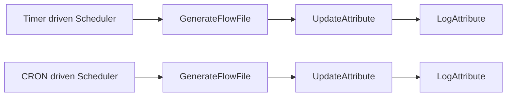
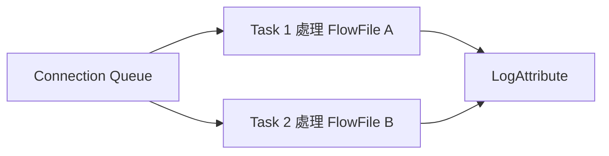
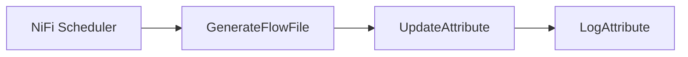

# Lab 08：Processor 排程與執行控制

目標：理解 NiFi Processor 的 `Scheduling` 分頁，能設定固定間隔排程、CRON 排程、併發數與執行節點策略。

預估時間：45 分鐘。

## 你會做出什麼

本 Lab 會建立兩條小流程：



第一條用固定間隔執行；第二條用 CRON 表達式模擬公司常見的批次排程。

## 官方確認的排程概念

NiFi 官方 User Guide 說明 Processor 的 `Scheduling` 分頁包含：

- `Scheduling Strategy`
- `Concurrent Tasks`
- `Run Schedule`
- `Execution`
- `Run Duration`

`Timer driven` 是預設模式，依 `Run Schedule` 固定間隔執行。`CRON driven` 也是週期性執行，但用 CRON 表達式提供更精細的時間控制。

官方文件也說明 `CRON driven` 的排程字串包含 6 個必要欄位與 1 個選用欄位：

```text
Seconds Minutes Hours Day-of-Month Month Day-of-Week Year(optional)
```

來源：https://nifi.apache.org/nifi-docs/user-guide.html

## Part 1：建立 Process Group

建立 `training-lab-08`，進入該 Process Group。

## Part 2：Timer Driven 固定間隔排程

### Step 1：新增 GenerateFlowFile

新增 Processor：`GenerateFlowFile`。

設定 `Properties`：

| Property | Value |
| --- | --- |
| `Custom Text` | `timer driven test` |

設定 `Scheduling`：

| Setting | Value |
| --- | --- |
| `Scheduling Strategy` | `Timer driven` |
| `Run Schedule` | `30 sec` |
| `Concurrent Tasks` | `1` |

### Step 2：新增 UpdateAttribute

新增 Processor：`UpdateAttribute`。

新增 dynamic properties：

| Property | Value |
| --- | --- |
| `schedule.type` | `timer` |
| `schedule.fired.at` | `${now():format("yyyy-MM-dd HH:mm:ss")}` |

### Step 3：新增 LogAttribute

新增 Processor：`LogAttribute`。

設定：

| Property | Value |
| --- | --- |
| `Log Prefix` | `lab08-timer` |
| `Log Payload` | `true` |

### Step 4：連線


Auto-terminate：

- `LogAttribute` 的 `success`

### Step 5：執行與觀察

1. 啟動三個 Processor。
2. 等 1 至 2 次排程觸發。
3. 停止 `GenerateFlowFile`。
4. 查看 log：

```powershell
docker compose logs --tail=160 nifi
```

你應該看到 `lab08-timer` 與 `schedule.fired.at`。

## Part 3：CRON Driven 指定時間排程

### Step 1：複製第一條流程

1. 先確認 Part 2 的 `GenerateFlowFile` 已停止。
2. 複製 Part 2 的三個 Processor。
3. 貼到同一個 Process Group 旁邊。
4. 新貼上的 Processor 先保持 stopped，等本 Part 設定完成後再啟動。
5. 將新的 `LogAttribute` 的 `Log Prefix` 改成：

```text
lab08-cron
```

6. 將新的 `UpdateAttribute` 裡 `schedule.type` 改成：

```text
cron
```

### Step 2：設定 CRON

打開第二個 `GenerateFlowFile` 的 `Scheduling`。

設定：

| Setting | Value |
| --- | --- |
| `Scheduling Strategy` | `CRON driven` |
| `Run Schedule` | `0/30 * * * * ?` |
| `Concurrent Tasks` | `1` |

這個 CRON 表達式代表每 30 秒觸發一次，適合練習觀察。正式公司排程不建議用這麼密。

常見範例：

| 需求 | NiFi CRON |
| --- | --- |
| 每 30 秒 | `0/30 * * * * ?` |
| 每 5 分鐘 | `0 0/5 * * * ?` |
| 每天凌晨 1 點 | `0 0 1 * * ?` |
| 每週一到週五 14:20 | `0 20 14 ? * MON-FRI` |

注意：NiFi 使用的 CRON 有秒欄位，和 Linux crontab 常見的 5 欄格式不同。

### Step 3：執行與觀察

1. 啟動第二條流程。
2. 等 CRON 觸發。
3. 查看 log：

```powershell
docker compose logs --tail=220 nifi
```

4. 停止第二個 `GenerateFlowFile`。

## Part 4：Concurrent Tasks 併發數

`Concurrent Tasks` 控制 Processor 同時使用多少執行緒處理資料。提高此值可能增加吞吐量，但也會消耗更多系統資源，並可能讓下游壓力變大。

練習：

1. 建立新的 Processor：`GenerateFlowFile`。
2. 建立新的 Processor：`LogAttribute`。
3. 設定 `GenerateFlowFile`：

| Property | Value |
| --- | --- |
| `Custom Text` | `concurrent test` |

4. 設定 `LogAttribute`：

| Property | Value |
| --- | --- |
| `Log Prefix` | `lab08-concurrent` |
| `Log Payload` | `false` |

5. 連線：


6. 將 `LogAttribute` 的 `success` auto-terminate。
7. 將 `GenerateFlowFile` 設定為：

| Setting | Value |
| --- | --- |
| `Scheduling Strategy` | `Timer driven` |
| `Run Schedule` | `0 sec` |
| `Concurrent Tasks` | `1` |

8. 啟動 `LogAttribute`。
9. 啟動 `GenerateFlowFile`，等待 5 秒後停止。
10. 觀察 connection queue、Processor stats 或 log 數量。
11. 清空這條練習 connection 的 queue，避免上一輪資料影響比較。
12. 修改 Processor：`GenerateFlowFile`。
13. 將 `Concurrent Tasks` 改成 `2`。
14. 再啟動 5 秒後停止。
15. 比較 queue、Processor stats 或 log 數量。
16. 查看 log，觀察 `lab08-concurrent` 的輸出順序是否比 `Concurrent Tasks = 1` 更密集，也可能出現不同 FlowFile 的 log 交錯。

這個練習要觀察兩件事：

1. `Concurrent Tasks = 2` 代表這個 Processor 最多可以同時有 2 個 task 被 NiFi 排程執行，所以 log 輸出速度可能明顯變快。
2. 併發後不應期待 log 或資料處理順序完全固定，因為不同 task 可能同時處理不同 FlowFile。



結論：`0 sec` 代表盡可能執行，不適合作為新手練習或低頻公司批次排程的預設值。`Concurrent Tasks` 可以提高吞吐量，但也會讓同一個 Processor 有多個 task 同時工作。

### Race condition 與併行風險

Race condition 是指多個 task 同時操作同一份外部資源或同一個邏輯狀態，結果取決於誰先執行、誰後執行，導致資料結果不穩定。

在 NiFi 裡，`Concurrent Tasks` 調高後，不代表一定會出錯；但只要 Processor 會碰到共享資源，就要先評估。

| 情境 | 可能問題 | 建議 |
| --- | --- | --- |
| `LogAttribute` 只輸出 log | log 順序交錯，但通常不影響資料正確性 | 練習可用 `2` 觀察效果 |
| 寫同一張 DB table | duplicate key、lock、交易順序不符合預期 | 先用 `1`，確認 key、upsert、交易策略後再調高 |
| 呼叫同一個外部 API | rate limit、重複送出、回應順序不同 | 先確認 API 是否支援並行與重試 |
| 寫同一個檔案或固定檔名 | 檔案覆蓋、檔名衝突 | 使用唯一檔名或維持 `Concurrent Tasks = 1` |
| 流程依賴資料順序 | 先後順序不穩定 | 不要調高，或重新設計成不依賴順序 |
| Stateful Processor 或自訂 Script | 多 task 可能同時讀寫狀態 | 確認 Processor 文件與程式是否 thread-safe |

簡單判斷：

```text
只是轉換、路由、觀察 log -> 可以小幅提高並觀察
會寫 DB、寫檔、呼叫 API、依賴順序 -> 先維持 1
```

公司專案不要只因為「調高後比較快」就直接把 `Concurrent Tasks` 加大。正確做法是先找瓶頸，再確認來源與目標系統可以承受並行。

## Part 5：Run Duration

`Run Duration` 是延遲與吞吐量的取捨：

- 越偏低延遲：每次觸發後較快交棒給下游。
- 越偏高吞吐：每次觸發做更多工作後再更新 repository。

入門階段建議先維持預設值。只有在資料量大、確認瓶頸後，再調整。

## Part 6：Execution 與 Primary Node

如果 NiFi 是 cluster，`Execution` 會影響 Processor 在哪些節點執行：

| Execution | 意義 |
| --- | --- |
| `All Nodes` | 每個節點都會執行 |
| `Primary Node` | 只在 Primary Node 執行 |

公司常見判斷：

- 讀取共用 DB 或共用 API 的排程，常需要避免多節點重複抓資料。
- 若是 cluster 且來源不支援多節點並行，應評估 `Primary Node`。
- 若每個節點處理各自本機資料，才可能使用 `All Nodes`。

目前你的本機 Docker 是單節點環境，這一段先理解概念即可。

## Part 7：公司專案排程檢查清單

新增或修改排程前，先確認：

- 排程是固定間隔還是指定時間點。
- 是否允許重疊執行。
- 上一次還沒跑完時，下一次觸發要怎麼處理。
- `Concurrent Tasks` 是否會造成重複讀取、重複寫入或資料競爭。
- Processor 是否會寫同一份共享資源，例如同一張 DB table、同一個 API endpoint、同一個檔案路徑。
- 流程是否依賴資料順序；若依賴順序，不要隨意提高 `Concurrent Tasks`。
- 來源系統是否有 rate limit。
- 目標系統是否能承受尖峰寫入。
- 失敗資料要重試、告警、還是進錯誤佇列。
- 是否需要用 attribute 記錄批次時間，例如 `batch.date`、`batch.id`。
- CRON 時區是否符合公司排程約定。

## 常見錯誤

### 排程太密

現象：

- queue 快速累積。
- CPU 或 disk IO 上升。
- 下游 DB/API 開始 timeout。

處理：

- 拉長 `Run Schedule`。
- 降低 `Concurrent Tasks`。
- 加上 back pressure。
- 先確認下游瓶頸再調整。

### CRON 格式錯誤

現象：

- Processor invalid。
- `Run Schedule` 顯示格式錯誤。

處理：

- 確認 NiFi CRON 是 6 欄起跳，第一欄是 seconds。
- 不要直接貼 Linux crontab 的 5 欄格式。

### 多節點重複執行

現象：

- 公司排程本來一天一批，結果 cluster 每個節點都跑一次。

處理：

- 檢查 `Execution`。
- 對只應執行一次的排程，評估 `Primary Node`。

### 調高 Concurrent Tasks 後資料結果不穩定

現象：

- log 順序和預期不同。
- DB 出現 duplicate key 或 lock timeout。
- API 收到重複請求。
- 同一批資料有時成功、有時失敗。

處理：

- 先將 `Concurrent Tasks` 調回 `1`，確認問題是否消失。
- 檢查 Processor 是否寫入共享資源。
- 檢查資料是否依賴處理順序。
- 若要提高併發，先設計唯一 key、idempotent 寫入、重試策略與下游限流。

## 完成檢查

- 你能設定 `Timer driven` 固定間隔排程。
- 你能設定 `CRON driven` 指定時間排程。
- 你知道 NiFi CRON 和 Linux crontab 欄位數不同。
- 你知道 `Concurrent Tasks` 會影響併發與資源使用。
- 你知道提高 `Concurrent Tasks` 可能造成 race condition 或順序不穩定。
- 你知道 cluster 下 `Execution` 可能造成多節點重複執行。
- 你知道公司排程要考慮重疊執行、下游承載與錯誤處理。

## 本 Lab 的學習重點回顧

這個 Lab 建立的是排程觸發 flow：



整個流程的意思是：

1. NiFi Scheduler 根據 Processor 的 `Scheduling` 設定觸發 Processor。
2. `Timer driven` 用固定間隔觸發，例如每 30 秒。
3. `CRON driven` 用指定時間規則觸發，例如每天凌晨 1 點。
4. `Concurrent Tasks` 決定同一個 Processor 可以同時跑幾個執行緒。
5. `Concurrent Tasks` 提高後，吞吐量可能增加，但也可能帶來 race condition、重複寫入或順序不穩定。
6. 在 cluster 環境中，`Execution` 會影響是所有節點都跑，還是只有 Primary Node 跑。

這個 Lab 模擬公司專案常見情境：每天固定時間拉資料、每幾分鐘輪詢 API、或定期把資料寫入資料庫。

做完後你要理解：

- 排程不是獨立服務，而是每個 Processor 自己有 Scheduling 設定。
- `Run Schedule` 太密會讓資料和 queue 快速累積。
- `Concurrent Tasks` 不是越高越好；只要流程碰到共享資源或資料順序，就要先評估併行安全。
- 公司批次排程常用 `CRON driven`，但 NiFi CRON 和 Linux crontab 格式不同。
- 在 cluster 上，如果沒有處理 `Execution`，可能發生多節點重複執行。
