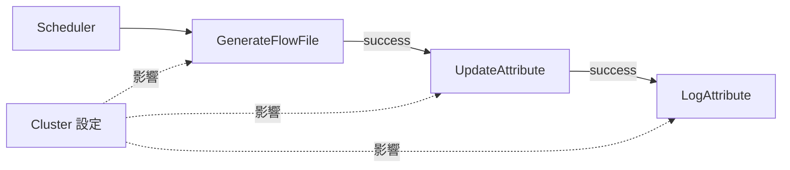
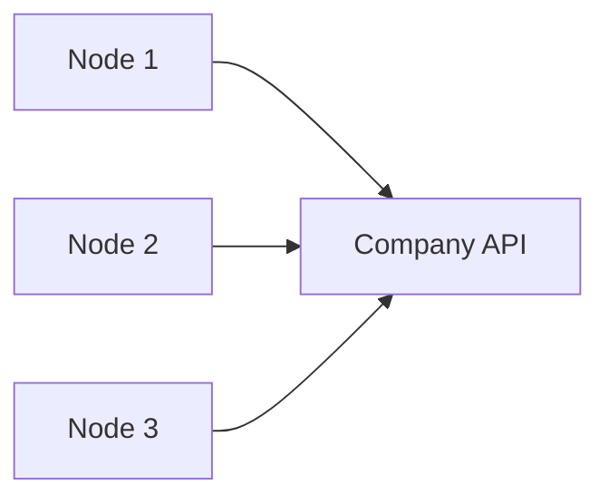
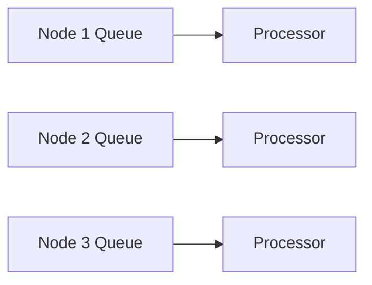
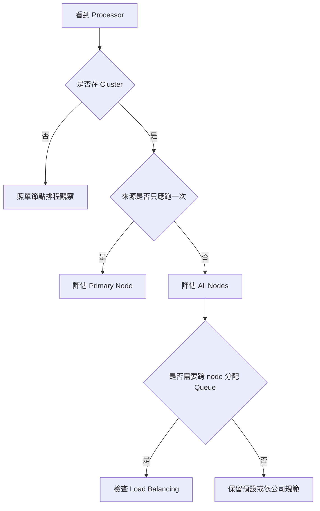

# Lab 09：NiFi Cluster 入門與多節點執行觀念

目標：理解 NiFi cluster 的基本運作方式，能判斷 Processor 在多節點環境中會不會重複執行，並知道 `Primary Node`、`All Nodes`、connection load balancing 與 cluster state 的用途。

預估時間：45 分鐘。

## 你會做出什麼

本 Lab 會先在目前單節點 Docker 環境建立一條小流程，觀察 `Execution` 設定，再把同一條 flow 對照到公司 cluster 的多節點行為。



本機只有一個 NiFi node，所以不會真的看到多台機器同時處理資料；但你會學會在 UI 中檢查哪些設定到了公司 cluster 會改變行為。

## 官方確認的 Cluster 概念

NiFi cluster 是多個 NiFi node 共同提供同一套資料流。每個 node 執行同一份 flow，但各 node 有自己的 repository 與本機資源。

重要名詞：

| 名詞 | 白話說明 |
| --- | --- |
| `Node` | cluster 裡的一台 NiFi instance |
| `Cluster Coordinator` | 負責協調 cluster 成員與連線狀態的 node |
| `Primary Node` | 被選為 primary 的 node，適合執行只應跑一次的排程 |
| `Execution` | Processor 在 cluster 中要跑在 `All Nodes` 還是 `Primary Node` |
| `Load Balanced Connection` | 在 cluster 節點之間分配 queued FlowFiles |
| `Cluster State` | 給 Processor 保存 cluster-wide 狀態，避免每個 node 各自記錄造成重複處理 |

來源：

- https://nifi.apache.org/docs/nifi-docs/html/administration-guide.html
- https://nifi.apache.org/nifi-docs/user-guide.html

## Part 1：確認目前環境是單節點

1. 打開 NiFi UI：`https://localhost:8443/nifi`。
2. 打開右上角 `Global Menu`。
3. 進入 `Summary`。
4. 觀察是否有 cluster 或 node 相關資訊。

也可以在 PowerShell 看目前只有一個 NiFi container：

```powershell
docker compose ps
```

說明：目前課程環境是單節點 NiFi，適合練 UI 與 flow 設定，但不會真的出現多 node 分散處理。公司專案若是 cluster，看到的畫面會多出 node、cluster、primary node 等資訊。

## Part 2：建立 Cluster 觀念練習 Flow

建立新的 Process Group：`training-lab-09`。

### Step 1：新增 GenerateFlowFile

新增 Processor：`GenerateFlowFile`。

設定 `Properties`：

| Property | Value |
| --- | --- |
| `Custom Text` | `cluster execution test` |

設定 `Scheduling`：

| Setting | Value |
| --- | --- |
| `Scheduling Strategy` | `Timer driven` |
| `Run Schedule` | `60 sec` |
| `Concurrent Tasks` | `1` |

### Step 2：新增 UpdateAttribute

新增 Processor：`UpdateAttribute`。

新增 dynamic properties：

| Property | Value |
| --- | --- |
| `lab.name` | `training-lab-09` |
| `cluster.lesson` | `execution-check` |
| `generated.at` | `${now():format("yyyy-MM-dd HH:mm:ss")}` |

### Step 3：新增 LogAttribute

新增 Processor：`LogAttribute`。

設定：

| Property | Value |
| --- | --- |
| `Log Prefix` | `lab09-cluster` |
| `Log Payload` | `true` |

### Step 4：連線與 Auto-terminate

連線：


設定：

- `LogAttribute` 的 `success`：auto-terminate

說明：這條 flow 很簡單，目的是把排程產生資料、加 attribute、輸出 log 的行為對照到 cluster 設定。先不要把 `Run Schedule` 設太短，避免本機累積太多測試資料。

## Part 3：觀察 Execution 設定

1. 打開 `GenerateFlowFile`。
2. 進入 `Scheduling`。
3. 找到 `Execution`。
4. 觀察目前值。

常見值：

| Execution | 在 cluster 的意思 |
| --- | --- |
| `All Nodes` | 每個 node 都會執行這個 Processor |
| `Primary Node` | 只有 Primary Node 執行這個 Processor |

如果本機單節點 UI 沒有明顯 cluster 效果，仍要記住：這個設定到了公司 cluster 會非常重要。

## Part 4：練習判斷 All Nodes 與 Primary Node

先不要啟動流程，先做判斷。

### 情境 A：每天凌晨抓一次公司共用 API

如果 `GenerateFlowFile` 或上游抓資料 Processor 在 cluster 使用 `All Nodes`：



可能結果：

- 同一批資料被抓 3 次。
- API 被打 3 倍流量。
- 下游 DB 出現重複資料。

建議：這類「整個 cluster 只應執行一次」的排程，通常要評估 `Primary Node`。

### 情境 B：每個 node 處理自己 queue 裡的資料

如果資料已經在 NiFi queue 中，而且每個 node 都可以安全處理不同 FlowFile：



建議：這類可以評估 `All Nodes`，讓多個 node 分散處理，提高吞吐量。

判斷重點：

```text
來源只應讀一次 -> 優先評估 Primary Node
資料已分散在 queue -> 可評估 All Nodes
會寫共享 DB/API/檔案 -> 先確認 idempotent 與併行安全
```

## Part 5：執行本機練習

1. 確認 `GenerateFlowFile` 的 `Run Schedule = 60 sec`。
2. 啟動 `UpdateAttribute`。
3. 啟動 `LogAttribute`。
4. 啟動 `GenerateFlowFile`。
5. 等 1 次觸發後停止 `GenerateFlowFile`。
6. 查看 log：

```powershell
docker compose logs --tail=160 nifi
```

7. 確認看到 `lab09-cluster`。

說明：本機只會看到一個 node 產生資料。這個練習的重點不是製造多節點效果，而是讓你知道同一條 flow 到公司 cluster 時，`Execution` 會決定它是在每個 node 都跑，還是只在 Primary Node 跑。

## Part 6：Connection Load Balancing

NiFi cluster 的 connection 可以設定 load balancing，用來把 queue 裡的 FlowFile 分配到不同 node。

常見 load balancing 策略：

| 策略 | 意義 |
| --- | --- |
| `Do not load balance` | 不跨 node 分配 FlowFile |
| `Round robin` | 輪流分配到不同 node |
| `Single node` | 儘量送到同一個 node |
| `Partition by attribute` | 依某個 attribute 分區，讓同 key 資料盡量到同 node |

實務判斷：

- 如果資料可以任意分散處理，可評估 `Round robin`。
- 如果同一個 customer/order/account 必須保持順序或同節點處理，可評估 `Partition by attribute`。
- 如果下游不是 cluster-aware，先不要急著開 load balancing。

本機單節點不容易看出 load balancing 效果；公司 cluster 排錯時才會看到不同 node 的 queue 與處理量差異。

## Part 7：Cluster State 與重複處理

有些 Processor 需要記錄「上次讀到哪裡」，例如：

- 上次查 DB 的時間。
- 上次讀 API 的 cursor。
- 上次處理的 offset。

在 cluster 中要確認 state 是 local 還是 cluster-wide。

| State 類型 | 意義 | 風險 |
| --- | --- | --- |
| Local state | 每個 node 各自記錄 | 多 node 可能各自讀一次，造成重複 |
| Cluster state | cluster 共用狀態 | 較適合避免多 node 重複讀同一批資料 |

說明：不是每個 Processor 都有 state，也不是每個 Processor 都支援 cluster-wide state。遇到會記錄進度的 Processor，要先查該 Processor 文件與公司既有設定。

## Part 8：公司專案 Cluster 檢查清單

看到公司 NiFi cluster flow 時，先問這些問題：

- 這個 Processor 是 `All Nodes` 還是 `Primary Node`？
- 如果是 `All Nodes`，每個 node 同時執行會不會重複抓資料？
- 如果是 `Primary Node`，Primary Node 切換時是否會影響排程？
- connection 是否開啟 load balancing？
- load balancing strategy 是否符合資料順序需求？
- Processor 是否使用 state？state 是 local 還是 cluster-wide？
- 目標 DB/API 是否能承受多 node 並行寫入？
- 如果 node 掛掉，queue、state、未完成資料如何恢復？
- 是否有版本管理，避免不同環境 flow 不一致？

## 常見錯誤

### 多節點重複抓資料

現象：

- 原本預期一天一批，結果同一批資料出現多份。
- DB 出現 duplicate key。
- API log 顯示同一時間多台 NiFi node 打同一個 endpoint。

處理：

- 檢查上游排程 Processor 的 `Execution`。
- 對只應執行一次的來源，評估 `Primary Node`。
- 檢查是否需要 cluster-wide state 或外部鎖。

### 開了 load balancing 後順序不穩定

現象：

- 同一客戶或同一訂單的事件順序偶爾錯亂。
- 下游處理時找不到前一筆狀態。

處理：

- 檢查 connection load balancing strategy。
- 若要同 key 走同 node，評估 `Partition by attribute`。
- 若順序非常重要，先不要任意分散。

### Primary Node 切換造成排程中斷或重跑

現象：

- cluster 維護或 node 重啟後，排程時間點附近出現漏跑或重跑。

處理：

- 檢查 bulletin、provenance 與 logs。
- 檢查 Processor state。
- 公司正式排程要設計 idempotent，不能只依賴「理論上只跑一次」。

## 完成檢查

- 你知道 NiFi cluster 是多個 node 執行同一份 flow。
- 你知道 `All Nodes` 會讓 Processor 在每個 node 執行。
- 你知道 `Primary Node` 適合只應跑一次的排程來源。
- 你知道 connection load balancing 會影響 FlowFile 分配到哪個 node。
- 你知道 cluster 中要注意 local state 與 cluster state 的差異。
- 你知道公司 cluster 排程要檢查重複執行、順序、共享資源與 failover。

## 本 Lab 的學習重點回顧

這個 Lab 建立的是 cluster 執行判斷流程：



整個流程的意思是：

1. 先判斷目前是不是 cluster。
2. 如果是 cluster，先看 Processor 的 `Execution`。
3. 只應執行一次的來源，通常要評估 `Primary Node`。
4. 可分散處理的資料，才考慮 `All Nodes` 與 connection load balancing。
5. 有順序、state、共享 DB/API 的流程，要先確認併行安全與重複處理策略。

做完後你要理解：

- cluster 不是單純加速開關；它會改變資料被哪些 node 執行。
- `Execution` 是公司 cluster 排程最重要的檢查點之一。
- load balancing 可以提高吞吐量，但可能影響資料順序。
- 正式專案要把 failover、state、idempotent、重複資料處理一起納入設計。
