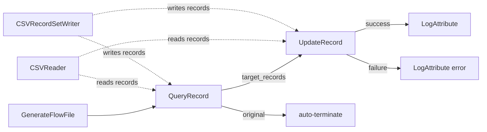
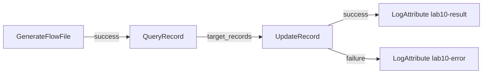
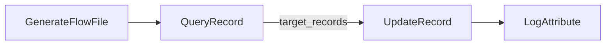

# Lab 10：Query、Formatter 與 Expression Language 實戰

目標：用 `QueryRecord` 找出指定 records，再用 `UpdateRecord` 搭配 `Expression Language` 做字串替換、日期格式化與欄位補值。

預估時間：60 分鐘。

## 你會做出什麼



你會先產生一批 CSV 訂單資料，再只挑出 `status = CANCELLED` 的 record，最後把該 record 的欄位格式化：

- `/status`：改成固定文字。
- `/note`：用 Expression Language 替換電話字串。
- `/order_date`：把日期格式從 `yyyy-MM-dd HH:mm:ss` 改成 `yyyy/MM/dd`。
- `/processed_at`：補上目前處理時間。

## 官方確認的語法觀念

本 Lab 會同時用到三種語法，不要混在一起：

| 語法 | 用途 | 常見位置 |
| --- | --- | --- |
| `QueryRecord SQL` | 查 record content 裡的欄位 | `QueryRecord` dynamic property |
| `RecordPath` | 指定要更新哪個 record 欄位 | `UpdateRecord` dynamic property name |
| `Expression Language` | 對值做字串、日期、attribute 運算 | `UpdateRecord` dynamic property value |

重要觀念：

- `QueryRecord` 是看 content 裡的 record，不是看 FlowFile attribute。
- `UpdateRecord` 的 dynamic property name 是 RecordPath，例如 `/note`。
- `UpdateRecord` 的 dynamic property value 可以用 `${field.value}` 代表目前正在更新的欄位值。
- `Expression Language` 的 `replaceAll` 可以做字串替換。
- `Expression Language` 的 `toDate(...):format(...)` 可以做日期格式轉換。

來源：

- https://nifi.apache.org/components/org.apache.nifi.processors.standard.QueryRecord/
- https://nifi.apache.org/components/org.apache.nifi.processors.standard.UpdateRecord/
- https://nifi.apache.org/nifi-docs/expression-language-guide.html
- https://nifi.apache.org/nifi-docs/record-path-guide.html

## Part 1：建立 Process Group

建立 `training-lab-10`，進入該 Process Group。

## Part 2：建立 Reader 與 Writer

### Step 1：建立 CSVReader

在 Process Group 空白處右鍵，選 `Configure`，進入 `Controller Services`。

建立 `CSVReader`：

| Property | Value |
| --- | --- |
| `Schema Access Strategy` | `Infer Schema` |
| `CSV Format` | `RFC 4180` 或預設值 |

Enable。

### Step 2：建立 CSVRecordSetWriter

建立 `CSVRecordSetWriter`：

| Property | Value |
| --- | --- |
| `Schema Access Strategy` | `Inherit Record Schema` |
| `Schema Write Strategy` | `Do Not Write Schema` |
| `Include Header Line` | `true` |

Enable。

說明：這裡先用 `Infer Schema` 與 `Inherit Record Schema`，讓練習聚焦在查詢與格式化。正式專案若欄位固定，應改用明確 schema，避免欄位型別被推斷錯誤。

## Part 3：建立測試資料

新增 Processor：`GenerateFlowFile`。

設定 `Scheduling`：

| Setting | Value |
| --- | --- |
| `Run Schedule` | `60 sec` |

設定 `Properties`：

| Property | Value |
| --- | --- |
| `Custom Text` | 使用下方 CSV |

```csv
order_id,customer,amount,status,order_date,note
1001,Alice,120.50,NEW,2026-05-01 09:30:00,normal order
1002,Bob,35.00,CANCELLED,2026-05-02 10:15:00,phone=0912-345-678 cancelled by user
1003,Carol,520.00,PAID,2026-05-03 14:45:00,vip customer
```

說明：`1002` 是本 Lab 的目標 record。等一下會用 `QueryRecord` 只挑出這一筆，再對它做格式化。

## Part 4：用 QueryRecord 找出目標 record

新增 Processor：`QueryRecord`。

設定：

| Property | Value |
| --- | --- |
| `Record Reader` | 選 `CSVReader` |
| `Record Writer` | 選 `CSVRecordSetWriter` |

新增 dynamic property：

| Property | Value |
| --- | --- |
| `target_records` | `SELECT * FROM FLOWFILE WHERE "status" = 'CANCELLED'` |

說明：dynamic property name 會變成 relationship 名稱。這裡的 `target_records` 代表「被查詢挑中的 records」。

## Part 5：建立 UpdateRecord 格式化目標 record

新增 Processor：`UpdateRecord`。

設定：

| Property | Value |
| --- | --- |
| `Record Reader` | 選 `CSVReader` |
| `Record Writer` | 選 `CSVRecordSetWriter` |
| `Replacement Value Strategy` | `Literal Value` |

新增 dynamic properties：

| Property | Value |
| --- | --- |
| `/status` | `CANCELLED_NORMALIZED` |
| `/note` | `${field.value:replaceAll('phone=[0-9-]+', 'phone=***')}` |
| `/order_date` | `${field.value:toDate('yyyy-MM-dd HH:mm:ss'):format('yyyy/MM/dd')}` |
| `/processed_at` | `${now():format("yyyy-MM-dd HH:mm:ss")}` |

說明：

- `/status` 是固定值替換。
- `/note` 會把 `phone=0912-345-678` 替換成 `phone=***`。
- `/order_date` 會把 `2026-05-02 10:15:00` 改成 `2026/05/02`。
- `/processed_at` 是新增欄位，值是目前處理時間。
- `Replacement Value Strategy` 必須是 `Literal Value`，因為這一段的 value 要被當成固定文字或 Expression Language。不要改成 `Record Path Value`，否則 `${field.value...}` 不會照你預期處理。

## Part 6：連線與 Auto-terminate

建立連線：



新增兩個 `LogAttribute`：

第一個命名或註解為 `lab10-result`：

| Property | Value |
| --- | --- |
| `Log Prefix` | `lab10-result` |
| `Log Payload` | `true` |

第二個命名或註解為 `lab10-error`：

| Property | Value |
| --- | --- |
| `Log Prefix` | `lab10-error` |
| `Log Payload` | `true` |

Auto-terminate：

- `QueryRecord` 的 `original`
- `QueryRecord` 的 `failure`
- `lab10-result` 的 `success`
- `lab10-error` 的 `success`

說明：這個 Lab 只觀察被挑出的目標 record，所以 `original` 可以先 auto-terminate。公司專案若需要保留所有 records，不能直接丟掉 `original`，要另外設計 matched / unmatched 的合併或下游處理。

## Part 7：執行與觀察

1. Start `lab10-result`。
2. Start `lab10-error`。
3. Start `UpdateRecord`。
4. Start `QueryRecord`。
5. Start `GenerateFlowFile`。
6. 等一筆資料送出後，停止 `GenerateFlowFile`。
7. 查看 log：

```powershell
docker compose logs --tail=220 nifi
```

你應該看到類似結果：

```csv
order_id,customer,amount,status,order_date,note,processed_at
1002,Bob,35.00,CANCELLED_NORMALIZED,2026/05/02,phone=*** cancelled by user,2026-05-10 15:30:00
```

重點不是時間值完全一樣，而是：

- 只剩 `1002` 這筆目標 record。
- `status` 被改掉。
- `note` 裡的電話被遮罩。
- `order_date` 日期格式被改掉。
- 新增 `processed_at` 欄位。

## Part 8：練習題

### 練習 1：改查詢條件，指定另一筆 record

這一題沿用同一條 flow。先停止 `GenerateFlowFile`，避免邊改邊產生資料。

修改 Processor：`QueryRecord`

把 `target_records` 改成：

```sql
SELECT * FROM FLOWFILE WHERE "order_id" = 1003
```

重新執行後，觀察輸出是否只剩 `1003`。

### 練習 2：替換不同字串

這一題沿用練習 1 後的狀態。先停止 `GenerateFlowFile`。

修改 Processor：`UpdateRecord`

把 `/note` 改成：

```text
${field.value:replaceAll('vip', 'priority')}
```

重新執行後，觀察 `1003` 的 note 是否從 `vip customer` 變成 `priority customer`。

### 練習 3：故意填錯日期格式

這一題沿用同一條 flow。先停止 `GenerateFlowFile`。

修改 Processor：`UpdateRecord`

把 `/order_date` 改成錯誤格式：

```text
${field.value:toDate('yyyy/MM/dd'):format('yyyy-MM-dd')}
```

重新執行後，觀察資料是否走 `failure`，並查看 `lab10-error` log。

練習完成後，把 `/order_date` 改回：

```text
${field.value:toDate('yyyy-MM-dd HH:mm:ss'):format('yyyy/MM/dd')}
```

說明：`toDate` 的格式必須符合原始字串。原始值是 `2026-05-02 10:15:00`，所以要用 `yyyy-MM-dd HH:mm:ss` 解析。

## 常見錯誤

### 把 Expression Language 寫在 dynamic property name

錯誤觀念：

```text
${field.value:replaceAll(...)}
```

不能放在 `UpdateRecord` dynamic property name。

處理：

- dynamic property name 放 RecordPath，例如 `/note`。
- dynamic property value 才放 Expression Language。

### 忘記 field.value 代表目前欄位值

`field.value` 不是 FlowFile attribute，而是 `UpdateRecord` 在更新某個欄位時提供的目前欄位值。

例如：

```text
/note = ${field.value:replaceAll('phone=[0-9-]+', 'phone=***')}
```

意思是：拿 `/note` 原本的值做 replace，再寫回 `/note`。

### 日期格式和原始資料不一致

現象：

- FlowFile 走 `failure`。
- log 出現日期 parse 相關錯誤。

處理：

- 先看原始日期字串長什麼樣子。
- `toDate` 的第一個格式要對應原始字串。
- `format` 的格式才是輸出格式。

### QueryRecord 數字欄位拿字串比較

現象：

```text
Unable to query FlowFile ... Error while preparing statement
SELECT * FROM FLOWFILE WHERE "order_id" = '1003'
```

原因：

- 本 Lab 的 `CSVReader` 使用 `Infer Schema`。
- `order_id` 可能被推斷成數字欄位。
- SQL 卻用 `'1003'` 字串去比較，Calcite 在準備 SQL 時可能失敗。

處理：

```sql
SELECT * FROM FLOWFILE WHERE "order_id" = 1003
```

若公司正式 schema 把 `order_id` 定義成 string，才使用：

```sql
SELECT * FROM FLOWFILE WHERE "order_id" = '1003'
```

### 想保留全部 records，但只改其中幾筆

本 Lab 的主線是「挑出目標 records 後輸出」，所以結果只會剩目標 records。

如果公司需求是保留所有 records，但只修改其中幾筆，常見設計方式有：

- 用 `QueryRecord` 分成 matched / unmatched，再於下游合併。
- 用資料庫或 API 的 upsert / merge 規則處理。
- 用更進階的 RecordPath、Script 或專用轉換 Processor，依公司規範設計。

不要在還沒釐清需求時直接 auto-terminate `original`。

## 完成檢查

- 你知道 `QueryRecord` 可以用 SQL-like 語法指定目標 records。
- 你知道 `UpdateRecord` 的 dynamic property name 是 RecordPath。
- 你知道 `UpdateRecord` 的 dynamic property value 可以用 Expression Language。
- 你知道 `${field.value}` 代表目前正在更新的欄位值。
- 你能用 `replaceAll` 做字串替換或遮罩。
- 你能用 `toDate(...):format(...)` 做日期格式轉換。
- 你知道只改某幾筆 records 時，要先想清楚是否需要保留 unmatched records。

## 本 Lab 的學習重點回顧

這個 Lab 建立的是 record 查詢與格式化 flow：



整個流程的意思是：

1. `GenerateFlowFile` 產生多筆 CSV records。
2. `QueryRecord` 用 SQL-like 語法挑出目標 records。
3. `UpdateRecord` 用 RecordPath 指定要更新的欄位。
4. `Expression Language` 對欄位值做字串替換、日期格式化或補值。
5. `LogAttribute` 輸出轉換後的 content，方便觀察結果。

做完後你要理解：

- query、RecordPath、Expression Language 是三種不同層次的工具。
- 公司專案常見的 formatter，不只是改字串；還包含日期格式、遮罩、固定值、補處理時間。
- 只改某些 records 時，先用查詢或路由界定目標資料，再做格式化，比直接在一個 Processor 裡硬塞所有邏輯更容易排錯。
