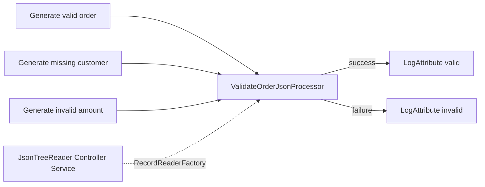

# Lab 11：使用 NiFi SPI 開發 JSON 訂單驗證 Processor

目標：理解 NiFi SPI 的角色分工，使用 NiFi 公開 Java API 實作自訂 Processor，將它
打包成 JAR 與 NAR，最後透過 NiFi REST API 安裝並建立可驗證的 JSON 訂單流程。

預估時間：60～90 分鐘。<br>
前置條件：完成 [Lab 00：基本名詞與環境](00-basic-terms.md)，並已依
[README](README.md) 啟動 NiFi。

## 你會做出什麼

本 Lab 會完成一個接近實際專案的驗證流程：



自訂 Processor 的責任是：

1. 透過 `RecordReaderFactory` 讀取一個 JSON FlowFile 的 Record。
2. 驗證 `order_id`、`customer`、`amount` 三個必要欄位。
3. 將驗證結果寫入 FlowFile attributes。
4. 將合法資料送到 `success`，格式錯誤或商業規則不合法的資料送到 `failure`。
5. 保留原始 JSON content，讓下游仍可記錄、重試或送往 dead-letter flow。

## 開始前先知道：SPI 是什麼

SPI 是 `Service Provider Interface`，可翻成「服務提供者介面」。它不是某一個 NiFi
專用 class，而是一種設計方式：

| 角色 | 在本 Lab 的對應 | 責任 |
| --- | --- | --- |
| Service contract | `Processor`、`RecordReaderFactory` 等公開 API | 定義 runtime 如何找到、設定與呼叫元件 |
| Service provider | `ValidateOrderJsonProcessor` | 提供符合 contract 的實作 |
| Discovery metadata | `META-INF/services/org.apache.nifi.processor.Processor` | 讓 Java ServiceLoader 找到實作 class |
| Runtime | NiFi | 載入 extension、建立 classloader、執行 Processor |

因此，SPI 的重點不是「寫一個 Java class 就完成」，而是完整走過：

```text
公開 API contract
      ↓
Java provider implementation
      ↓
ServiceLoader descriptor
      ↓
JAR
      ↓
NAR
      ↓
NiFi runtime 註冊與執行
```

本 Lab 選用 `AbstractProcessor`、`ProcessSession`、`ProcessContext`、`Relationship`、
`RecordReaderFactory` 等公開 extension API。課程不依賴 UI 內部 class、瀏覽器 DOM 或
自訂畫面目前產生的內部 JSON，這樣公司專案升級或改用自動化部署時，比較容易維護。

### JAR 與 NAR 的基本概念

`JAR` 是 `Java Archive`。它是 Java 常見的封裝格式，通常包含：

- 編譯後的 `.class`。
- `src/main/resources` 內的資源。
- ServiceLoader descriptor 與其他 metadata。

本 Lab 的 `processors` module 產生：

```text
nifi-training-custom-processor-processors-2.0.0.jar
```

`NAR` 是 `NiFi Archive`。它是 NiFi extension 的部署封裝，除了放入 Processor JAR，
也會描述 NAR 相依關係與 extension metadata，讓 NiFi 建立 extension classloader。
本 Lab 最後上傳的是：

```text
nifi-training-custom-processor-nar-2.0.0.nar
```

可以用以下方式區分兩者：

| 產物 | 用途 | 誰使用 |
| --- | --- | --- |
| JAR | 保存 Java 編譯產物與 ServiceLoader descriptor | Maven、NAR plugin |
| NAR | 封裝可被 NiFi 載入的 extension 與相依關係 | NiFi NAR Manager/runtime |
| Flow 元件 | 由已安裝 NAR 建立的 Processor instance | NiFi Process Group |

不要把 JAR 直接當成 NiFi 部署單位。課程的部署步驟是「先將 JAR 打包進 NAR，再將
NAR 上傳給 NiFi」，不是每個 JAR 各自放進 Process Group。

### 為什麼使用 Record API

如果 Processor 直接在 `onTrigger` 中呼叫某個 JSON library，Processor 會同時負責
格式解析、schema 來源與商業驗證，之後想支援 CSV、Avro 或不同 schema 時，程式會變得
難以替換。

本 Lab 將責任切開：

| 層次 | 元件 | 責任 |
| --- | --- | --- |
| 格式讀取 | `JsonTreeReader` | 把 JSON content 轉成 `Record` |
| API 邊界 | `RecordReaderFactory` | Processor 只依賴讀取契約，不綁定 reader 實作 |
| 商業規則 | `ValidateOrderJsonProcessor` | 驗證欄位與決定 success/failure |
| 觀察與後續處理 | `LogAttribute` 或公司下游 | 記錄、告警、重試或寫入資料庫 |

`ValidateRecord` 適合檢查 Record 是否符合 schema；本 Lab 再往前一步，示範公司通常
會需要的「必要欄位不可空白、金額必須大於零、錯誤原因要可追蹤」等商業規則。這也是
需要自訂 Processor 的原因。

## 容器啟動與 Lab 11 初始化順序

`docker compose up -d` 只會啟動 NiFi runtime，不會自動把 repository 裡的 Java
Processor 載入 NiFi。Lab 11 必須依序完成：

| 階段 | 你應該看到的結果 | 指令或證據 |
| --- | --- | --- |
| 啟動 runtime | `nifi-service`、`nifi-registry-service` 為 `Up` | `docker compose ps` |
| 建置 extension | JAR、NAR 與 7 個測試通過 | `build.ps1`、`BUILD SUCCESS` |
| 安裝 extension | Processor type 已註冊 | `GET /flow/processor-types` |
| 建立測試 flow | Controller Service、Processor、connection 都存在 | NiFi UI 或 REST response |
| 驗證資料流 | 三種案例依預期分流 | queue FlowFile attributes/content |

從 repository 根目錄執行：

```powershell
.\examples\nifi-custom-processor\build.ps1
.\examples\nifi-custom-processor\scripts\setup-flow.ps1
```

如果只修改 Java 後想保留 `target/`，可以使用：

```powershell
.\examples\nifi-custom-processor\build.ps1 -SkipClean
```

若 NiFi 剛啟動，先等到 `https://localhost:8443/nifi` 可以登入，再執行部署腳本。
登入資訊讀取根目錄 `.env` 的 `NIFI_USERNAME` 與 `NIFI_PASSWORD`，不要將實際密碼寫入
文件或 commit。

## Part 1：建置 JAR 與 NAR

### Step 1：檢查範例結構

```powershell
Set-Location .\examples\nifi-custom-processor
Get-ChildItem
```

重要檔案如下：

```text
nifi-custom-processor/
├─ pom.xml
├─ build.ps1
├─ nifi-training-custom-processor-processors/
│  ├─ pom.xml
│  └─ src/
│     ├─ main/java/com/example/nifi/training/ValidateOrderJsonProcessor.java
│     ├─ main/resources/META-INF/services/org.apache.nifi.processor.Processor
│     └─ test/java/com/example/nifi/training/ValidateOrderJsonProcessorTest.java
├─ nifi-training-custom-processor-nar/
│  └─ pom.xml
└─ scripts/setup-flow.ps1
```

`processors/pom.xml` 的 `packaging` 是 `jar`；`nar/pom.xml` 的 `packaging` 是 `nar`。
這個 module 分工讓「Java 編譯與測試」和「NiFi 部署封裝」各自有清楚責任。

### Step 2：執行建置

回到 repository 根目錄執行：

```powershell
Set-Location ..\..
.\examples\nifi-custom-processor\build.ps1
```

`build.ps1` 會使用 Docker 裡的 Maven 3.9.14 與 JDK 21，執行：

```text
mvn clean verify
```

預期結果包含：

```text
Tests run: 7, Failures: 0, Errors: 0
BUILD SUCCESS
.../nifi-training-custom-processor-processors-2.0.0.jar
.../nifi-training-custom-processor-nar-2.0.0.nar
```

建置完成只代表 JAR、測試與 NAR 成功，尚未代表 NiFi runtime 已經載入 Processor。

### Step 3：從 JAR/NAR 反查註冊資訊

查看 processors JAR 內的 class 與 descriptor：

```powershell
$jarPath = ".\examples\nifi-custom-processor\nifi-training-custom-processor-processors\target\nifi-training-custom-processor-processors-2.0.0.jar"
jar tf $jarPath | Select-String 'ValidateOrderJsonProcessor|META-INF/services/org.apache.nifi.processor.Processor'
```

查看 NAR 內的 Processor JAR：

```powershell
$narPath = ".\examples\nifi-custom-processor\nifi-training-custom-processor-nar\target\nifi-training-custom-processor-nar-2.0.0.nar"
jar tf $narPath | Select-String 'nifi-training-custom-processor-processors-2.0.0.jar|bundled-dependencies'
```

查看 ServiceLoader descriptor 的內容：

```powershell
jar xf $jarPath META-INF/services/org.apache.nifi.processor.Processor
Get-Content .\META-INF\services\org.apache.nifi.processor.Processor
```

預期只有一個 class name：

```text
com.example.nifi.training.ValidateOrderJsonProcessor
```

`jar xf` 會在目前目錄產生檢查用檔案；檢查完成後可以刪除這個非課程產物的
`META-INF` 資料夾。若不想解開 JAR，也可以直接使用 Maven target 中的 resource 檔案
查看內容。

## Part 2：讀懂 Processor 實作

原始碼：

```text
examples/nifi-custom-processor/
└─ nifi-training-custom-processor-processors/
   └─ src/main/java/com/example/nifi/training/ValidateOrderJsonProcessor.java
```

### Step 1：宣告 Processor contract

`ValidateOrderJsonProcessor` extends `AbstractProcessor`，並公開兩個 relationship：

| Relationship | 意義 |
| --- | --- |
| `success` | JSON 已解析，且所有必要欄位通過商業驗證 |
| `failure` | JSON 無法解析，或欄位驗證失敗 |

Processor 另外宣告必填的 `Record Reader` property：

```java
public static final PropertyDescriptor RECORD_READER = new PropertyDescriptor.Builder()
        .name("Record Reader")
        .identifiesControllerService(RecordReaderFactory.class)
        .required(true)
        .build();
```

這段的 why 是把 Processor 與 Reader 的依賴變成 NiFi 可驗證的配置契約。使用者若沒有
選取 `RecordReaderFactory`，Processor 在啟動前就會是 invalid，而不是資料進來後才出現
難以追蹤的 NullPointerException。

### Step 2：設定 JsonTreeReader schema

REST 腳本建立 `JsonTreeReader` Controller Service，並設定 `Schema Access Strategy`
為 `schema-text-property`。schema 使用 nullable 欄位：

```json
{
  "type": "record",
  "name": "TrainingOrder",
  "fields": [
    {"name": "order_id", "type": ["null", "string"], "default": null},
    {"name": "customer", "type": ["null", "string"], "default": null},
    {"name": "amount", "type": ["null", "double"], "default": null}
  ]
}
```

欄位允許 `null` 是刻意的：缺少 `customer` 時，Reader 可以先產生一個 Record，
Processor 才能輸出可讀的 `customer.required`。若 schema 直接把所有欄位設定成必填，
解析器可能先拒絕資料，學員就看不到「格式解析」與「商業驗證」的責任差異。

### Step 3：看 `onTrigger` 的處理順序

```text
session.get()
    │
    ├─ 沒有 FlowFile：return，不建立假資料
    │
    ├─ context 取得 RecordReaderFactory
    │
    ├─ session.read + reader.nextRecord()
    │      ├─ 讀不到 record：record.required
    │      ├─ 讀到第二筆：record.count
    │      └─ 解析例外：record-reader.error
    │
    ├─ 依序驗證 order_id、customer、amount
    │
    ├─ putAllAttributes(training.validation.*)
    │
    └─ transfer(success 或 failure)
```

這個 Processor 的每個輸入 FlowFile 預期是一個 JSON order object。它不改寫 content，
只新增：

| Attribute | 可能值 |
| --- | --- |
| `training.validation.status` | `valid`、`invalid`、`error` |
| `training.validation.reason` | `accepted`、錯誤 code，或 `record-reader.error` |

多個商業錯誤會依固定順序用分號串接，例如：

```text
order_id.blank;customer.required;amount.positive
```

固定順序是 why：下游 log、測試與告警規則可以穩定比對，不必依賴 HashMap 或 JSON
欄位輸入順序。

## Part 3：先看測試，再看實作邊界

測試使用 `TestRunners.newTestRunner`、`MockFlowFile`，並在 mock runtime 中啟用真正的
`JsonTreeReader`。這樣測試不是只測字串判斷，也會驗證 Processor 與 `RecordReaderFactory`
的整合。

| 測試情境 | 預期結果 |
| --- | --- |
| 完整訂單 | `success`、`valid`、`accepted`、content 不變 |
| 多個欄位錯誤 | `failure`，依固定順序收集全部錯誤 |
| 負數 amount | `failure`、`amount.positive` |
| JSON 無法解析 | `failure`、`error`、`record-reader.error` |
| 一個 FlowFile 有多筆 record | `failure`、`record.count` |
| 沒有輸入 FlowFile | 不產生 transfer |
| 沒有 Record Reader | TestRunner 驗證為 invalid |

重新執行測試：

```powershell
.\examples\nifi-custom-processor\build.ps1 -SkipClean
```

測試通過後，才進入 NiFi runtime 部署。這個順序可以先排除 Java 邏輯問題，再檢查
NAR classloader 或 REST flow 配置問題。

## Part 4：以 REST API 安裝 NAR 並建立 Flow

腳本位置：

```text
examples/nifi-custom-processor/scripts/setup-flow.ps1
```

它使用公開 REST API 完成整個 Lab 初始化，不需要手動拖曳元件。腳本中的每一個更新
都會先讀取目前 entity 的 `revision`，再送出 `PUT`；不要把這個 revision 當成可以永久
寫死的版本號。

### Step 1：取得 token、上傳與等待 NAR

流程依序使用：

```text
POST /access/token
POST /controller/nar-manager/nars/content
GET  /controller/nar-manager/nars/{id}
GET  /flow/processor-types
```

上傳 response 的 identifier 只代表安裝請求建立，腳本會等到 `installComplete = true`
才查找 Processor type。這個等待是 why：NiFi 尚未完成 extension classloader 建立時，
立即呼叫建立 Processor 可能會收到 type not found。

腳本驗證的 Processor type 與 bundle：

```text
type     = com.example.nifi.training.ValidateOrderJsonProcessor
group    = com.example.nifi.training
artifact = nifi-training-custom-processor-nar
version  = 2.0.0
```

### Step 2：建立並啟用 Controller Service

腳本用以下 API 找到 reader type 並建立 service：

```text
GET  /flow/controller-service-types
POST /process-groups/{id}/controller-services
PUT  /controller-services/{id}
PUT  /controller-services/{id}/run-status
GET  /controller-services/{id}
```

建立 `JsonTreeReader` 時使用 NiFi 回傳的 bundle：

```json
{
  "type": "org.apache.nifi.json.JsonTreeReader",
  "bundle": {
    "group": "org.apache.nifi",
    "artifact": "nifi-record-serialization-services-nar",
    "version": "2.9.0"
  }
}
```

設定完成後才啟用 service。若 service 不是 `ENABLED`，自訂 Processor 的 `Record Reader`
property 會無法通過 validation。

### Step 3：建立來源、自訂 Processor 與下游

腳本建立三個 `GenerateFlowFile`，內容分別是：

```json
{"order_id":"1001","customer":"Alice","amount":120.50}
{"order_id":"1002","amount":80.00}
{"order_id":"1003","customer":"Carol","amount":0}
```

自訂 Processor 的 property 設定為：

```text
Record Reader = 前一步建立的 JsonTreeReader service id
```

最後建立：

```text
三條 GenerateFlowFile → ValidateOrderJsonProcessor 的 success connection
ValidateOrderJsonProcessor success → LogAttribute valid
ValidateOrderJsonProcessor failure → LogAttribute invalid
```

兩個 `LogAttribute` 的 `success` relationship 都設定 auto-terminate。這讓練習 flow
沒有未處理的 relationship，也保留 failure 作為公司專案接重試、告警或 dead-letter 的
示範位置。

### Step 4：以 RUN_ONCE 執行並讀回結果

腳本對每個來源先執行：

```json
{
  "revision": {
    "clientId": "latest-client-id",
    "version": 1
  },
  "state": "RUN_ONCE"
}
```

送到：

```text
PUT /processors/{id}/run-status
```

接著使用 Queue API：

```text
POST /flowfile-queues/{connection-id}/listing-requests
GET  /flowfile-queues/{connection-id}/listing-requests/{request-id}
GET  /flowfile-queues/{connection-id}/flowfiles/{flowfile-uuid}
GET  /flowfile-queues/{connection-id}/flowfiles/{flowfile-uuid}/content
```

腳本會同時檢查：

- Queue 是否真的有 FlowFile。
- `training.validation.status` 是否符合案例。
- `training.validation.reason` 是否符合商業規則。
- FlowFile content 是否仍是來源 JSON。

預期輸出：

```text
驗證通過：valid order -> success (accepted)
驗證通過：missing customer -> failure (customer.required)
驗證通過：invalid amount -> failure (amount.positive)
```

腳本預設在讀回驗證結果後清空輸出 queue，避免每次重跑把測試資料累積在環境中；
Process Group 與元件仍會保留給你在 UI 觀察。若要刪除本次建立的整個 group：

```powershell
.\examples\nifi-custom-processor\scripts\setup-flow.ps1 `
  -GroupName training-lab-11-json-validation-cleanup `
  -Cleanup
```

若 NAR 已安裝，只建立另一個測試 group：

```powershell
.\examples\nifi-custom-processor\scripts\setup-flow.ps1 `
  -SkipNarUpload `
  -GroupName training-lab-11-json-validation-rerun
```

## Part 5：在 NiFi UI 反查部署結果

開啟：

```text
https://localhost:8443/nifi
```

在 UI 中找到腳本輸出的 Process Group，依序檢查：

1. `JSON order reader` 的 Controller Service 是 `Enabled`。
2. `Validate order JSON` 的 `Record Reader` 已指向該 service。
3. Processor 的 `success` 與 `failure` 都有下游 connection。
4. 三個 `GenerateFlowFile` 的 `Custom Text` 分別對應三種案例。
5. 兩個 `LogAttribute` 的 `success` 已 auto-terminate。
6. Processor 沒有 bulletin 顯示 invalid 或 reader 設定錯誤。

腳本為了讓驗證可重跑，會在每個案例驗證完成後清空輸出 queue，所以流程圖上的 queue
通常是空的；這是清理策略，不代表 Processor 沒有執行。要觀察內容，請在腳本輸出
「驗證通過」時立即查詢該 queue，或在 UI 手動先 stop 下游、再執行單一案例。

## Part 6：練習題

### 練習 1：增加可接受的欄位規則

將 `order_id` 的規則改為必須符合 `ORD-` 開頭，例如 `ORD-1001`：

1. 在 Processor 中加入 `order_id.format` 錯誤 code。
2. 新增一個成功案例與一個失敗案例。
3. 確認多個錯誤仍依固定欄位順序輸出。
4. 將 NAR 版本提升，重新執行 build 與 setup script。

### 練習 2：擴充 JSON schema

新增 nullable 的 `currency` 欄位，並要求值只能是 `TWD` 或 `USD`：

1. 更新測試中的 Avro schema。
2. 更新 REST script 的 schema text 與測試 JSON。
3. 新增 `currency.required`、`currency.allowable` 等 reason code。
4. 確認缺少欄位時由 Processor 輸出商業錯誤，而不是由 reader 直接拒絕。

### 練習 3：設計 failure 下游

不要直接將 `failure` auto-terminate。請設計公司專案中的錯誤處理：

- 哪些錯誤可重試？
- 哪些錯誤應進 dead-letter？
- `training.validation.reason` 要如何交給告警或稽核系統？
- 如何從 bulletin、Provenance 與 LogAttribute 反查原始 FlowFile？

## 完成檢查

- [ ] 能說明 SPI 的 contract、provider、discovery metadata 與 runtime。
- [ ] `build.ps1` 使用 Docker Maven + JDK 21 完成 `mvn verify`。
- [ ] 7 個 `nifi-mock` 測試全部通過。
- [ ] JAR 內有 Processor class 與 ServiceLoader descriptor。
- [ ] NAR 內有 2.0.0 Processor JAR。
- [ ] `GET /flow/processor-types` 找得到 `ValidateOrderJsonProcessor`。
- [ ] `GET /flow/controller-service-types` 找得到 `JsonTreeReader`。
- [ ] Controller Service 使用明確 schema 並成功啟用。
- [ ] `Record Reader` property 指向 `JsonTreeReader`。
- [ ] 完整訂單走 `success`，缺少 customer 與 invalid amount 走 `failure`。
- [ ] FlowFile 有 `training.validation.status` 與 `training.validation.reason`。
- [ ] FlowFile content 維持來源 JSON。
- [ ] 能說明 JAR、NAR、Processor instance 與 Process Group 的差異。
- [ ] 知道修改 REST 元件前要先取得最新 `revision`。

## 排錯提示

### `build.ps1` 顯示 Maven 或 Java 版本錯誤

確認使用 repository 提供的 `build.ps1`，不要用主機上不確定版本的 Maven 取代 Docker
建置。NiFi 2.9.0 parent 與範例的 Java 編譯目標都是 21。

### Processor type 找不到

依序檢查：

1. NAR 是否產生且檔名為 `...-2.0.0.nar`。
2. upload response 的 identifier 是否已完成安裝。
3. `GET /controller/nar-manager/nars/{id}` 是否有 `failureMessage`。
4. `GET /flow/processor-types` 是否回傳 2.0.0 bundle。
5. `docker compose logs --tail=220 nifi` 是否出現 classloader 或 dependency 錯誤。

### Controller Service 無法 Enabled

確認：

- `Schema Access Strategy` 使用 allowable value `schema-text-property`。
- `Schema Text` 是合法 Avro schema。
- Controller Service type 的 bundle 是 NiFi 2.9.0 的
  `nifi-record-serialization-services-nar`。
- 沒有其他元件仍引用錯誤或已刪除的 service。

### Processor 顯示 invalid

先看 bulletin，再檢查：

- `Record Reader` 是否已設定。
- Reader Controller Service 是否為 `Enabled`。
- `success`、`failure` 是否都有 connection 或明確 auto-terminate。
- `LogAttribute` sink 的 `success` 是否已 auto-terminate。

### Queue 沒有 FlowFile

這個腳本的順序是：

1. `GenerateFlowFile` `RUN_ONCE`。
2. 等待來源 connection 的 queue listing。
3. 自訂 Processor `RUN_ONCE`。
4. 等待預期的 success/failure queue。

若手動操作，不能只執行自訂 Processor；上游必須先產生 FlowFile。若腳本已輸出驗證
成功，後續看到 queue 為空是因為腳本已讀回並清除測試結果。

### API 回傳 409 revision conflict

先對相同 resource 做 `GET`，使用最新 response 的 `revision` 放入下一次 `PUT` 或
`DELETE`。不要重送舊 payload，也不要把 `version` 永遠寫成 0。

### JSON 欄位缺少時變成 reader error

先確認 schema 的欄位 type 是 nullable union，例如：

```json
["null", "string"]
```

如果把欄位定義成單一 `string`，reader 可能在商業 Processor 執行前就拒絕資料；那是
schema contract 的結果，不是欄位驗證規則沒有執行。

## 本 Lab 的學習重點回顧

本 Lab 走完自訂 Processor 的完整生命週期：

1. 以 `PropertyDescriptor`、`Relationship` 宣告元件 contract。
2. 以 `RecordReaderFactory` 與 `JsonTreeReader` 分離格式讀取和商業規則。
3. 以 `ProcessSession` 操作 FlowFile，而不是直接操作 NiFi repository 檔案。
4. 以 ServiceLoader descriptor 讓 NiFi 發現 Processor。
5. 以 JAR 保存 Java 編譯產物，再以 NAR 作為 NiFi 部署單位。
6. 以 `nifi-mock` 在沒有 NiFi runtime 時先驗證行為。
7. 以 REST API 上傳 NAR、啟用 Controller Service、建立 flow、執行與讀回結果。
8. 以 attributes、queue、bulletin、Provenance 與 logs 反查實際執行結果。

公司專案要擴充 NiFi SPI 時，可以先沿用這個最小模型，再依需求加入其他 Controller
Service、state、Record writer 或 custom UI。每增加一個 extension 類型，就同步增加
公開 API 依賴、descriptor、測試、NAR 依賴與可觀察的 failure path。

## 官方文件依據

- [Apache NiFi Developer's Guide](https://nifi.apache.org/nifi-docs/developer-guide.html)
- [Apache NiFi REST API](https://nifi.apache.org/nifi-docs/rest-api.html)
- [JsonTreeReader component](https://nifi.apache.org/components/org.apache.nifi.json.JsonTreeReader/)
- [ValidateRecord component](https://nifi.apache.org/components/org.apache.nifi.processors.standard.ValidateRecord/)
- [NiFi 2.9.0 source tag](https://github.com/apache/nifi/tree/rel/nifi-2.9.0)
