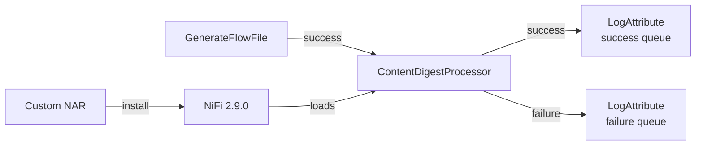

# Lab 11：使用 NiFi SPI 開發自訂 Processor

目標：使用 NiFi 2.9.0 公開 Java API 實作一個可部署的 custom Processor，完成單元測試、NAR 打包、REST API 安裝與實際 Flow 驗證。

預估時間：90 至 120 分鐘。第一次建置會下載 Docker 映像與 Maven 相依套件，可能需要更久。

本 Lab 的範例是 `ContentDigestProcessor`：讀取 FlowFile content，計算 SHA-256 或 SHA-512，將結果寫入 attribute，並保留原始 content。課程以 Java API 與 NiFi REST API 為主，不依賴 UI 內部 class、瀏覽器自動化或 Python script。

## 你會做出什麼



你最後會得到：

- `nifi-training-custom-processor-processors`：Processor JAR、ServiceLoader descriptor 與 `nifi-mock` 測試。
- `nifi-training-custom-processor-nar`：NiFi 可以載入的 NAR。
- 一個由 REST API 建立的獨立 Process Group，不需要手動拖曳元件。
- success queue 中帶有 `content.digest` 的 FlowFile；content 本身仍未被改寫。

## 開始前先知道

### 需要的環境

所有命令都從 repository 根目錄執行，或依命令提示切換到範例目錄：

| 依賴 | 用途 | 確認方式 |
| --- | --- | --- |
| Docker Desktop | 執行 NiFi 與 Maven + JDK 21 | `docker version` |
| Java 21 | NiFi 2.9.0 的編譯目標；建置腳本仍在 Docker 內執行 Maven | `java -version` |
| `.env` | REST API 的本機帳密 | 只確認檔案存在，不要把內容貼到終端輸出 |
| NiFi 2.9.0 | 載入與執行 NAR | `docker compose ps` |

如果 NiFi 尚未啟動：

```powershell
docker compose up -d
docker compose ps
```

根目錄 `.env` 只保留在本機。腳本會讀取 `NIFI_USERNAME` 與 `NIFI_PASSWORD`，不會把密碼寫入文件或 commit。

### 容器啟動後的初始化順序

`docker compose ps` 顯示 `nifi-service` 為 `Up`，代表 NiFi runtime 已啟動；課程的
custom Processor 仍在 repository 的 Java 原始碼中，尚未載入 NiFi。Lab 11 的初始化有
以下三個狀態，必須依序完成：

| 階段 | 產物或狀態 | 完成方式 |
| --- | --- | --- |
| 啟動 runtime | `nifi-service` 與 `nifi-registry-service` 為 `Up` | `docker compose up -d` |
| 建置 extension | `nifi-training-custom-processor-nar-1.0.0.nar` | `build.ps1` 執行 `mvn verify` |
| 部署 extension | `ContentDigestProcessor` 出現在 NiFi Processor type | `setup-flow.ps1` 上傳、等待安裝並建立測試 Flow |

因此，容器啟動後先從 repository 根目錄執行：

```powershell
.\examples\nifi-custom-processor\build.ps1
.\examples\nifi-custom-processor\scripts\setup-flow.ps1
```

建置成功只代表 NAR 已產生並通過測試；完成部署腳本後，NiFi 才能載入
`ContentDigestProcessor`。腳本最後會以 REST API 執行一次測試 Flow，並驗證
FlowFile 的 `content.digest`。若 NiFi 剛啟動仍在初始化，先等待 API ready，再重新執行
部署腳本。

### 本 Lab 的範例範圍

本 Lab 先專注一個 native Java Processor，不同時加入 Controller Service、Processor UI、外部 HTTP service 或 scripted processor。這樣可以清楚看見 SPI 的最小契約：

1. Java class 實作 `Processor` 行為。
2. `META-INF/services/org.apache.nifi.processor.Processor` 讓 Java ServiceLoader 找到 class。
3. Processor JAR 放進 NAR，NAR 才是部署單位。
4. NiFi 透過公開 API 載入、驗證與執行元件。

## 先理解本 Lab 的架構關係

### Processor JAR 與 NAR 不是同一件事

```text
ContentDigestProcessor.java
        │ compile
        ▼
processors JAR
        │ NAR Maven plugin + dependency
        ▼
custom NAR
        │ upload to NAR Manager
        ▼
NiFi extension classloader
        │ ServiceLoader descriptor
        ▼
flow 中可選取的 Processor type
```

NiFi 不應只拿一般 JAR 放進任意 classpath 就當成完成部署。NAR 會描述 extension bundle 的邊界與相依關係，讓 NiFi 以自己的 classloader 載入。這也是本範例把 `processors` 與 `nar` 分成兩個 Maven module 的原因。

### 本範例使用的公開 API

| API | 在本範例的責任 |
| --- | --- |
| `AbstractProcessor` | 提供 Processor 基本生命週期與 logger |
| `PropertyDescriptor` | 宣告 `Hash Algorithm`、`Output Attribute` |
| `Relationship` | 宣告 `success`、`failure` 出口 |
| `ProcessContext` | 讀取 Processor properties |
| `ProcessSession` | 取得 FlowFile、讀 content、寫 attribute、轉送 FlowFile |
| `ProcessorInitializationContext` | 初始化 descriptor 與 relationship 集合 |
| `TestRunner` / `MockFlowFile` | 在沒有啟動 NiFi 的情況下驗證 Processor 行為 |

這些 API 直接對應 Processor 的資料處理責任。課程不依賴 NiFi UI 的內部 Java class，也不把某個畫面目前使用的 JSON 細節當成 Java SPI 契約。

## Part 1：確認專案與建置入口

### Step 1：進入範例目錄

在 repository 根目錄執行：

```powershell
Set-Location .\examples\nifi-custom-processor
Get-ChildItem
```

你應該看到：

```text
pom.xml
build.ps1
README.md
nifi-training-custom-processor-processors
nifi-training-custom-processor-nar
scripts
```

### Step 2：執行 Docker Maven + JDK 21 建置

```powershell
.\build.ps1
```

建置腳本實際執行的核心概念是：

```text
Maven 3.9.14 + JDK 21 container
        │ bind mount
        ▼
examples/nifi-custom-processor
        │ mvn clean verify
        ▼
tests pass + NAR generated
```

NiFi 2.9.0 的 parent 會檢查 Maven 版本，因此腳本固定使用 Maven `3.9.14` 與 JDK 21。Maven 相依套件放在 Docker named volume `nifi-training-m2`，避免每次練習重新下載。

預期結果包含：

```text
Tests run: 6, Failures: 0, Errors: 0
BUILD SUCCESS
.../nifi-training-custom-processor-nar/target/nifi-training-custom-processor-nar-1.0.0.nar
```

### Step 3：確認 NAR 真的包含註冊資訊

回到 repository 根目錄，使用 JDK 的 `jar` 查看輸出，不要直接修改 NAR：

```powershell
jar tf .\examples\nifi-custom-processor\nifi-training-custom-processor-nar\target\nifi-training-custom-processor-nar-1.0.0.nar |
  Select-String 'ContentDigestProcessor|org.apache.nifi.processor.Processor|bundled-dependencies'
```

你應該能找到：

- `META-INF/bundled-dependencies/nifi-training-custom-processor-processors-1.0.0.jar`
- NAR extension documentation 或相關 metadata

再查看 processors JAR 的 ServiceLoader descriptor：

```powershell
jar tf .\examples\nifi-custom-processor\nifi-training-custom-processor-processors\target\nifi-training-custom-processor-processors-1.0.0.jar |
  Select-String 'META-INF/services/org.apache.nifi.processor.Processor'
```

這個 descriptor 的內容只有一個 class name：

```text
com.example.nifi.training.ContentDigestProcessor
```

如果 class 已編譯但 descriptor 缺少，NiFi 就不會把它列為可建立的 Processor type。

## Part 2：讀懂 Processor 實作

原始碼位置：

```text
examples/nifi-custom-processor/
└─ nifi-training-custom-processor-processors/
   └─ src/main/java/com/example/nifi/training/ContentDigestProcessor.java
```

### Step 1：宣告 properties

`HASH_ALGORITHM` 使用 `AllowableValue` 限制成 `SHA-256` 與 `SHA-512`。`OUTPUT_ATTRIBUTE` 使用 `NON_EMPTY_VALIDATOR`，避免把 digest 寫到空白 attribute 名稱。

這些設定是 Processor 的公開配置契約。應該讓錯誤在 Processor start 前就變成 invalid，而不是等資料跑到一半才用字串判斷。

### Step 2：宣告 relationships

`success` 表示 content 已完成摘要；`failure` 表示摘要建立失敗。任何沒有連線的 relationship 都必須在 UI 或 API 設定下游，或明確 auto-terminate；否則 Processor 可能會顯示 invalid。

本範例把 failure 留給下游 `LogAttribute`，不直接丟掉錯誤 FlowFile。公司專案可以將 failure 接到重試、告警或 dead-letter flow。

### Step 3：看 `onTrigger` 的資料處理順序

```text
session.get()
    │
    ├─ 沒有 FlowFile：return，不建立假資料
    │
    ├─ createMessageDigest(algorithm)
    │
    ├─ session.read(flowFile, callback)
    │      └─ 以 buffer 讀 content，更新本次執行自己的 MessageDigest
    │
    ├─ session.putAttribute(flowFile, outputAttribute, digest)
    │
    └─ session.transfer(flowFile, success)
```

每次 `onTrigger` 都建立自己的 `MessageDigest`，不能把它做成 Processor instance 的共用欄位，否則 Concurrent Tasks 可能互相污染摘要結果。這是 thread safety 的原因，不是寫法偏好。

程式只修改 attribute，不呼叫 `session.write`，所以 FlowFile content 會保持原樣。這個行為會在 `nifi-mock` 測試與後面的 queue 觀察各驗證一次。

## Part 3：理解測試先行的邊界

測試位置：

```text
examples/nifi-custom-processor/
└─ nifi-training-custom-processor-processors/
   └─ src/test/java/com/example/nifi/training/ContentDigestProcessorTest.java
```

目前測試涵蓋：

| 情境 | 驗證 |
| --- | --- |
| 預設 SHA-256 | 已知 `abc` 摘要值、success、content 不變 |
| SHA-512 + 自訂 attribute | 可切換 algorithm 與輸出欄位 |
| 不支援的 algorithm | `MD5` 會讓 Processor invalid |
| 空白輸出欄位 | validator 會阻止啟動 |
| 沒有輸入 | 不建立 success 或 failure transfer |
| 摘要建立失敗 | 轉到 failure，寫入 failure reason，content 不變 |

測試使用 `TestRunners.newTestRunner` 啟動 mock session，不需要啟動 Docker NiFi。`createMessageDigest` 是受保護的測試 seam，讓測試能穩定模擬 JDK algorithm 建立失敗；它不是讓 production code 依賴測試框架。

重新執行測試：

```powershell
.\build.ps1 -SkipClean
```

`-SkipClean` 仍然會執行 `verify`，只是保留現有 `target/` 以縮短練習迭代時間。

## Part 4：用 REST API 安裝 NAR 並建立 Flow

這一段使用範例附帶腳本，將每一個 REST API 動作排成可重跑流程。腳本位置：

```text
examples/nifi-custom-processor/scripts/setup-flow.ps1
```

### Step 1：取得 token 與上傳 NAR

腳本讀取根目錄 `.env` 後，先呼叫：

```text
POST /nifi-api/access/token
```

再將 NAR 以 `application/octet-stream` 上傳：

```text
POST /nifi-api/controller/nar-manager/nars/content
```

這個 endpoint 的用途是要求 NiFi 安裝 NAR，不是把 NAR 解壓到主機的 `lib` 目錄。上傳回應中的 identifier 會被腳本拿來輪詢：

```text
GET /nifi-api/controller/nar-manager/nars/{id}
```

只有 `installComplete = true` 後才繼續建立 flow。若先建立 Processor，NiFi 可能還找不到 type。

### Step 2：確認 Processor type 與 Bundle

腳本呼叫：

```text
GET /nifi-api/flow/processor-types
```

並尋找：

```text
com.example.nifi.training.ContentDigestProcessor
```

同時確認回應中的 bundle 是：

```text
group    = com.example.nifi.training
artifact = nifi-training-custom-processor-nar
version  = 1.0.0
```

建立 Processor 時使用 API 回傳的 bundle metadata，不在腳本中猜 NiFi 內部版本。這可以避免同一個 class name 被不同 NAR 版本遮蔽時，flow 建立到錯的 extension。

### Step 3：建立 Process Group 與元件

腳本依序使用：

| 動作 | REST API |
| --- | --- |
| 取得 root group | `GET /flow/process-groups/root` |
| 建立練習 group | `POST /process-groups/{id}/process-groups` |
| 建立 GenerateFlowFile | `POST /process-groups/{id}/processors` |
| 建立 custom Processor | `POST /process-groups/{id}/processors` |
| 建立 LogAttribute | `POST /process-groups/{id}/processors` |
| 建立 connection | `POST /process-groups/{id}/connections` |
| 設定 sink success auto-terminate | `PUT /processors/{id}` |

每個 mutable request 都帶上一個 `revision`。建立或更新後，下一次修改要使用上一個 API response 回傳的最新 revision，不要固定寫死 `version = 0`。

### Step 4：用 `RUN_ONCE` 驗證資料流

腳本使用：

```text
PUT /processors/{id}/run-status
```

將 `GenerateFlowFile` 與 `ContentDigestProcessor` 各執行一次。這比把測試來源設成極短的 Timer schedule 更適合教材，因為不會在學員觀察前產生大量 queue。

最後使用：

```text
POST /flowfile-queues/{connection-id}/listing-requests
GET  /flowfile-queues/{connection-id}/listing-requests/{request-id}
GET  /flowfile-queues/{connection-id}/flowfiles/{flowfile-uuid}
```

從 FlowFile API 讀出 `content.digest`，並確認它是 64 個小寫十六進位字元。這一步驗證的是「Flow 真的執行了 custom Processor」，不是只有確認 NAR 上傳成功。

### Step 5：執行腳本

從 repository 根目錄執行：

```powershell
.\examples\nifi-custom-processor\scripts\setup-flow.ps1
```

成功時會輸出 digest 與 Process Group id。回 NiFi UI 開啟同名 group，觀察：

- custom Processor 的 `Hash Algorithm` 預設為 `SHA-256`。
- `Output Attribute` 預設為 `content.digest`。
- success queue 有一筆 FlowFile。
- FlowFile content 沒有因為計算摘要而被替換。
- failure sink 有被連線，沒有未處理的 failure relationship。

若 NAR 已安裝，只想重新建立另一個測試 group：

```powershell
.\examples\nifi-custom-processor\scripts\setup-flow.ps1 -SkipNarUpload -GroupName training-lab-11-spi-rerun
```

本機驗證使用 `curl.exe -k` 是因為 compose 預設使用自簽 HTTPS 憑證；`-k` 只適合本機練習，不應複製到正式環境。正式環境應驗證憑證鏈，並使用 secret manager 取得 token 所需的帳密。

## Part 5：用 API 修改 Processor 設定

先在前一段腳本輸出或 UI 找到 custom Processor id。先讀取最新 entity：

```powershell
$processor = curl.exe -k -sS `
  -H "Authorization: Bearer $token" `
  "https://localhost:8443/nifi-api/processors/$processorId" |
  ConvertFrom-Json
```

保留 response 中的 `revision`，再用 `PUT /processors/{id}` 修改 properties。下面的 payload 是觀念範例，`$processor.revision` 應該替換成你剛剛 GET 到的值：

```powershell
$body = @{
  revision = $processor.revision
  component = @{
    id = $processor.id
    config = @{
      properties = @{
        "Hash Algorithm" = "SHA-512"
        "Output Attribute" = "training.digest"
      }
    }
  }
} | ConvertTo-Json -Depth 20

curl.exe -k -sS -X PUT `
  -H "Authorization: Bearer $token" `
  -H "Content-Type: application/json" `
  --data-raw $body `
  "https://localhost:8443/nifi-api/processors/$processorId"
```

修改後再次以 `PUT /processors/{id}/run-status` 執行一次，讀取 queue 中的 FlowFile，應看到 `training.digest` 是 128 個小寫十六進位字元。這個練習的重點是：

- `GET` 取得目前 revision。
- `PUT` 只送出公開的 component config。
- `RUN_ONCE` 讓測試輸入有明確邊界。
- queue / FlowFile API 提供可反查的驗證證據。

## 練習題

### 練習 1：切換 SHA-512

使用 Part 5 的 API 將輸出 attribute 改為 `training.digest`，執行一次後驗證：

- digest 長度是 128。
- `content.digest` 不再新增或更新。
- 原始 content 仍然存在。

### 練習 2：增加新的 allowable algorithm

在 `ContentDigestProcessor` 中加入 `SHA-384` 的 `AllowableValue`，讓 property 可以選取它，並新增一個 `nifi-mock` 測試確認已知輸入的摘要值。完成後將版本從 `1.0.0` 升到 `1.0.1`，重新建置並以新 NAR 測試。

要同步檢查：

1. `AllowableValue`。
2. property descriptor。
3. 測試預期值。
4. README 與腳本中的 NAR version。
5. NiFi NAR Manager 的實際安裝狀態。

### 練習 3：設計 failure 下游

說明公司專案中的 failure FlowFile 要進入哪一種處理：重試 queue、dead-letter、告警或人工檢視。不要只把 failure auto-terminate，先寫出「如何從 failure reason、bulletin、provenance 反查原因」的操作步驟。

## 完成檢查

完成本 Lab 前逐項確認：

- [ ] `build.ps1` 使用 Docker Maven + JDK 21 完成 `mvn verify`。
- [ ] 6 個 `nifi-mock` 測試全部通過。
- [ ] NAR 內含 processors JAR 與 ServiceLoader descriptor。
- [ ] `GET /flow/processor-types` 找得到 `ContentDigestProcessor`。
- [ ] REST script 建立獨立 Process Group、Processor 與三條 connection。
- [ ] custom Processor 的 success queue 有 FlowFile。
- [ ] FlowFile 有 64 字元的 `content.digest`。
- [ ] FlowFile content 維持 `GenerateFlowFile` 原始輸出。
- [ ] failure relationship 有下游或明確 auto-terminate。
- [ ] 你能說明 `ProcessSession`、`ProcessContext`、`Relationship`、JAR、NAR 與 ServiceLoader 的責任差異。
- [ ] 你知道修改 Processor 設定前要先取得最新 `revision`。

## 排錯提示

### Maven 版本錯誤

如果看到 `RequireMavenVersion`，不要先修改 NiFi parent。確認使用的是 repository 提供的 `build.ps1`，且 Docker image 是 `maven:3.9.14-eclipse-temurin-21`。

### Java 編譯找不到 NiFi API

確認命令是在範例目錄執行，且由 `build.ps1` 啟動 Maven。不要用任意 JDK 或 IDE classpath 取代 POM 的 `nifi-api` 依賴；NiFi 2.9.0 的 API version 必須一致。

### `processor-types` 找不到 custom Processor

依序檢查：

1. NAR 是否真的產生。
2. upload response 的 identifier 是否有完成安裝。
3. `GET /controller/nar-manager/nars/{id}` 是否有 failure message。
4. NAR 的 group、artifact、version 是否和 script 預期相同。
5. `docker compose logs --tail=220 nifi` 是否有 classloader 或 dependency 錯誤。

### API 回傳 409 revision conflict

先對相同 resource 做 `GET`，將最新 response 的 `revision` 放回下一次 `PUT` 或 `DELETE`。不要重送舊 payload，也不要把 version 永遠寫成 `0`。

### Processor 顯示 invalid

先查 bulletin，再查：

- `Hash Algorithm` 是否是 allowable value。
- `Output Attribute` 是否為非空字串。
- success/failure 是否都有 connection 或 auto-terminate。
- `LogAttribute` sink 的 `success` 是否已 auto-terminate。

### success queue 沒有 FlowFile

這個 script 使用 `RUN_ONCE`，執行順序必須是：

1. `GenerateFlowFile` 執行一次。
2. 等待資料進入 source connection。
3. `ContentDigestProcessor` 執行一次。
4. 對 success connection 建立 listing request。

如果重新執行同一個 group，先查看 queue 是否已經有舊資料，或改用新的 `-GroupName`，避免把前一次結果當成這次結果。

### NAR 上傳 401 或 token 失敗

確認 `.env` 的帳密與 NiFi 實際 single-user 設定一致。不要在命令列、文件或 issue 中貼出完整密碼或 token；若是正式環境，應改用受控 secret 管理與有效憑證驗證。

## 本 Lab 的學習重點回顧

這個 Lab 不只是寫一個 Java class，而是走完 custom Processor 的生命週期：

1. 以 `PropertyDescriptor`、`Relationship` 定義元件契約。
2. 以 `ProcessSession` 操作 FlowFile，而不是直接操作 NiFi repository 檔案。
3. 以 ServiceLoader descriptor 讓 NiFi 發現 Processor。
4. 以 NAR 封裝部署單位與相依關係。
5. 以 `nifi-mock` 在沒有 NiFi runtime 時先驗證行為。
6. 以 REST API 上傳、等待安裝、建立 flow、執行與讀回結果。
7. 以 queue、FlowFile attributes、bulletin 與 logs 反查實際執行結果。

公司專案要擴充 SPI 時，可以先沿用這個最小模型，再依需求加入 Controller Service、state、record API 或 custom UI。每增加一個 API，就同步增加 descriptor、測試、NAR 依賴與可觀察的 failure path；不要先把所有 extension 類型混在同一個練習裡。

## 官方文件依據

- Apache NiFi Developer's Guide：https://nifi.apache.org/docs/nifi-docs/html/developer-guide.html
- Apache NiFi REST API：https://nifi.apache.org/nifi-docs/rest-api.html
- Apache NiFi Administration Guide：https://nifi.apache.org/nifi-docs/administration-guide.html
- NiFi 2.9.0 source tag：https://github.com/apache/nifi/tree/rel/nifi-2.9.0
- Processor Bundle Archetype：https://central.sonatype.com/artifact/org.apache.nifi/nifi-processor-bundle-archetype/2.9.0
