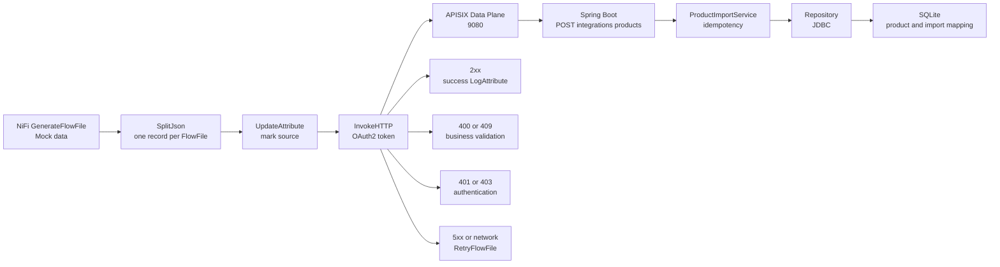
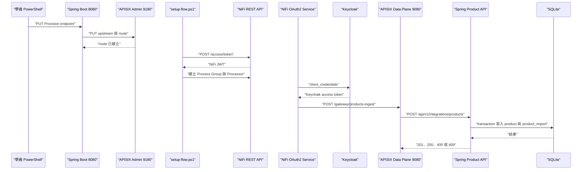

# Lab 12：以 REST API 建立 NiFi → APISIX → Spring Boot 匯入流程

目標：用 NiFi 內建 Processor 模擬外部資料來源，透過 OAuth2 Client Credentials 取得
Keycloak Bearer token，呼叫 APISIX Gateway，再由 Spring Boot 驗證並寫入 SQLite。

預估時間：60～90 分鐘。<br>
前置條件：完成 [Lab 00：基本名詞與環境](00-basic-terms.md)、[Lab 11：NiFi SPI
自訂 Processor](11-00-custom-processor-spi.md)，並完成 Spring 課程的
[`docs/19-nifi-api-ingest.md`](../../../spring-boot-training/docs/19-nifi-api-ingest.md)。

## 你會做出什麼

本 Lab 不新增 NAR，因為本次資料來源切分、HTTP 呼叫、狀態分流與重試都能由 NiFi
公開 Processor API 完成。你會用 PowerShell 將 NiFi REST API 封裝成可重複執行的部署腳本：



完成後，你應能從 NiFi UI、FlowFile attributes、Spring API response 與 SQLite repository
反查同一筆資料經過哪些邊界，以及每個錯誤是在誰的責任範圍內產生。

## 開始前先知道：這條 flow 有兩種不同的 token

這個 Lab 同時出現兩種 token，目的與發行者不同，不要混用：

| Token | 發行者 | 用途 | 放在哪裡 |
| --- | --- | --- | --- |
| NiFi access token | NiFi | 腳本呼叫 `/nifi-api` 建立 flow | PowerShell `$context.AccessToken` |
| Keycloak access token | Keycloak | NiFi runtime 呼叫 APISIX/Spring | OAuth2 Controller Service cache |

部署腳本先讀取根目錄 `.env` 的 `NIFI_USERNAME` 與 `NIFI_PASSWORD`，呼叫：

```text
POST /nifi-api/access/token
```

NiFi 驗證成功後回傳 NiFi JWT。後續建立 Process Group、Processor、Controller Service
與 Connection 的 REST request 都使用：

```http
Authorization: Bearer <NiFi access token>
```

Flow 執行時則由 `StandardOauth2AccessTokenProvider` 以 Parameter Context 的 Client ID、
Client Secret 與 Token URI 呼叫 Keycloak。Keycloak 回傳的 Bearer token 只會送給 APISIX
Gateway；它不是部署腳本使用的 NiFi token。

## 先理解本 Lab 的架構責任

```text
NiFi container
  ├─ host.docker.internal:9080
  │    └─ APISIX Data Plane
  │         └─ Spring Boot :8080 /api/v1/integrations/products
  └─ Keycloak Token URI
```

- NiFi container 內的 `localhost` 是 NiFi 自己，不是 Windows 主機上的 APISIX 或 Spring。
- `host.docker.internal:9080` 代表從 NiFi container 連到主機映射的 APISIX Data Plane。
- APISIX 只負責匹配 `/gateway/products-ingest` 並轉送 request；Spring endpoint 與
  business validation 仍由 Spring Boot 負責。
- `sourceRecordId` 是外部資料的冪等鍵。相同內容重送會回傳 200；相同 ID 但內容不同
  會回傳 409，避免把同一外部紀錄悄悄覆蓋成另一筆商品。

## 這條串接的實作檔案地圖

請不要只把 UI 上的方塊視為完成。每一個方塊都能在 repository 找到建立它、設定它或
處理它的程式；遇到問題時，先從結果反查下表的檔案：

| 邊界 | 實作檔案位置 | 先看什麼 |
| --- | --- | --- |
| NiFi 建流入口 | `examples/nifi-api-ingest/scripts/setup-flow.ps1` | 參數、mock JSON、Processor property、Connection 與 `-RunOnce` |
| NiFi REST 共用層 | `examples/nifi-custom-processor/scripts/nifi-flow-helper.ps1` | `.env` 登入、`Authorization: Bearer`、建立 Processor 與 Connection |
| Spring 的 APISIX Provision API | `spring-boot-training/spring-course-backend/src/main/java/dev/course/product/controller/ApisixEndpointController.java` | 接收 endpoint key、target path 與 HTTP methods |
| APISIX route 建立規則 | `spring-boot-training/spring-course-backend/src/main/java/dev/course/product/service/ApisixEndpointProvisioningService.java` | allowlist、path 正規化與 method 驗證 |
| APISIX Admin API adapter | `spring-boot-training/spring-course-backend/src/main/java/dev/course/product/integration/apisix/ApisixAdminAdapter.java` | Upstream、Route、`proxy-rewrite` 與 9180 Admin API |
| APISIX runtime | `spring-boot-training/apisix/docker-compose.yml`、`spring-boot-training/apisix/config.yaml` | 9080 Data Plane、9180 Admin API、etcd 與 container 對主機的連線 |
| Spring 匯入 endpoint | `spring-boot-training/spring-course-backend/src/main/java/dev/course/product/controller/ProductImportController.java` | `/api/v1/integrations/products`、validation 後呼叫 Service |
| Spring 業務邏輯 | `spring-boot-training/spring-course-backend/src/main/java/dev/course/product/service/ProductImportService.java` | transaction、冪等重送與 409 conflict |
| Spring 資料存取 | `spring-boot-training/spring-course-backend/src/main/java/dev/course/product/repository/JdbcProductImportRepository.java` | `product_import` 的查詢與寫入 |
| 資料結構 | `spring-boot-training/spring-course-backend/src/main/resources/schema.sql` | `source_record_id` 主鍵、`product_id` 關聯與資料庫約束 |
| 權限邊界 | `spring-boot-training/spring-course-backend/src/main/java/dev/course/product/security/RolePermissionMapping.java` | `nifi-ingest` 是否可 POST 匯入 API |

兩個 repository 是同一個 workspace root 下的 sibling directory。NiFi 腳本
只負責建立 flow 與送出資料；它不會直接 import Spring 的 Java class，也不會直接寫入
Spring 使用的 SQLite。

## 先用一張圖理解「誰先呼叫誰」

```text
[Spring Lab 19：Provision]
  Keycloak Role + target token
             │ PUT /api/v1/apisix/endpoints/products-ingest
             ▼
  [Spring Boot 8080] ── X-API-KEY ──> [APISIX Admin 9180]
                                      建立 /gateway/products-ingest
                                      rewrite 到 /api/v1/integrations/products

[NiFi Lab 12：Runtime ingest]
  GenerateFlowFile → SplitJson → UpdateAttribute → InvokeHTTP
                                                   │
                              Keycloak Bearer token│ POST
                                                   ▼
                       [APISIX Data Plane 9080]
                                                   │ rewrite
                                                   ▼
                       [Spring Controller 8080]
                                                   │
                           Service → Repository → SQLite
```

部署與執行是兩個不同時機：Spring Provision API 在開始送資料前先把 APISIX route
準備好；NiFi 的 `setup-flow.ps1` 再建立 Process Group；真正執行時才由 NiFi 的
`InvokeHTTP` 取得 Keycloak token 並呼叫 APISIX Data Plane。



## 關鍵程式碼如何把邊界接起來

### 1. `setup-flow.ps1` 把 APISIX URL 與 OAuth2 service 接到 `InvokeHTTP`

腳本先建立 OAuth2 Controller Service，再把它的 ID 與 Parameter reference 放進
`InvokeHTTP`。`#{...}` 是 Parameter Context 參照；`${...}` 才是 FlowFile Attribute
的 Expression Language。這裡使用前者，是為了讓環境值可以在不改 flow 結構的情況下替換：

```powershell
Set-ProcessorProperties -Context $context -ProcessorId $invoke.id -Properties @{
    "HTTP Method" = "POST"
    "HTTP URL" = "#{apisix.gateway-url}"
    "Request OAuth2 Access Token Provider" = $oauthService.id
    "Request Body Enabled" = "true"
    "Request Content-Type" = "application/json"
    "Response Body Attribute Name" = "api.response.body"
    "Response Generation Required" = "true"
} | Out-Null
```

因此資料流的 request body 是目前 FlowFile 的單筆 JSON，URL 不是寫死在 Java 或 UI，
Bearer token 也不是寫死在 FlowFile attribute。

### 2. 共用 helper 封裝 NiFi REST API 的認證與資源建立

`nifi-flow-helper.ps1` 的 `Set-NifiAccessToken` 讀取 `.env`，只在腳本記憶體中保存
NiFi token；`Invoke-NifiJson` 再把這個 token 放到每一個 NiFi API request：

```powershell
$Context.AccessToken = ((& curl.exe @tokenArguments 2>&1) -join [Environment]::NewLine).Trim()

# 後續建立 Process Group、Processor、Controller Service 與 Connection
"Authorization: Bearer $($Context.AccessToken)"
```

這個 Bearer token 只用於「修改 NiFi flow」。Flow 執行時的 Keycloak token 由
`StandardOauth2AccessTokenProvider` 取得，兩者的 issuer 與生命週期不同。

### 3. Spring 的 APISIX adapter 建立外部入口與內部 target 的對應

`ApisixAdminAdapter` 先建立固定 Spring backend 的 Upstream，再建立公開 Gateway route；
`proxy-rewrite` 將外部 path 改寫成 Spring endpoint：

```java
var gatewayPath = "/gateway/" + endpointKey;
putUpstream(upstreamId);
putRoute(routeId, upstreamId, gatewayPath, springPath, methods);

var plugins = Map.of(
        "proxy-rewrite",
        new ApisixProxyRewriteDto(springPath));
```

所以 NiFi 應該呼叫 `http://host.docker.internal:9080/gateway/products-ingest`；
NiFi 不應直接呼叫 Spring 的 `http://localhost:8080/api/v1/integrations/products`，
也不應接觸 APISIX 的 9180 Admin API。

### 4. Spring Controller 與 Service 才是 business validation 的責任邊界

Spring endpoint 先以 `@Valid` 驗證 request，再由 Service 以 transaction 處理匯入：

```java
@PostMapping
public ResponseEntity<ApiResponse<ProductImportResponse>> importProduct(
        @Valid @RequestBody ProductImportRequest request) {
    var result = productImportService.importProduct(new ProductImportDto(
            request.sourceRecordId(), request.name(), request.description(),
            request.price(), request.initialStock()));
    var errorCode = result.duplicate() ? ErrorCode.SUCCESS : ErrorCode.CREATED;
    return ResponseEntity.status(result.duplicate() ? HttpStatus.OK : HttpStatus.CREATED)
            .body(responseFactory.success(errorCode, ProductImportResponse.from(result)));
}
```

`ProductImportService` 先查 `product_import.source_record_id`；新資料在同一個 transaction
建立 `product` 與 mapping；相同 ID 且內容不同則回傳 409。這也是為什麼 NiFi 只做
傳輸、分流與重試，不把重複判斷複製一份在 Processor 裡。

## 從執行結果反查實作檔案

| 觀察到的結果 | 先看哪裡 | 判斷重點 |
| --- | --- | --- |
| NiFi 腳本無法建立 flow | `nifi-flow-helper.ps1`、`.env` | NiFi token、REST path 或帳密是否正確 |
| APISIX 回 404 | `setup-flow.ps1` 的 `GatewayUrl`、`ApisixAdminAdapter` | route path 是否為 `/gateway/products-ingest`，rewrite 是否正確 |
| 回 401 | OAuth2 Controller Service、Keycloak Token URI | runtime Bearer 是否由 Keycloak 發行、是否過期 |
| 回 403 | `RolePermissionMapping.java` | token 是否有 `nifi-ingest`，method/path 是否相符 |
| 回 400 | `ProductImportRequest.java`、Spring response | JSON 欄位驗證或業務輸入規則是否不符 |
| 回 409 | `ProductImportService.java`、`ProductImport.java` | 同一 `sourceRecordId` 是否被送出不同內容 |
| 成功但資料不在 DB | `ProductImportService.java`、`JdbcProductImportRepository.java`、`schema.sql` | transaction、mapping 與 SQLite 是否為同一 runtime |

完成這個反查後，學員應能回答：「這個錯誤是在 NiFi、APISIX、Spring Security、
Spring validation、business service，還是 repository 產生的？」而不是只看到 queue
有 FlowFile 就判定串接完成。

## Step 0：確認 Spring 與 APISIX 前置設定

請先依 Spring 課程的 [Lab 19：NiFi API Ingest](../../../spring-boot-training/docs/19-nifi-api-ingest.md)
完成：

1. 啟動 APISIX 與 Spring Boot `local,apisix` profile。
2. 在 Keycloak `spring-course-demo` Client 的 Service Account 建立或沿用
   `gateway-admin` 與 `nifi-ingest` Role。
3. 透過 Spring Provision API 建立 `products-ingest` endpoint：
   `POST /api/v1/integrations/products`。
4. 保留 Provision 回傳的 Client Secret 在同一個 PowerShell session；不要貼到聊天、
   Git 或課程檔案。

可先確認 APISIX Gateway URL 與 Spring backend health：

```powershell
Invoke-RestMethod -Uri http://localhost:8080/actuator/health

# 這裡的 URL 是由 APISIX route 的 endpoint key 組成；從 NiFi container 呼叫時，
# setup-flow.ps1 會使用 host.docker.internal，而不是 localhost。
$gatewayUrl = 'http://host.docker.internal:9080/gateway/products-ingest'
```

若尚未建立 route，NiFi flow 會收到 404 或 401；這不是 NiFi Processor 本身的錯誤，
請先檢查 Spring Provision API 與 APISIX route。

## Step 1：準備執行時參數

執行位置：`nifi-training` repository root。

以下只把非 Secret 的 Token URI 放進變數；`$targetClientSecret` 應沿用 Spring Lab
Provision response 的記憶體變數：

```powershell
$keycloakTokenUri = 'replace-with-keycloak-token-uri'
$targetClientId = 'spring-course-demo'
$targetClientSecret = 'replace-with-client-secret-from-provision-response'
```

真實練習時，請把 placeholder 換成目前 Keycloak 環境的值，但不要把 Secret 寫入
`.ps1`、`.env.sample`、Markdown 或 command transcript。腳本會把 Secret 送進 NiFi
Parameter Context 的 sensitive parameter，並且不在輸出中顯示。

## Step 2：以 REST API 建立 Process Group 與 Parameter Context

執行：

```powershell
.\examples\nifi-api-ingest\scripts\setup-flow.ps1 `
  -KeycloakTokenUri $keycloakTokenUri `
  -KeycloakClientId $targetClientId `
  -KeycloakClientSecret $targetClientSecret `
  -ReplaceExisting
```

腳本會使用 NiFi 公開 REST API 完成下列動作：

1. 取得 NiFi access token。
2. 找到同名 Process Group；只有指定 `-ReplaceExisting` 才會停止、清空並刪除舊群組。
3. 建立新的 `training-lab-12-api-ingest` Process Group。
4. 建立或更新 `training-lab-12-api-ingest-parameters` Parameter Context。
5. 將 Parameter Context 綁定到 Process Group。
6. 建立 OAuth2 Controller Service，並使用 `#{keycloak.client-secret}` 參照 sensitive
   parameter。

這裡使用 Parameter Context 的原因，是把環境值與 flow 結構分離。Processor property
中的 `#{apisix.gateway-url}` 是 NiFi Parameter reference；`${...}` 則是 FlowFile
attribute 的 Expression Language，兩者不要混淆。

## Step 3：建立並觀察資料流

腳本建立的元件與責任如下：

| 元件 | 為什麼需要 |
| --- | --- |
| `GenerateFlowFile` | 用固定 JSON array 模擬外部資料來源，讓每次練習可重現 |
| `SplitJson` | 把一個 array 拆成三個獨立商品 FlowFile |
| `UpdateAttribute` | 標記資料來源，讓下游 log 與排錯可追蹤 |
| `InvokeHTTP` | 以 POST + JSON body 呼叫 APISIX，並要求 OAuth2 token |
| `RouteOnAttribute` | 依 `invokehttp.status.code` 將 400/409、401/403 與其他 4xx 分開 |
| `RetryFlowFile` | 只處理 5xx 或連線失敗，最多重試三次 |
| `LogAttribute` | 保留成功、驗證失敗、驗證錯誤與重試耗盡等觀察點 |

開啟 `https://localhost:8443/nifi`，進入 `training-lab-12-api-ingest`，依序檢查：

1. Process Group 是否綁定正確 Parameter Context。
2. OAuth2 Controller Service 是否為 `Enabled`，且 Client Secret property 顯示為敏感值。
3. `InvokeHTTP` 的 `HTTP URL` 是否為 `#{apisix.gateway-url}`。
4. `InvokeHTTP` 是否連接 `Response`、`No Retry`、`Retry` 與 `Failure` relationships。
5. `RetryFlowFile` 的 `Maximum Retries` 是否為 3。
6. 每個 `LogAttribute` 下游 queue 是否清楚表示成功、業務失敗、認證失敗或重試耗盡。

## Step 4：執行一次並驗證 Spring 業務結果

加入 `-RunOnce`：

```powershell
.\examples\nifi-api-ingest\scripts\setup-flow.ps1 `
  -KeycloakTokenUri $keycloakTokenUri `
  -KeycloakClientId $targetClientId `
  -KeycloakClientSecret $targetClientSecret `
  -ReplaceExisting `
  -RunOnce
```

腳本會先暫時啟動下游 worker，再以 REST API 對 `GenerateFlowFile` 執行 `RUN_ONCE`，
最後停止 worker 並讀取 terminal queue。mock data 包含：

| sourceRecordId | 內容 | 預期結果 |
| --- | --- | --- |
| `mock-1001` | 有效商品 | HTTP 201 / `code=A003`，首次匯入；若 SQLite 已有資料則為 HTTP 200 |
| `mock-1002` | 有效商品 | HTTP 201 / `code=A003`，首次匯入；若 SQLite 已有資料則為 HTTP 200 |
| `mock-1003` | `price=-1` | HTTP 400 / `code=E005`，進入 business validation queue |

第一次執行成功後，在 Spring API 可確認商品列表：

```powershell
Invoke-RestMethod -Uri http://localhost:8080/api/v1/products
```

真正的 repository 寫入由 Spring 的 `ProductImportService`、`ProductRepository` 與
`ProductImportRepository` 完成；NiFi 不直接連線 Spring 的 SQLite 檔案。

## Step 5：驗證冪等重送

加入 `-VerifyReplay`。此參數會隱含執行第一次 ingest，再用相同 mock data 重送一次：

```powershell
.\examples\nifi-api-ingest\scripts\setup-flow.ps1 `
  -KeycloakTokenUri $keycloakTokenUri `
  -KeycloakClientId $targetClientId `
  -KeycloakClientSecret $targetClientSecret `
  -ReplaceExisting `
  -RunOnce `
  -VerifyReplay
```

第二次的兩筆有效資料應符合：

- HTTP 200。
- response `data.duplicate=true`。
- `product` 的 id 不變。
- `product_import.source_record_id` 不會新增第二筆 mapping。

如果用相同 `sourceRecordId` 但修改 `price` 或 `name`，Spring 應回傳 HTTP 409 / `E303`。
這個結果要進入業務衝突處理，不應被 RetryFlowFile 當成暫時性網路錯誤重試。

## 練習題

1. 將 `mock-1003` 的負價格改成缺少 `name`，確認 Spring 仍回傳 HTTP 400，但錯誤欄位
   由 `@NotBlank` 驗證處理。
2. 暫時把 Gateway URL 改成不存在的 path，觀察 `No Retry` 的其他 4xx 分支。
3. 暫時把 Keycloak Client Secret 改錯，觀察 OAuth2 Controller Service bulletin、
   `InvokeHTTP` 的 `401/403` 與 flow 的責任邊界。
4. 暫時把 APISIX port 改成未監聽的 port，觀察 `Failure` → `RetryFlowFile` →
   `retries_exceeded` 的 queue 與 retry attributes。
5. 思考若外部資料改由 `ExecuteSQLRecord` 產生，哪一段可以保持不變？答案應是每一筆
   record 仍需整理成同一個 API contract，`InvokeHTTP` 之後的驗證、重試與分流可以重用。

## 完成檢查

- [ ] 能分辨 NiFi access token 與 Keycloak access token 的發行者與用途。
- [ ] 能從腳本反查 `POST /nifi-api/access/token`、Parameter Context 與 Process Group API。
- [ ] 能說明 `host.docker.internal` 是因為 request 從 NiFi container 發出。
- [ ] 能說明 `InvokeHTTP` 的 400/409 不應進入 retry，5xx/連線失敗才進入 retry。
- [ ] 能在 Spring API 看到兩筆有效商品，並在 NiFi queue 看到一筆 400 驗證失敗。
- [ ] 能以第二次執行證明 `sourceRecordId` 冪等，而不是只看 HTTP status。
- [ ] 能指出哪一層負責 mock data、Gateway routing、JWT、business validation 與 repository。

## 排錯提示

| 現象 | 先檢查 |
| --- | --- |
| `401` | Keycloak token URI、Client Secret、issuer、Bearer token 是否由 `nifi-ingest` Client 取得 |
| `403` | `spring-course-demo` Service Account 是否有 `nifi-ingest` Role；Spring `RolePermissionMapping` 是否允許 POST |
| `404` | APISIX 是否建立 `products-ingest` route，且 proxy-rewrite target 為 `/api/v1/integrations/products` |
| `400` | 先看 Spring response 與 `code`；這是 request/business validation，不是 NiFi 連線錯誤 |
| `409` | `sourceRecordId` 已存在但 payload 不同；確認外部資料是否重複或 mapping 規則是否正確 |
| `5xx` 或 `Failure` | APISIX 9080 是否可從 NiFi container 連線，確認 `host.docker.internal` 與 port |
| Controller Service invalid | Parameter Context 是否綁定、敏感參數是否提供、Token URI 是否可由 container 連線 |
| 腳本說同名 Process Group 已存在 | 先確認是否為課程群組，再使用 `-ReplaceExisting`；不要直接刪除不屬於課程的群組 |

## 本 Lab 的學習重點回顧

本 Lab 的重點不是把每個 Processor 都改成 Java，而是學會判斷責任邊界：

1. NiFi 用公開 REST API 建立可重現 flow，並以 Parameter Context 管理環境差異。
2. `InvokeHTTP` 使用官方 OAuth2 Controller Service 取得 runtime token，不把 Bearer
   token 寫死在 FlowFile 或腳本中。
3. APISIX 是外部入口與 routing layer；它不取代 Spring endpoint 或 business rules。
4. Spring API 以 validation、transaction、Repository 與 `product_import` mapping
   實作可測試的冪等匯入。
5. 只有暫時性失敗進 retry；輸入錯誤、認證錯誤與資源衝突要進可觀察的業務分支。
6. 這條 flow 可以將 `GenerateFlowFile` 替換成資料庫、Queue 或其他外部來源，而不必
   改變下游 API contract；這就是把整合流程拆成可重用邊界的原因。

## 官方文件

- [NiFi InvokeHTTP](https://nifi.apache.org/components/org.apache.nifi.processors.standard.InvokeHTTP/)
- [NiFi StandardOauth2AccessTokenProvider](https://nifi.apache.org/components/org.apache.nifi.oauth2.StandardOauth2AccessTokenProvider/)
- [NiFi REST API 補充清單](supplement-api-endpoints.md)
