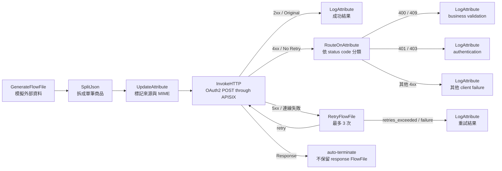
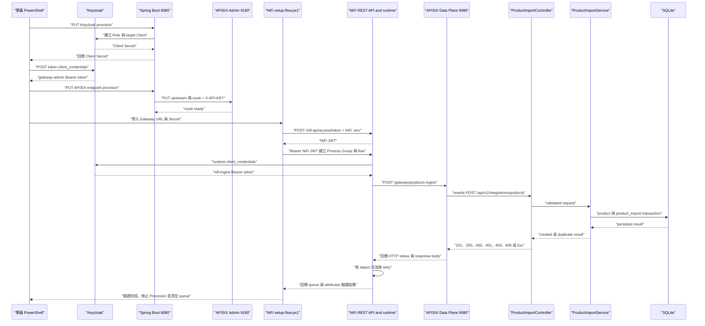

# Lab 12：以 REST API 建立 NiFi → APISIX → Spring Boot 匯入流程

本文件是一份可以獨立完成的端到端教材。學員只需要閱讀目前手上的這一份文件，
不需要再跳到另一個 repository 的課程文件；NiFi repository 與 Spring Boot repository
只是透過 HTTP contract 串接，並不是同一個專案或 Java module。

本 Lab 的操作順序、Keycloak Role、APISIX route、Spring API contract、NiFi REST 建流、
執行驗證與排錯都集中在本文。另一個 repository 只提供可被反查的實作檔案，不是課程
前置依賴。

NiFi 版本：2.9.0<br>
預估時間：60～90 分鐘

## 你會做出什麼

~~~mermaid
flowchart LR
    keycloak["Keycloak<br>Client Credentials"] --> nifi["NiFi container<br>InvokeHTTP"]
    nifi --> apisix["APISIX Data Plane<br>9080"]
    apisix --> controller["Spring Controller<br>POST integrations products"]
    controller --> service["ProductImportService<br>transaction and idempotency"]
    service --> product["ProductRepository<br>product"]
    service --> mapping["ProductImportRepository<br>product_import"]
    product --> database["SQLite"]
    mapping --> database
~~~

本 Lab 的資料契約是 POST /api/v1/integrations/products。NiFi 不直接操作 SQLite，
APISIX 不負責建立 Spring endpoint；每一層只負責自己的邊界。

## 本 Lab 的 Processor 責任與分流

先釐清本 Lab 的 Processor 定位：本 Lab 使用 NiFi 2.9.0 內建 Processor，沒有新增
Java 客製化 Processor。這裡的客製化是 `setup-flow.ps1` 透過 NiFi REST API 組合
Processor、設定屬性、綁定 Controller Service 與建立 Connection，形成符合匯入業務的
資料流。若需求是開發 NiFi 內建功能無法完成的 Java Processor，應另行進入 SPI
客製化 Processor 主題；本 Lab 不要求該主題作為前置依賴。



### Processor 各自負責什麼

| Processor | 本 Lab 的責任 | 為什麼需要它 |
| --- | --- | --- |
| `GenerateFlowFile` | 產生包含三筆商品的 JSON array | 模擬外部資料來源，讓學員可以重現相同輸入 |
| `SplitJson` | 以 `$.*` 將 array 拆成一筆商品一個 FlowFile | 每筆資料要獨立呼叫 API，才能分別觀察成功與失敗 |
| `UpdateAttribute` | 加上 `mime.type` 與 `training.source` | 保留資料來源與內容格式，方便下游 API 與 LogAttribute 反查 |
| `InvokeHTTP` | 以 OAuth2 Client Credentials 取得 Bearer token，呼叫 APISIX Gateway | 將 NiFi FlowFile 轉成對外 HTTP request，並把 HTTP status 與 response body 帶回 FlowFile |
| `RouteOnAttribute` | 依 `invokehttp.status.code` 分類 400、409、401、403 | 將業務錯誤、認證錯誤與其他 client 錯誤分開處理 |
| `RetryFlowFile` | 對 5xx 或連線失敗最多重試 3 次 | 暫時性基礎設施錯誤適合重試，業務驗證錯誤不應重試 |
| `LogAttribute` | 記錄 HTTP status、status message、來源識別與 training source | 讓學員從 NiFi log 或 Provenance 反查每筆 FlowFile 的處理結果 |

`InvokeHTTP` 的 `Response Generation Required=false` 讓 2xx 使用 `Original` relationship
繼續往 success；response body 寫入 `api.response.body` attribute。`Response` relationship
設定為 auto-terminate，避免 4xx response FlowFile 與 `No Retry` 同時進入 success。

### HTTP status 如何分流

| 情境 | HTTP status | NiFi 路徑 | 說明 |
| --- | ---: | --- | --- |
| 第一次匯入有效商品 | `201` | `Original → success LogAttribute` | Spring 建立 `product` 與 `product_import` |
| 重送相同有效商品 | `200` | `Original → success LogAttribute` | Spring 回傳 `duplicate=true`，不重複建立資料 |
| 商品欄位驗證失敗 | `400` | `No Retry → RouteOnAttribute → business.validation.400` | 例如 `price=-1`，修正輸入後再送，不進 retry |
| 相同來源 ID 但內容衝突 | `409` | `No Retry → RouteOnAttribute → business.validation.409` | 外部資料與既有 mapping 不一致，需要人工判斷 |
| Token 或權限錯誤 | `401`、`403` | `No Retry → RouteOnAttribute → authentication` | 檢查 Keycloak token、Role 與 Spring Security |
| 暫時性服務或網路錯誤 | `5xx` 或連線失敗 | `Retry / Failure → RetryFlowFile` | 最多重試 3 次，超過後進重試失敗 LogAttribute |

因此本 Lab 的核心不是撰寫新的 Processor class，而是學會把既有 Processor 組合成
可觀察、可分流、可重試且符合業務語意的 Flow；SPI 客製化 Processor 則是另一個
開發主題。

## 先定位實作檔案

本 Lab 建議採用「先看檔案責任，再執行指令」的閱讀方式。下表是從外部 request 到
資料庫的最短追蹤路徑：

| 串接責任 | 實作檔案位置 | 關鍵內容 |
| --- | --- | --- |
| 建立 Keycloak Role | `spring-course-backend/src/main/java/dev/course/product/controller/KeycloakController.java` | `PUT /api/v1/keycloak/clients/{clientId}/provision`，建立或沿用 Client Role |
| 呼叫 Keycloak adapter | `spring-course-backend/src/main/java/dev/course/product/service/KeycloakProvisioningService.java` | 將 provisioning use case 與外部 HTTP 細節分離 |
| 接收 Gateway Provision request | `spring-course-backend/src/main/java/dev/course/product/controller/ApisixEndpointController.java` | `PUT /api/v1/apisix/endpoints/{endpointKey}` |
| 驗證 Gateway target | `spring-course-backend/src/main/java/dev/course/product/service/ApisixEndpointProvisioningService.java` | endpoint key、Spring path、methods 與 allowlist |
| 呼叫 APISIX Admin API | `spring-course-backend/src/main/java/dev/course/product/integration/apisix/ApisixAdminAdapter.java` | 9180、`X-API-KEY`、Upstream、Route、`proxy-rewrite` |
| APISIX runtime container | `apisix/docker-compose.yml`、`apisix/config.yaml` | 9080 Data Plane、9180 Admin API、etcd 與 `host.docker.internal` |
| APISIX runtime 設定 | `spring-course-backend/src/main/resources/application-apisix.yaml`、`spring-course-backend/.env` | Admin URL、Data Plane public URL、upstream host/port、target allowlist |
| 匯入 API contract | `spring-course-backend/src/main/java/dev/course/product/controller/ProductImportController.java`、`dto/ProductImportRequest.java` | POST path、JSON 欄位與 Bean Validation |
| 匯入業務邏輯 | `spring-course-backend/src/main/java/dev/course/product/service/ProductImportService.java`、`model/ProductImport.java` | transaction、冪等重送與 409 conflict |
| JDBC persistence | `spring-course-backend/src/main/java/dev/course/product/repository/JdbcProductImportRepository.java` | 查詢與寫入 `product_import` |
| SQLite schema | `spring-course-backend/src/main/resources/schema.sql` | `source_record_id`、`product_id` constraint 與 foreign key |
| NiFi 呼叫端 | `nifi-training/examples/nifi-api-ingest/scripts/setup-flow.ps1` | `InvokeHTTP` URL、OAuth2 service、status 分流與 retry |

上述檔案分屬兩個獨立 repository；它們只透過 HTTP contract 串接。本文已提供必要的 contract、設定與操作步驟，學員不需要閱讀另一個 repository 的課程文件。

## 先看完整串接順序

```text
[1. Keycloak]
  建立 gateway-admin、nifi-ingest Role
             │
             ▼
[2. Spring Provision API :8080]
  驗證 gateway-admin
  └─ 呼叫 APISIX Admin :9180
       ├─ Upstream → Spring backend :8080
       └─ Route /gateway/products-ingest
                    └─ proxy-rewrite → /api/v1/integrations/products

[3. NiFi runtime]
  GenerateFlowFile → SplitJson → InvokeHTTP
                                      │
                     Keycloak Bearer │ POST :9080
                                      ▼
                         [APISIX Data Plane]
                                      │
                                      ▼
                         [Spring Controller]
                                      │
                         Service → JDBC → SQLite
```



注意這裡有三種不同的安全資料：Keycloak access token 是呼叫 Spring 或 APISIX Data
Plane 的 Bearer token；NiFi access token 是 `setup-flow.ps1` 修改 NiFi 的 token；
APISIX Admin key 只由 Spring 的 `ApisixAdminAdapter` 呼叫 9180 使用。NiFi 不應拿到
APISIX Admin key。

## 關鍵程式碼反查

### 0. APISIX container 先提供兩個不同入口

`apisix/docker-compose.yml` 將 9080 與 9180 映射到本機，並以
`host.docker.internal:host-gateway` 讓 APISIX container 可以找到主機上的 Spring Boot；
`apisix/config.yaml` 再設定 Data Plane 的 `node_listen: 9080`、Admin key 與 etcd 位址。

~~~yaml
# apisix/config.yaml
apisix:
  node_listen: 9080

deployment:
  admin:
    admin_key:
      - name: "admin"
        key: ${{APISIX_ADMIN_KEY}}
        role: admin
~~~

因此 9180 只給 Spring 的 adapter 管理 route；NiFi runtime 使用 9080。學員若把
`APISIX_ADMIN_URL` 填進 NiFi，代表把管理面與資料面混在一起，這不是正確的串接方式。

### 1. Spring Provision API 將公開輸入轉成受控的 APISIX route

`ApisixEndpointController` 只負責接收 HTTP DTO，再交給 Service；Service 會先確認
target path 在 allowlist，才允許 adapter 呼叫 APISIX：

~~~java
@PutMapping("/{endpointKey}")
public ResponseEntity<ApiResponse<ApisixEndpointProvisionResponse>> provision(
        @PathVariable String endpointKey,
        @Valid @RequestBody ProvisionApisixEndpointRequest request) {
    var specification = new ApisixEndpointProvisionSpecDto(
            endpointKey, request.springPath(), request.methods());
    var result = provisioningService.provision(specification);
    return ResponseEntity.ok(responseFactory.success(
            ErrorCode.SUCCESS,
            ApisixEndpointProvisionResponse.from(result)));
}
~~~

真正與 APISIX 9180 溝通的是 `ApisixAdminAdapter`。它把同一個 endpoint key 展開成
固定的 upstream ID、route ID 與公開 path，並透過 `proxy-rewrite` 對應到 Spring path：

~~~java
var routeId = "spring-course-route-" + endpointKey;
var upstreamId = "spring-course-upstream-" + endpointKey;
var gatewayPath = "/gateway/" + endpointKey;

putUpstream(upstreamId);
putRoute(routeId, upstreamId, gatewayPath, springPath, methods);
~~~

`putRoute` 的 payload 使用 `upstream_id` 指向 Spring backend，並設定：

~~~java
var plugins = Map.of(
        "proxy-rewrite",
        new ApisixProxyRewriteDto(springPath));
~~~

因此 APISIX 的責任是路由與 rewrite；它不應複製 Spring 的 DTO validation 或匯入規則。

### 2. RolePermissionMapping 決定哪一種 token 可以做哪件事

`RolePermissionMapping.java` 用明確的 method + path 綁定權限：

~~~java
"gateway-admin",
Set.of(new ApiPermission("PUT", "/api/v1/apisix/endpoints/{endpointKey}")),
"nifi-ingest",
Set.of(new ApiPermission("POST", "/api/v1/integrations/products"))
~~~

所以 Provision token 與 runtime ingest token 即使來自同一個 Keycloak Client，也要靠 Role
區分責任。401 表示 token 不存在或無法驗證；403 表示 token 有效但缺少對應 permission。

### 3. ProductImportController 將 APISIX request 交給 Spring business layer

APISIX rewrite 後，request 會進入 `ProductImportController` 的固定 endpoint。DTO 的
`@NotBlank`、`@NotNull` 與 `@Min(0)` 先處理 request 格式與欄位規則：

~~~java
@RequestMapping("/api/v1/integrations/products")
public class ProductImportController {

    @PostMapping
    public ResponseEntity<ApiResponse<ProductImportResponse>> importProduct(
            @Valid @RequestBody ProductImportRequest request) {
        var result = productImportService.importProduct(new ProductImportDto(
                request.sourceRecordId(), request.name(), request.description(),
                request.price(), request.initialStock()));
        var errorCode = result.duplicate() ? ErrorCode.SUCCESS : ErrorCode.CREATED;
        return ResponseEntity.status(result.duplicate() ? HttpStatus.OK : HttpStatus.CREATED)
                .body(responseFactory.success(errorCode, ProductImportResponse.from(result)));
    }
}
~~~

### 4. ProductImportService 保留只能存在一份的冪等規則

NiFi 可能因 retry 或外部來源重送相同 record；因此這個規則必須在 Spring Service，而
不是只放在 NiFi flow：

~~~java
@Transactional
public ProductImportResultDto importProduct(ProductImportDto dto) {
    var sourceRecordId = dto.sourceRecordId().trim();
    var name = dto.name().trim();
    var description = normalizeDescription(dto.description());
    var existing = productImportRepository.findBySourceRecordId(sourceRecordId);
    if (existing.isPresent()) {
        return resolveDuplicate(existing.get(), sourceRecordId, name, description, dto);
    }

    var now = Instant.now(clock);
    var product = productRepository.create(name, description, dto.price(), dto.initialStock(), now);
    productImportRepository.create(new ProductImport(
            sourceRecordId, product.id(), name, description,
            dto.price(), dto.initialStock(), now));
    return new ProductImportResultDto(sourceRecordId, product, false);
}
~~~

實際檔案中的 `resolveDuplicate` 會比較 name、description、price 與 initialStock。全部
相同才回傳 `duplicate=true`；同一 source ID 但內容不同就丟出 E303 / HTTP 409。`schema.sql`
則用 `source_record_id PRIMARY KEY` 與 `product_id UNIQUE` 讓資料庫也保留這個邊界。

### 5. NiFi 端只把資料送到公開 Gateway URL

`nifi-training/examples/nifi-api-ingest/scripts/setup-flow.ps1` 的核心連接設定如下：

~~~powershell
Set-ProcessorProperties -Context $context -ProcessorId $invoke.id -Properties @{
    "HTTP Method" = "POST"
    "HTTP URL" = "#{apisix.gateway-url}"
    "Request OAuth2 Access Token Provider" = $oauthService.id
    "Request Body Enabled" = "true"
    "Request Content-Type" = "application/json"
} | Out-Null
~~~

`#{apisix.gateway-url}` 是 NiFi Parameter Context reference；實際值從 container 呼叫
時是 `http://host.docker.internal:9080/gateway/products-ingest`。NiFi 不需要知道
Spring upstream 的 host，也不需要知道 APISIX Admin API 的 key。

## 從結果反查到程式

| 結果 | 反查順序 | 主要檔案 |
| --- | --- | --- |
| Provision API 回 400 | target path 是否在 allowlist、method 是否支援 | `ApisixEndpointProvisioningService.java`、`ApisixProperties.java` |
| Provision API 回 403 | token 是否包含 `gateway-admin` | `RolePermissionMapping.java`、Security config |
| Gateway 回 404 | route URI、endpoint key、public URL | `ApisixAdminAdapter.java`、APISIX route |
| Gateway 回 401 | runtime token、issuer、OAuth2 Controller Service | `setup-flow.ps1`、Keycloak 設定 |
| Spring 回 400 | JSON 欄位與 validation annotations | `ProductImportRequest.java`、`ProductImportController.java` |
| Spring 回 409 | 同一 `sourceRecordId` 是否送出不同 payload | `ProductImportService.java`、`ProductImport.java` |
| Spring 回 201 | 新增 product 與 mapping | `ProductImportService.java`、`JdbcProductImportRepository.java`、`schema.sql` |
| Spring 回 200 且 duplicate=true | 相同 payload 冪等重送 | `ProductImportService.java`、`ProductImportResponse.java` |

完成這張反查表，才算理解串接；只看到 NiFi success queue 或只看到 APISIX route 存在，
都還不能證明 Spring transaction 與資料 mapping 正確。

## Step 0：準備 Keycloak、Spring、APISIX 與 NiFi
執行目錄：依 0.1～0.3 子步驟切換至 `<spring-boot-training-root>\spring-course-backend`、`<spring-boot-training-root>\apisix` 或 `<nifi-training-root>`。

### 0.1 Keycloak 管理用 Client

若環境已經有可呼叫 Keycloak Admin API 的管理用 Client，可以沿用；否則在目標 Realm
建立 `spring-course-admin` confidential Client：

1. 開啟 Client authentication。
2. 開啟 Service accounts roles。
3. 關閉本 Lab 不使用的 Standard flow 與 Direct access grants。
4. 在 Service Account Roles → `realm-management` 指派課程環境允許的
   `query-clients`、`view-clients`、`create-client`、`manage-clients`、
   `manage-users` 與 `manage-realm`。
5. Client Secret 只保存於本機 `.env` 或 Secret Manager，不要貼到文件、command transcript 或 Git。

Spring `local` profile 需要：

~~~properties
KEYCLOAK_ISSUER_URI=<keycloak-base>/realms/<realm>
KEYCLOAK_REALM=<realm>
KEYCLOAK_TOKEN_URI=<keycloak-base>/realms/<realm>/protocol/openid-connect/token
KEYCLOAK_ADMIN_CLIENT_ID=spring-course-admin
KEYCLOAK_ADMIN_CLIENT_SECRET=<management-client-secret>
KEYCLOAK_RESOURCE_CLIENT_ID=spring-course-demo
~~~

### 0.2 APISIX 與 Spring

Spring backend 的 `.env` 需要下列設定，且 allowlist 必須包含匯入 target：

~~~properties
APISIX_ADMIN_URL=http://localhost:9180/apisix/admin
APISIX_ADMIN_KEY=<local-only-apisix-admin-key>
APISIX_PUBLIC_URL=http://localhost:9080
APISIX_UPSTREAM_HOST=host.docker.internal
APISIX_UPSTREAM_PORT=8080
APISIX_ALLOWED_TARGET_PATHS=/api/v1/products,/api/v1/integrations/products
~~~

9180 是 Admin API，只有 Spring adapter 使用；9080 是 Data Plane，NiFi runtime 使用。
APISIX 與 NiFi container 連到主機上的 Spring 時都使用 `host.docker.internal:8080`，
不能把 container 內的 `localhost` 當成主機。

~~~powershell
Set-Location <spring-boot-training-root>\apisix
docker compose up -d
docker compose ps

Set-Location <spring-boot-training-root>\spring-course-backend
.\mvnw.cmd spring-boot:run '-Dspring-boot.run.profiles=local'
~~~

### 0.3 NiFi 本機環境

在 NiFi repository 根目錄準備 `.env`，實際帳密只放本機：

~~~powershell
Set-Location <nifi-training-root>
Copy-Item .env.sample .env
# 編輯 .env，填入 NIFI_USERNAME 與長度足夠的 NIFI_PASSWORD
docker build -t nifi-sample .
docker compose up -d
docker compose ps
~~~

端點為 NiFi UI `https://localhost:8443/nifi`、主機 HTTP mapping
`http://localhost:18081` → container `8080`、Spring `localhost:8080`、
APISIX Data Plane `localhost:9080` 與 Admin API `localhost:9180`。

修改已啟動 NiFi 的 `.env` 後，要重建 container 才會載入新帳密，不需要重新 build image：

~~~powershell
docker compose up -d --force-recreate nifi
~~~

## Step 1：確認 APISIX allowlist 與環境設定
執行目錄：`<spring-boot-training-root>\apisix`（設定檔位於 `<spring-boot-training-root>\spring-course-backend\.env`）。

在 spring-course-backend/.env 確認：

~~~properties
APISIX_ADMIN_URL=http://localhost:9180/apisix/admin
APISIX_ADMIN_KEY=<本機 APISIX Admin key>
APISIX_PUBLIC_URL=http://localhost:9080
APISIX_UPSTREAM_HOST=host.docker.internal
APISIX_UPSTREAM_PORT=8080
APISIX_ALLOWED_TARGET_PATHS=/api/v1/products,/api/v1/integrations/products
~~~

APISIX_ALLOWED_TARGET_PATHS 是 Spring Provision API 的安全 allowlist。沒有加入新 path
時，即使 endpoint request 的 JSON 正確，Spring 仍會回傳 400 / E005。

啟動 APISIX，確認 Admin API 與 Data Plane：

~~~powershell
Set-Location <spring-boot-training-root>\apisix
docker compose up -d
docker compose ps
~~~

APISIX 9180 是管理入口；NiFi 執行業務 request 使用的是 APISIX Data Plane 9080。

## Step 2：建立或沿用三個 Keycloak Role
執行目錄：`<spring-boot-training-root>\spring-course-backend`。

在仍執行 `local` profile 的 Spring backend 上，使用本機 Provision API。這個 API 會
建立或沿用 `spring-course-demo` Client、Client Role、Service Account 與 Role mapping；
重複執行是安全的。以下保留 Client Secret 在同一個 PowerShell session 的記憶體中：

~~~powershell
$provisionUri = 'http://localhost:8080/api/v1/keycloak/clients/spring-course-demo/provision'
$roleRequests = @(
    @{
        clientName = 'Spring Course Demo'
        roleName = 'course-reader'
        roleDescription = '課程練習用讀取角色'
    }
    @{
        clientName = 'Spring Course Demo'
        roleName = 'gateway-admin'
        roleDescription = '可建立課程 APISIX Gateway endpoint'
    }
    @{
        clientName = 'Spring Course Demo'
        roleName = 'nifi-ingest'
        roleDescription = '可由 NiFi 呼叫商品匯入 API'
    }
)

foreach ($roleRequest in $roleRequests) {
    $provisionBody = $roleRequest | ConvertTo-Json -Depth 5
    $provisionResponse = Invoke-RestMethod -Method Put `
        -Uri $provisionUri `
        -ContentType 'application/json' `
        -Body $provisionBody `
        -ErrorAction Stop

    if ([string]::IsNullOrWhiteSpace($provisionResponse.data.clientSecret)) {
        throw "$($roleRequest.roleName) Provision response 沒有回傳目標 Client Secret"
    }

    $targetClientSecret = $provisionResponse.data.clientSecret
    Write-Host "$($roleRequest.roleName) 已建立或沿用，roleAssigned=$($provisionResponse.data.roleAssigned)"
}

'三個 Role 已完成 Provision；Client Secret 只保留在 PowerShell 記憶體'
~~~

三個 Role 的責任是：`course-reader` 用於查詢、`gateway-admin` 用於
`PUT /api/v1/apisix/endpoints/{endpointKey}`、`nifi-ingest` 用於
`POST /api/v1/integrations/products`。若回 403，檢查管理用 Client 的
`realm-management` 權限；若回 400，檢查 Realm、issuer 與 Spring `.env`。

## Step 3：啟動 APISIX profile 並取得 target token
執行目錄：`<spring-boot-training-root>\spring-course-backend`。

停止 local backend 後，以 local,apisix profile 重新啟動：

~~~powershell
.\mvnw.cmd spring-boot:run '-Dspring-boot.run.profiles=local,apisix'
~~~

在仍保留 $targetClientSecret 的 PowerShell 視窗讀取 .env，向 Keycloak Token
Endpoint 交換短效 token。這段不輸出完整 access token：

~~~powershell
$envValues = @{}
Get-Content -LiteralPath .\.env | ForEach-Object {
    if ($_ -match '^\s*([^#=]+)=(.*)$') {
        $envValues[$Matches[1].Trim()] = $Matches[2]
    }
}

$tokenForm = @{
    grant_type = 'client_credentials'
    client_id = $envValues.KEYCLOAK_RESOURCE_CLIENT_ID
    client_secret = $targetClientSecret
}
$targetTokenResponse = Invoke-RestMethod -Method Post `
    -Uri $envValues.KEYCLOAK_TOKEN_URI `
    -ContentType 'application/x-www-form-urlencoded' `
    -Body $tokenForm `
    -ErrorAction Stop

if ([string]::IsNullOrWhiteSpace($targetTokenResponse.access_token)) {
    throw 'Keycloak 沒有回傳 access_token'
}

$bearerHeaders = @{
    Authorization = "Bearer $($targetTokenResponse.access_token)"
}
"target token 取得成功，expires_in=$($targetTokenResponse.expires_in) 秒"
~~~

此 Bearer token 是 Keycloak 發行的，不是 APISIX X-API-KEY，也不是 NiFi
/nifi-api/access/token 回傳的 token。

## Step 4：以 Spring Provision API 建立 APISIX route
執行目錄：`<spring-boot-training-root>\spring-course-backend`（沿用 Step 3 的 PowerShell session）。

使用含 gateway-admin 的 $bearerHeaders，讓 Spring 在內部呼叫 APISIX Admin API：

~~~powershell
$gatewayProvisionBody = @{
    springPath = '/api/v1/integrations/products'
    methods = @('POST')
} | ConvertTo-Json -Depth 5

$gatewayProvisionResponse = Invoke-RestMethod -Method Put `
    -Uri http://localhost:8080/api/v1/apisix/endpoints/products-ingest `
    -Headers $bearerHeaders `
    -ContentType 'application/json' `
    -Body $gatewayProvisionBody `
    -ErrorAction Stop

$gatewayData = $gatewayProvisionResponse.data
$gatewayData | Select-Object endpointKey, gatewayPath, gatewayUrl, routeId, upstreamId
~~~

預期資料：

~~~text
endpointKey = products-ingest
gatewayPath = /gateway/products-ingest
gatewayUrl  = http://localhost:9080/gateway/products-ingest
~~~

這個 gatewayUrl 是給主機上的 client 使用。NiFi 在 Docker container 內執行，傳給
NiFi 腳本時要把 host 位置改成 host.docker.internal：

~~~powershell
$nifiGatewayUrl = $gatewayData.gatewayUrl -replace '://localhost:', '://host.docker.internal:'
~~~

若得到 403，先確認 token 是否含 gateway-admin；若得到 400 / E005，確認
springPath 已在 allowlist 且 methods 為受支援的 HTTP method；若得到 502 / E603，
檢查 APISIX Admin URL、Admin key 與 container 狀態。

## Step 5：確認 API contract（規格說明，不需直接執行）
執行目錄：無（本 Step 不需執行）；可選手動驗證請沿用 `<spring-boot-training-root>\spring-course-backend` 的 PowerShell session。

本 Step 的目的，是先確認 Spring API 接收的欄位、驗證規則與回應狀態，不會建立 flow
或寫入資料庫。下方 `http` code block 是 request contract 範例，不是可直接貼到
PowerShell 執行的指令；正式課程主線請閱讀完本 Step 後直接進入 Step 6。

`/api/v1/integrations/products` 是 APISIX rewrite 後的 Spring target path。NiFi runtime
實際呼叫的是 Step 4 建立的公開路徑 `/gateway/products-ingest`。

### Request contract（閱讀用）

~~~http
POST /api/v1/integrations/products
Authorization: Bearer <含有 nifi-ingest 的 target-client-token>
Content-Type: application/json

{
  "sourceRecordId": "mock-1001",
  "name": "USB-C 擴充座",
  "description": "NiFi mock data",
  "price": 1890,
  "initialStock": 8
}
~~~

### 可選：手動呼叫 Gateway 驗證

若想在建立 NiFi flow 前先驗證「APISIX → Spring」的 HTTP contract，可以執行下列
PowerShell。這不是必要步驟；它會新增 `manual-1001` 商品資料，因此只在需要先隔離
驗證 Gateway 或 Spring API 時使用。此指令需要沿用 Step 3 取得的 `$bearerHeaders`，
以及 Step 4 已建立的 `products-ingest` route：

~~~powershell
$manualRequest = @{
    sourceRecordId = "manual-1001"
    name = "USB-C 擴充座"
    description = "手動 contract 驗證"
    price = 1890
    initialStock = 8
} | ConvertTo-Json -Depth 5

$manualResponse = Invoke-RestMethod -Method Post `
    -Uri "http://localhost:9080/gateway/products-ingest" `
    -Headers $bearerHeaders `
    -ContentType "application/json" `
    -Body $manualRequest `
    -ErrorAction Stop

$manualResponse.data | Select-Object sourceRecordId, duplicate
~~~

預期第一次執行回傳 HTTP 201、`duplicate=false`；相同 `manual-1001` 再送一次會回傳
HTTP 200、`duplicate=true`。這裡從主機呼叫使用 `localhost:9080`；Step 6 的 NiFi
container 內部呼叫則使用 `host.docker.internal:9080`。

| 欄位 | Java 型別 | JSON 型別 | 必填與規則 |
| --- | --- | --- | --- |
| sourceRecordId | String | string | 必填，最多 100 字元；外部來源冪等鍵 |
| name | String | string | 必填，最多 100 字元 |
| description | String | string 或 null | 選填，最多 500 字元 |
| price | Integer | number | 必填，不可小於 0 |
| initialStock | Integer | number | 必填，不可小於 0 |

### Response

首次建立成功回傳 HTTP 201：

~~~json
{
  "code": "A003",
  "message": "created",
  "data": {
    "sourceRecordId": "mock-1001",
    "duplicate": false,
    "product": {
      "id": 4,
      "name": "USB-C 擴充座",
      "description": "NiFi mock data",
      "price": 1890,
      "stock": 8
    }
  }
}
~~~

同一個完整 payload 再送一次回傳 HTTP 200、A001、duplicate=true，並回傳原本的
商品 id。相同 sourceRecordId 但 name、price 或 stock 不同，回傳 HTTP 409 / E303。

### 錯誤邊界

| HTTP | code | 誰負責 | 例子 |
| --- | --- | --- | --- |
| 400 | E003／E005 | Spring validation | 缺 name、price 小於 0、JSON 欄位型別錯誤 |
| 401 | — | Spring Security | 缺少、過期或無法驗證的 Keycloak token |
| 403 | — | RolePermissionMapping | token 有效但沒有 nifi-ingest |
| 409 | E303 | ProductImportService | 同一外部 ID 的內容與既有匯入不同 |
| 5xx | —／E603 | APISIX 或 Spring infrastructure | Gateway、upstream 或服務暫時不可用 |

NiFi 不應把 400、401、403、409 當成同一種錯誤。輸入與權限問題要進可觀察的
業務分支；只有 5xx 或連線失敗才適合進 RetryFlowFile。

## Step 6：以 REST API 建立並執行 NiFi flow
執行目錄：`<nifi-training-root>`。

以下指令要在 NiFi repository 根目錄執行；建議沿用建立 Role 時的同一個 PowerShell
session，讓 `$targetClientSecret` 只存在記憶體：

執行前請將 `<nifi-training-root>` 替換成實際 NiFi repository 路徑，例如
`C:\side-project\nifi-training`，不可將佔位符原樣貼入 PowerShell。

~~~powershell
Set-Location <nifi-training-root>

.\examples\nifi-api-ingest\scripts\setup-flow.ps1 `
  -KeycloakTokenUri $envValues.KEYCLOAK_TOKEN_URI `
  -KeycloakClientId $envValues.KEYCLOAK_RESOURCE_CLIENT_ID `
  -KeycloakClientSecret $targetClientSecret `
  -GatewayUrl $nifiGatewayUrl `
  -ReplaceExisting `
  -RunOnce `
  -VerifyReplay
~~~

`setup-flow.ps1` 只使用 NiFi 2.9.0 內建 Processor 與 Controller Service，不需要重新建置
Lab 11 的 JAR/NAR。它會以 NiFi `.env` 帳密呼叫 `POST /nifi-api/access/token`，
再以 `Authorization: Bearer <nifi-token>` 建立 Process Group、Parameter Context、
OAuth2 Controller Service、Processor 與 Connection。Keycloak Client Secret 只放入
sensitive Parameter，不寫入 repository。

建立的 flow 是 `GenerateFlowFile` → `SplitJson` → `UpdateAttribute` →
`InvokeHTTP`；400/409 進 business 分支、401/403 進 authentication 分支、5xx 或
連線失敗進 `RetryFlowFile`，最後由 `LogAttribute` 保留觀察結果。

`InvokeHTTP` 使用 `#{apisix.gateway-url}` 與 OAuth2 Controller Service。
`#{...}` 是 Parameter Context reference；`${...}` 才是 FlowFile Attribute
Expression Language。`Response Generation Required` 設為 `false`，讓 2xx 由
`Original` relationship 進入 success；`Response` relationship auto-terminate，避免
4xx response FlowFile 與 `No Retry` 重複分流。

開啟 `https://localhost:8443/nifi`，確認 Process Group 綁定 Parameter Context、
OAuth2 Controller Service 已 `Enabled`、URL 不是 9180 Admin URL，且
`Original`、`No Retry`、`Retry`、`Failure` relationships 與 retry queue 都存在；
`Response` relationship 應設定為 auto-terminate。

腳本內含三筆 mock data：`mock-1001` 與 `mock-1002` 為有效商品，
`mock-1003` 的 `price=-1` 應進 HTTP 400 business validation。
`-VerifyReplay` 會重送相同資料，預期有效商品回 HTTP 200 且
`data.duplicate=true`；同一 `sourceRecordId` 但內容不同則是 HTTP 409 / `E303`，
不應交給 retry。

## Step 7：從 Repository 反查結果
執行目錄：無（本 Step 為結果反查與程式閱讀）。

Spring API 會在同一個 transaction 中：

1. 讀取 product_import.source_record_id。
2. 新 ID 使用既有 ProductRepository 建立 product。
3. 寫入 product_import 與 product_id mapping。
4. 重送相同 payload 時回傳原本商品，不重複新增。
5. 相同 ID 但 payload 不同時拋出 RESOURCE_STATE_CONFLICT。

程式碼責任：

| 檔案 | 責任 |
| --- | --- |
| controller/ProductImportController.java | 驗證 HTTP request、選擇 201 或 200 envelope |
| dto/ProductImportRequest.java | 宣告 request 欄位與 bean validation |
| service/ProductImportService.java | transaction、冪等判斷與 conflict 邏輯 |
| model/ProductImport.java | 保存來源 mapping 與 payload fingerprint-like 比對資料 |
| repository/JdbcProductImportRepository.java | 以 Spring JDBC 存取 product_import |
| schema.sql | 建立 product_import table 與 foreign key |
| security/RolePermissionMapping.java | 限制 nifi-ingest 只能 POST 匯入 API |
| config/ApisixProperties.java | 允許 APISIX Provision target path |

這裡沒有讓 NiFi 直接寫資料庫，因為冪等與 transaction 是 Spring business boundary；
NiFi 只負責來源、傳輸、分流、重試與觀測。

## 練習題

1. 把 mock-1003 的 price 改成 0，確認 validation 通過，並思考「非負」與「大於零」是不同的業務規則。
2. 用相同 sourceRecordId 修改 price，確認得到 409 / E303，且 product 不被覆蓋。
3. 移除 nifi-ingest Role 後重送，確認 response 為 403，而不是 400。
4. 將 APISIX route 的 method 改為 GET，確認 POST 不能通過 Gateway route。
5. 研究如何把 NiFi 的 GenerateFlowFile 換成 ExecuteSQLRecord，但保持本 API request contract 不變。

## 完成檢查

- [ ] 能以 Provision API 建立 nifi-ingest Role 與 products-ingest route。
- [ ] 能說明 localhost:9080 與 host.docker.internal:9080 的使用情境。
- [ ] 能說明 Keycloak token、NiFi token、APISIX Admin key 的責任差異。
- [ ] 能驗證第一次匯入 201、重送 200、payload conflict 409、欄位錯誤 400。
- [ ] 能從 ProductImportService 反查 product_import 與 product 的 transaction 關係。
- [ ] 能說明為什麼 400/409 不進 retry，而 5xx/連線失敗進 RetryFlowFile。

## 官方文件

本文件已包含另一個 repository 課程所需的操作內容；以下只列出元件官方文件，避免學員因課程內容分散而需要跳轉：

- [NiFi InvokeHTTP](https://nifi.apache.org/components/org.apache.nifi.processors.standard.InvokeHTTP/)
- [NiFi StandardOauth2AccessTokenProvider](https://nifi.apache.org/components/org.apache.nifi.oauth2.StandardOauth2AccessTokenProvider/)
- [APISIX Admin API](https://apisix.apache.org/docs/apisix/admin-api/)
- [Spring Security OAuth 2.0 Resource Server](https://docs.spring.io/spring-security/reference/servlet/oauth2/resource-server/index.html)
