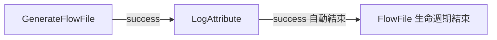
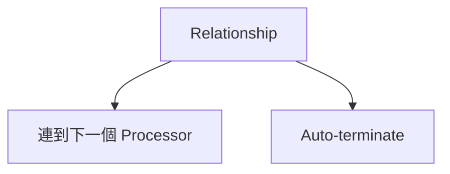
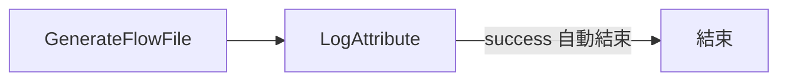
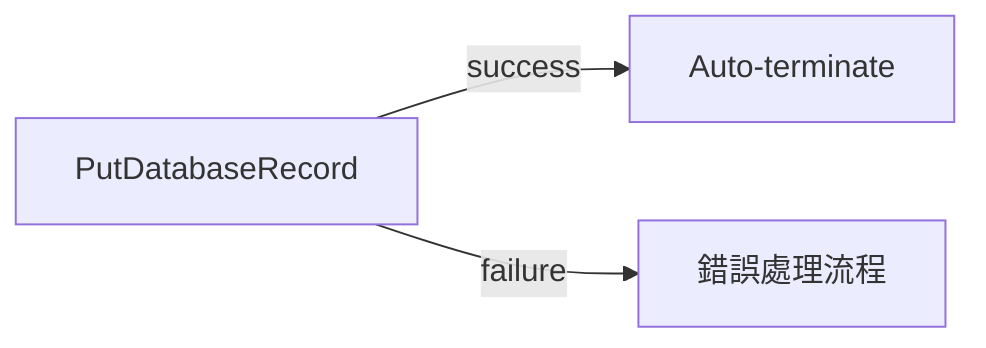
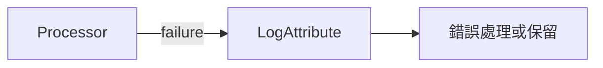
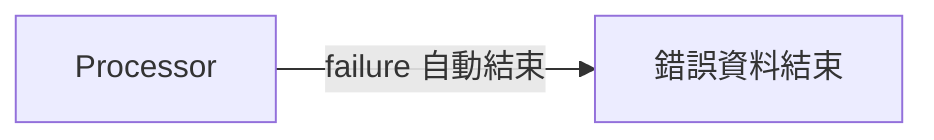
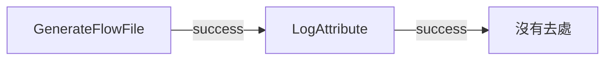

# 補充：Auto-terminate 完整說明

目標：完整理解 NiFi 的 `Auto-terminate` 是什麼、為什麼需要它、什麼時候可以用、什麼時候不該亂用。

這份是補充文檔，不是實作 Lab。建議在 Lab 01 做完後閱讀。

## 一句話定義

`Auto-terminate` 代表：

```text
某個 Processor 的某個 relationship 產生的 FlowFile，到這個出口就結束，不再送往下一個 Processor。
```

注意重點是「某個 relationship」，不是整個 Processor。

同一個 Processor 可能有多個 relationships：

| Relationship | 可能意義 |
| --- | --- |
| `success` | 處理成功 |
| `failure` | 處理失敗 |
| `matched` | 符合條件 |
| `unmatched` | 不符合條件 |
| `original` | 原始 FlowFile |

你可以讓其中一個 relationship 連到下一個 Processor，也可以讓其中一個 relationship auto-terminate。每個 relationship 都要被明確處理。

## 用圖理解

以 Lab 01 為例：



這裡發生的事：

1. `GenerateFlowFile` 產生 FlowFile。
2. FlowFile 透過 `success` relationship 送到 `LogAttribute`。
3. `LogAttribute` 寫出 log。
4. `LogAttribute` 處理成功後，也會產生 `success` relationship。
5. 因為後面沒有下一個 Processor，所以把 `LogAttribute` 的 `success` 設成 auto-terminate。
6. 這筆 FlowFile 到此結束。

## 如果不設定 Auto-terminate 會怎樣

NiFi 要求每個 relationship 都必須有去處。

relationship 的去處只有兩種：



如果某個 relationship 沒有連線，也沒有 auto-terminate，NiFi 會認為 Processor 的輸出沒有人處理。

結果通常是：

- Processor 變成 invalid。
- Processor 不能正常 start。
- Validation 會提示 relationship 沒有被處理。

用白話說，NiFi 會問：

```text
這個 Processor 如果產生 success，那 success 的 FlowFile 要去哪裡？
```

如果你沒有連線，也沒有 auto-terminate，NiFi 就沒有答案，所以不允許流程執行。

## Auto-terminate 不是什麼

### 不是 Processor 停止

Auto-terminate 不會停止 Processor。

Processor 是否執行，是由 Start/Stop 與 Scheduling 控制。

### 不是 Connection Queue

Auto-terminate 不會建立 queue。

它代表資料不再往下游送，所以也不會進入下一條 connection queue。

### 不是錯誤忽略開關

不要看到 `failure` 就直接 auto-terminate。

如果 `failure` 被 auto-terminate，錯誤 FlowFile 就結束了。你可能就失去：

- 錯誤資料內容
- 錯誤 attributes
- 重試機會
- 告警機會
- 後續人工修復依據

## 什麼時候適合 Auto-terminate

### 練習流程最後一步

例如 Lab 01：



`LogAttribute` 已經完成觀察目的，後面沒有下一步，所以可以 auto-terminate `success`。

### 明確不需要後續處理的成功結果

例如某個流程最後已經成功寫入目的地：



這代表成功寫入 DB 後，FlowFile 可以結束；但失敗資料仍要送去錯誤處理。

### 不需要保留的 original

某些 Processor 會輸出處理後結果，也會保留原始 FlowFile 到 `original`。

如果你確定原始資料不需要再追蹤、重放或稽核，才可以 auto-terminate `original`。

## 什麼時候不建議 Auto-terminate

### failure

公司專案中，`failure` 通常應該接到：

- `LogAttribute`
- 錯誤 queue
- 錯誤檔案輸出
- 告警流程
- 重試流程

建議：



不要一開始就：



除非你已經非常確定這種 failure 可以被丟棄，而且公司流程允許。

### unmatched

`unmatched` 代表資料沒有符合條件。

這不一定是正常，也可能代表：

- 條件寫錯
- 資料格式變了
- 新狀態沒有被流程涵蓋
- 上游資料異常

建議先接到 `LogAttribute` 或錯誤觀察流程，確認真的不需要後續處理後，再考慮 auto-terminate。

### 不熟悉的 relationship

如果你不確定某個 relationship 代表什麼，不要先 auto-terminate。

先做：

1. 查看 Processor 官方文件。
2. 暫時接 `LogAttribute`。
3. 跑少量測試資料。
4. 看 attributes、content、provenance。
5. 確認後再決定要連下游或 auto-terminate。

## Relationship 決策表

| 問題 | 決策 |
| --- | --- |
| 這個 relationship 的資料還要給下一步處理嗎？ | 連到下一個 Processor |
| 這個 relationship 是流程最後成功結果嗎？ | 可以 auto-terminate |
| 這個 relationship 是錯誤資料嗎？ | 先連到錯誤處理 |
| 這個 relationship 是不符合條件資料嗎？ | 先觀察，不要急著丟 |
| 這個 relationship 是原始資料嗎？ | 依稽核與重放需求決定 |
| 我不確定它代表什麼嗎？ | 不要 auto-terminate，先接 `LogAttribute` |

## Lab 01 對照

Lab 01 中有兩個 Processor：


`GenerateFlowFile` 的 `success`：

- 有連到 `LogAttribute`
- 所以不需要 auto-terminate

`LogAttribute` 的 `success`：

- 後面沒有下一步
- 所以要 auto-terminate

如果 `LogAttribute` 的 `success` 不連線也不 auto-terminate：



NiFi 會判定 `LogAttribute` invalid，因為它成功處理後產生的 FlowFile 沒有任何去處。

## 公司專案建議

在公司專案中，新增 Processor 後不要只為了讓 validation 通過就亂勾 auto-terminate。

比較安全的順序：

1. 看 Processor 有哪些 relationships。
2. 判斷每個 relationship 的業務意義。
3. 成功資料接到下一步或流程結尾。
4. 錯誤資料接錯誤處理流程。
5. 不確定的 relationship 先接 `LogAttribute` 或暫存 queue。
6. 確認不需要後續處理後，才 auto-terminate。

## 一分鐘總結

記住這句：

```text
每個 relationship 都要有去處，不是連到下一個 Processor，就是 auto-terminate。
```

再記住這句：

```text
Auto-terminate 是流程結束點，不是錯誤忽略開關。
```

最後記住：

```text
success 可以視情況結束，failure 通常要先保留或處理。
```
