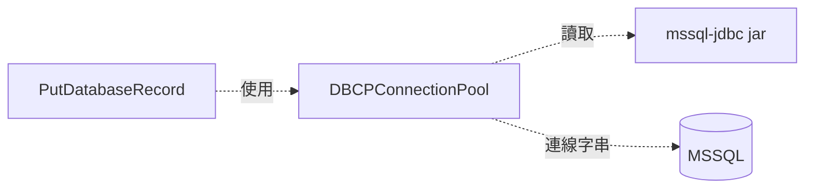

# 補充：JDBC Driver Jar 完整說明

這份補充文件用 Lab 06 的 MSSQL 連線當例子，說明 JDBC driver jar 是什麼、為什麼 NiFi 需要它，以及它和連線字串的差異。

## 基本定義

JDBC driver jar 是一個 Java library，讓 NiFi 這種 Java 程式可以連到特定資料庫。

以 MSSQL 為例：

```text
NiFi / Java 程式
  -> JDBC API
  -> MSSQL JDBC Driver
  -> SQL Server 網路協定
  -> MSSQL
```

NiFi 知道如何使用 JDBC API，但不知道每一種資料庫的細節。MSSQL、MySQL、PostgreSQL 的連線協定、metadata 查詢方式、錯誤碼與型別轉換都不同，所以需要各自的 JDBC driver。

## 用硬體驅動比喻

可以把 JDBC driver 想成資料庫的驅動程式。

```text
主機板 / 作業系統
  -> 需要硬體驅動程式
  -> 才知道怎麼跟顯卡、網卡、印表機溝通

NiFi / Java
  -> 需要 JDBC driver
  -> 才知道怎麼跟 MSSQL、MySQL、PostgreSQL 溝通
```

更精準一點：

- NiFi 就像作業系統上的應用程式。
- JDBC API 就像一套標準插槽規格。
- JDBC driver 就像資料庫的驅動程式。
- MSSQL 就像某個特定硬體設備。

NiFi 只知道「我要透過 JDBC 連資料庫」，但不同資料庫的細節不同：

| 資料庫 | JDBC URL 格式 |
| --- | --- |
| MSSQL | `jdbc:sqlserver://...` |
| MySQL | `jdbc:mysql://...` |
| PostgreSQL | `jdbc:postgresql://...` |

所以 NiFi 需要對應 driver 才知道：

- 怎麼解析這種 URL。
- 怎麼建立連線。
- 怎麼送 SQL。
- 怎麼讀資料表欄位資訊。
- 怎麼把錯誤回傳給 NiFi。

一句話：JDBC driver 就是 NiFi 連接特定資料庫時需要的資料庫驅動程式。

## 三個設定要一起看

在 `DBCPConnectionPool` 裡，這三個 property 是一組：

| Property | 作用 | MSSQL 範例 |
| --- | --- | --- |
| `Database Connection URL` | 說明要連哪裡、哪個 database、使用哪些連線參數 | `jdbc:sqlserver://host.docker.internal:1433;databaseName=nifi_training;encrypt=true;trustServerCertificate=true;` |
| `Database Driver Class Name` | 指定使用哪個 Java driver class | `com.microsoft.sqlserver.jdbc.SQLServerDriver` |
| `Database Driver Locations` | 指定 driver jar 在 NiFi container 內的位置 | `/tmp/mssql-jdbc.jar` |

連線字串不能取代 JDBC driver。連線字串只是地址與參數；driver 才是實際理解 MSSQL 協定並建立連線的元件。

## Jar 檔要放在哪裡

NiFi 跑在 Docker container 裡，所以 driver jar 必須放在 container 看得到的位置。

在本課程中，做法是把 Windows 專案根目錄的 jar 掛到 container 內：

```yaml
- "./mssql-jdbc-13.4.0.jre11.jar:/tmp/mssql-jdbc.jar"
```

這代表：

| 位置 | 意義 |
| --- | --- |
| `./mssql-jdbc-13.4.0.jre11.jar` | Windows 專案根目錄的檔案 |
| `/tmp/mssql-jdbc.jar` | NiFi container 裡看到的檔案 |

所以 `DBCPConnectionPool` 的 `Database Driver Locations` 要填：

```text
/tmp/mssql-jdbc.jar
```

不要填 Windows 路徑，例如 `C:\work_project\nifi\mssql-jdbc-13.4.0.jre11.jar`。NiFi container 看不到這個 Windows 路徑。

## 與 Lab 的對照

Lab 06 會用 `PutDatabaseRecord` 把 CSV records 寫入 MSSQL。

整條關係是：



對照設定：

1. `PutDatabaseRecord` 不直接保存 MSSQL driver 資訊。
2. `PutDatabaseRecord` 透過 `Database Connection Pooling Service` 使用 `DBCPConnectionPool`。
3. `DBCPConnectionPool` 透過 `Database Driver Locations` 載入 jar。
4. `DBCPConnectionPool` 透過 `Database Connection URL` 連到 MSSQL。
5. MSSQL 回傳成功或錯誤，`PutDatabaseRecord` 再決定 FlowFile 走 `success` 或 `failure`。

## 常見判斷

| 情境 | 判斷 |
| --- | --- |
| `Database Driver Locations` 填 Windows 路徑 | 錯，應填 container 內路徑 |
| 只有連線字串，沒有 jar | 不夠，NiFi 無法載入 MSSQL driver |
| jar 已掛載，但 driver class 打錯 | 仍會失敗，class name 必須正確 |
| URL host 用 `localhost` | 在 container 內代表 NiFi 自己，不是 Windows 主機 |
| URL databaseName 不存在 | 連線或執行時會失敗，要先建立 database |

## 一分鐘總結

JDBC driver jar 是 NiFi 和資料庫之間的轉譯器。

```text
Connection URL  = 要連哪裡
Driver Class    = 用哪個 driver
Driver Location = driver jar 放哪裡
```

三個都正確，NiFi 才能真正連到 MSSQL。
